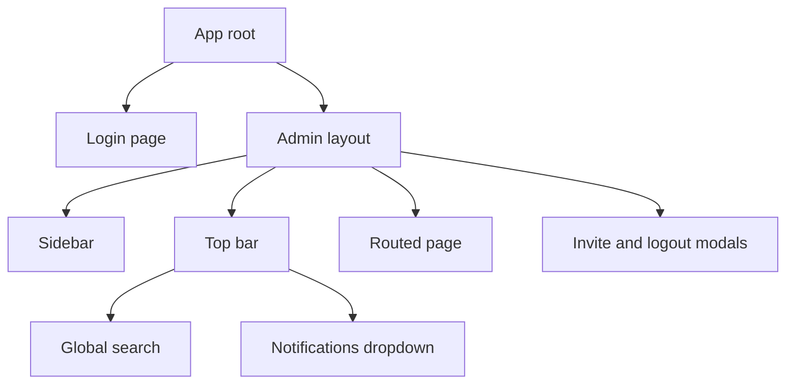

# SmartMoney Intelligence: Admin Interface

Angular 21 implementation of the SmartMoney Intelligence admin portal. The application is a
one-to-one translation of the Figma prototype held in `Figma Design`, with the same layout,
colour system, typography and status vocabulary.

## Document control

| Field | Value |
| --- | --- |
| Document type | Implementation notes |
| Version | 1.2 |
| Status | Active |
| Owner | Eclectics, SmartMoney Intelligence |
| Last updated | 5 October 2026 |
| Related documents | [Service README](../backend/README.md), [API contract](../docs/api-contract.md), [NCBA integration setup](../docs/ncba-integration-setup.md), [Domain knowledge](domain-knowledge.md) |
| Prerequisites | Node.js 20 or later, npm |

## Running the application

The project uses Windows native build binaries, so run it from Windows PowerShell rather than from
inside WSL.

```powershell
cd "C:\Users\user\Desktop\ECLECTICS\SM-Intelligence\admin-interface"
npm start -- --port 4300
```

Open `http://localhost:4300/admin/login`. Use port 4300: the web app uses 4200, and api-gateway only
accepts browser requests from 4200 and 4300. On any other port, sign in fails with "Could not reach
the identity service".

Sign in with an identity-service account whose email is listed in `ADMIN_EMAILS` (see
[backend setup](../backend/README.md)). The password is the one that account uses on the web app, and
a forgotten one is reset from the web app's "Forgot password?" link. Sign in needs api-gateway (8080)
and identity-service (8081). The bank screens need bank-integration-service (8090) and say so when it
is not running.

To produce a production bundle:

```powershell
npm run build
```

Build output is written to `dist/smartmoney-admin`.

## Technology

| Concern | Choice |
| --- | --- |
| Framework | Angular 21 with standalone components |
| Reactivity | Signals and zoneless change detection |
| Styling | Tailwind CSS v4 through `@tailwindcss/postcss` |
| Component library | None. Every primitive is hand built to match the design |
| Routing | Angular Router with an authentication guard and a login guard |

## How the design was translated

The prototype is a single `App.tsx` file of approximately 1,850 lines. The translation preserves
three things exactly.

1. Theme tokens. `src/styles.css` reproduces the prototype `index.css`, including the `:root` and
   `[data-theme="dark"]` custom properties, the animation keyframes, and the `.delay-*`,
   `.card-hover`, `.animate-*` and `.otp-input` utility classes.
2. Utility classes. Every Tailwind class in the prototype is reused as written, including
   arbitrary values such as `bg-[var(--green-soft)]` and `text-[10px]`.
3. Content. Mock organisations, users, transactions, reconciliation records, audit logs and
   notifications are reproduced exactly in `src/app/core/data.ts`.

Two deliberate deviations were required by the framework change.

| Deviation | Reason |
| --- | --- |
| Gradients use inline `linear-gradient` styles instead of `bg-gradient-to-br from-* to-*` | Identical rendering, and not sensitive to Tailwind v4 utility renaming |
| The animation stagger delay is applied as an inline `animation-delay` | A component host element already carries static classes, so a second class binding is ambiguous |

## Application structure

```text
src/app/
    core/       Types, sample data, theme, authentication, UI state, route guards
    shared/     Badge, KpiCard, SurfaceCard, Avatar, BankLogo, BarChart,
                Toggle, SettingsField, SettingsInput
    layout/     AdminLayout, Sidebar, TopBar, GlobalSearch, NotifDropdown,
                InviteModal, LogoutModal
    pages/      login, dashboard, organisations, users, bank-integrations,
                bank-accounts, transactions, reconciliation, notifications,
                audit-logs, reports, settings
public/banks/   Bank logo assets served at runtime
```



## Routes

| Route | Screen | Component |
| --- | --- | --- |
| `/admin/login` | Login and two factor | `LoginPage` |
| `/admin/dashboard` | System overview | `Dashboard` |
| `/admin/organisations` | Organisation management | `Organisations` |
| `/admin/users` | User management | `Users` |
| `/admin/bank-integrations` | Bank health | `BankIntegrations` |
| `/admin/bank-accounts` | Account monitoring | `BankAccounts` |
| `/admin/transactions` | Transaction monitoring | `Transactions` |
| `/admin/reconciliation` | Reconciliation queue | `Reconciliation` |
| `/admin/notifications` | Notification centre | `NotificationsPage` |
| `/admin/audit-logs` | Audit trail | `AuditLogs` |
| `/admin/reports` | Reporting | `Reports` |
| `/admin/settings` | Seven settings sections | `Settings` |

## Layout and scrolling

The shell is a fixed height flex column: sidebar, top bar and a bounded content region. Each page
host element is a flex item with `min-height: 0`, and each page provides its own scroll container
through `overflow-auto`. This keeps the top bar and sidebar in place while page content scrolls,
which matches the behaviour of the prototype.

## Backend contract

The interface consumes the Spring Boot REST API. Bank connectivity is never handled by the
frontend, so the browser never holds a bank credential.

| Screen | Endpoints |
| --- | --- |
| Dashboard | `/api/v1/admin/stats`, `/api/v1/admin/stats/events` |
| Bank integrations | `/api/v1/admin/bank-integrations`, `/api/v1/admin/bank-integrations/{bankId}`, `/settings`, `/credentials`, `/webhook-url`, `/test` |
| Transactions | `/api/v1/admin/demo/account`, `/demo/transactions`, `/demo/summary`. The screen is the demonstration account: money in and money out are recorded on demand and read back from the backend |
| Organisations, users, reconciliation, notifications, audit logs, reports | Still read `src/app/core/data.ts`, which is empty. The endpoints for these screens are defined in the [API contract](../docs/api-contract.md) and are not wired yet |

`{bankId}` is `kcb`, `stanbic` or `ncba`. Every response shape the integration screens read is
mirrored by an interface in `src/app/core/bank-integration.gateway.ts`, so a change on one side has
to be made on the other in the same change.

## The bank connection panel

One panel serves all three banks, because the layout is the same and only the vocabulary differs.
The labels are chosen per bank in `src/app/shared/bank-connection-panel.ts`.

| Element | KCB and Stanbic | NCBA |
| --- | --- | --- |
| Heading | Client credentials | Endpoint credentials given to NCBA |
| First value | Client key | Secret key |
| Second value | Client secret | Password |
| Third value | The `ApiKey` field of the register request | Username. KCB has no such field, so the column is dropped rather than shown as missing |
| First status pill | Token ready | Credentials ready |
| Second status pill | Callback registration | Public address |
| Extra rows | Token URL, registration URL, scope, account | Account only, and only once one is set |

Calling a secret key a client key is how an operator ends up looking for the wrong value in the
wrong portal, which is why the panel relabels itself rather than showing one bank's language to
another bank's operator.

Credentials are read only here. They live in `backend/bank-integration-service/.env.local` and are
never sent to the browser. Environment, timeouts, retries and signature checking are editable and
saved with "Save settings".

### Webhook base address

Above the bank panels, Settings, then Bank Integration Settings, has a "Webhook base address" field.
Every bank's webhook URL is that address followed by `/api/v1/webhooks/<bank>`. Saving stores it in
the bank service's database (`platform_setting`), so it is kept across restarts and overrides
`PUBLIC_BASE_URL`. For production it is `https://sm-intelligence.globalsmartspaces.com`. The main site
`https://globalsmartspaces.com` belongs to a different system and is not used for SmartMoney.

## Dependency note

The npm registry was unreachable on the machine where this project was assembled, so `node_modules`
was built from local sources.

| Package group | Source |
| --- | --- |
| Angular 21.2.22, TypeScript 5.9.3, rxjs 7.8.2, Vite 7.3.6, native build binaries | Existing `Smartwallet` project |
| Tailwind CSS 4.1.13 and `@tailwindcss/*` | Existing `spotternavbar/spotter-navbar` project |

`package.json` lists all of these as normal dependencies, so a plain `npm install` with network
access will replace the local copies. The `vitest`, `jsdom` and `prettier` packages were removed
from the generated scaffold because they could not be installed, so there is no `npm test` script
yet.

## Current limitations

| Item | State |
| --- | --- |
| Backend services | The bank integration screens are wired to the API. The remaining screens still read `src/app/core/data.ts` |
| Authentication | Real sign in against identity-service; only `PLATFORM_ADMIN` accounts are accepted |
| Detail views | Bank and organisation details open as in-page drawers rather than as routes, so they cannot be linked to directly |
| Automated tests | No test runner installed. The build is the only check |
| Live bank connectivity | The panel reports real credential state, real notification counts and a real four step connection test. No amount or balance passes through the admin surface |

## Revision history

| Version | Date | Summary |
| --- | --- | --- |
| 1.2 | 5 October 2026 | Real admin sign in on port 4300. Settings opens the section named in `?section=` (Integration settings opens Bank Integration Settings). Webhook base address editable and stored across restarts. Save errors say when port 8090 is down |
| 1.1 | 18 September 2026 | Bank connection panel documented, including the per bank labels. Backend contract replaced with the endpoints that are actually wired, and the limitations table corrected |
| 1.0 | 10 September 2026 | Initial Angular implementation of the admin interface |
