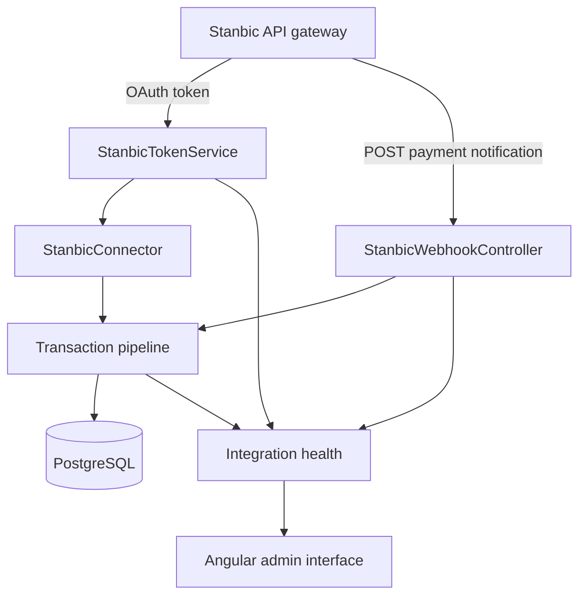

# SmartMoney Intelligence: Stanbic Integration Setup

How to stand up the Spring Boot backend for Stanbic bank integration, connect the Angular admin
interface to it, and drive the work through to a successful instant payment notification.

## Document control

| Field | Value |
| --- | --- |
| Document type | Integration setup guide |
| Version | 1.1 |
| Status | Working scaffold. The token endpoint is the one outstanding blocker |
| Owner | Eclectics, SmartMoney Intelligence |
| Last updated | 15 September 2026 |
| Related documents | [KCB real time trial](kcb-real-time-trial.md), [API contract](api-contract.md), [Service README](../backend/README.md) |
| Prerequisites | Stanbic sandbox account, Java 21, PostgreSQL, Docker (optional) |

The domain knowledge document lives outside this repository, in the planning folder at
`ECLECTICS/Planning/domain-knowledge.md`, alongside the original Figma prototype.

## 1. Scope

This covers the Stanbic side of the platform:

| Area | In scope |
| --- | --- |
| OAuth access token handling | Yes |
| Bank connector behind the shared interface | Yes |
| Incoming payment notification endpoint | Yes |
| Admin API consumed by the Angular interface | Yes |
| PostgreSQL schema for integration state | Yes |
| The other three banks | No, they follow the same pattern later |

## 2. What exists and what is missing

Already built, in the Angular project at `admin-interface`:

- A connection panel per bank under Settings, Bank Integration Settings, with environment,
  timeouts, retry policy, webhook endpoint URL, token status and a Test connection action.
- A monitoring view on the Bank Integrations page with API, webhook and token health.
- A single gateway boundary, `BankIntegrationGateway`, with a simulation behind it, so the
  interface runs today without a backend.

Missing:

- The Spring Boot service itself.
- The Stanbic instant payment notification specification, which is not in the document received so
  far. See section 12.

## 3. How the pieces fit together



Two rules govern the whole design. Bank credentials live only in the backend. The Angular
interface never calls a bank and never receives a client key or client secret.

## 4. Prerequisites and credentials

From the Stanbic developer sandbox portal at `https://sandbox.stanbicbank.co.ke/` you need:

| Item | Where it comes from | Status |
| --- | --- | --- |
| Developer account | Portal sign up and email activation | Your guide covers this |
| Application client key | Created when you register the application | Your guide covers this |
| Application client secret | Created with the client key | Your guide covers this |
| Account number | Your Stanbic account | `0100013306316` |
| Token URL | API product page, on the specific API | Your guide covers this |
| API base URL | API product page | Your guide covers this |
| Notification product subscription | API Products | To confirm |
| Callback registration route | To confirm with the Integrations Team | Outstanding |
| Notification payload and signature rules | To confirm | Outstanding |

Store the client key and client secret in environment variables or a secret manager. Never commit
them. The account number is configured, and the interface displays it masked.

## 5. Create the Spring Boot project

Generate the project from Spring Initializr or your IDE with these settings.

| Setting | Value |
| --- | --- |
| Project | Maven |
| Language | Java |
| Spring Boot | 3.3 or later |
| Group | `io.smartmoney` |
| Artifact | `smartmoney-api` |
| Java | 21 |

Dependencies:

```text
Spring Web
Spring WebFlux, for WebClient when polling the bank
Spring Data JPA
PostgreSQL Driver
Flyway Migration
Validation
Spring Security
OAuth2 Client
Spring Boot Actuator
Resilience4j, optional, for retries and circuit breaking
Lombok, optional
```

Suggested package layout:

```text
io.smartmoney.api
    auth
    organisation
    bank
    bankintegration
        BankConnector.java
        BankConnectionTest.java
        BankIntegrationService.java
        BankIntegrationController.java
        IntegrationHealth.java
    bankintegration.stanbic
        StanbicProperties.java
        StanbicTokenService.java
        StanbicConnector.java
        StanbicWebhookController.java
    transaction
    reconciliation
    notification
    audit
    config
```

## 6. Configuration

`src/main/resources/application.yml`:

```yaml
server:
  port: 8080

spring:
  datasource:
    url: ${DB_URL:jdbc:postgresql://localhost:5432/smartmoney}
    username: ${DB_USER:smartmoney}
    password: ${DB_PASSWORD:smartmoney}
  jpa:
    hibernate:
      ddl-auto: validate
  flyway:
    enabled: true

smartmoney:
  public-base-url: ${PUBLIC_BASE_URL:https://localhost:8443}

  stanbic:
    environment: ${STANBIC_ENV:Sandbox}
    portal-url: https://sandbox.stanbicbank.co.ke/
    # Copied from the API product page in the developer portal
    token-url: ${STANBIC_TOKEN_URL}
    api-base-url: ${STANBIC_API_BASE_URL}
    client-key: ${STANBIC_CLIENT_KEY}
    client-secret: ${STANBIC_CLIENT_SECRET}
    account-number: ${STANBIC_ACCOUNT_NUMBER:0100013306316}
    api-timeout-seconds: 30
    retry-attempts: 3
    retry-delay-seconds: 5
    webhook-path: /api/v1/webhooks/stanbic
    signature-verification: true
```

Environment variables to set on your machine:

```powershell
$env:STANBIC_TOKEN_URL    = "<token url copied from the portal>"
$env:STANBIC_API_BASE_URL = "<api base url copied from the portal>"
$env:STANBIC_CLIENT_KEY   = "<client key>"
$env:STANBIC_CLIENT_SECRET= "<client secret>"
$env:STANBIC_ACCOUNT_NUMBER = "0100013306316"
$env:PUBLIC_BASE_URL      = "<your public https base url, see section 11>"
```

`StanbicProperties` binds this block:

```java
@ConfigurationProperties(prefix = "smartmoney.stanbic")
public record StanbicProperties(
        String environment,
        String portalUrl,
        String tokenUrl,
        String apiBaseUrl,
        String clientKey,
        String clientSecret,
        String accountNumber,
        int apiTimeoutSeconds,
        int retryAttempts,
        int retryDelaySeconds,
        String webhookPath,
        boolean signatureVerification) {
}
```

## 7. Database schema

`src/main/resources/db/migration/V1__integration.sql`:

```sql
create table bank_integration (
    id                   bigserial primary key,
    bank_id              text not null unique,
    environment          text not null,
    account_number       text not null,
    client_key_ref       text not null,
    client_secret_ref    text not null,
    api_timeout_seconds  int  not null default 30,
    retry_attempts       int  not null default 3,
    retry_delay_seconds  int  not null default 5,
    signature_verification boolean not null default true,
    automatic_retry      boolean not null default true,
    updated_at           timestamptz not null default now()
);

create table webhook_event (
    id                bigserial primary key,
    bank_id           text not null,
    external_event_id text,
    signature_valid   boolean,
    payload           jsonb not null,
    processing_status text not null default 'RECEIVED',
    error_message     text,
    received_at       timestamptz not null default now(),
    processed_at      timestamptz
);

create unique index webhook_event_unique
    on webhook_event (bank_id, external_event_id)
    where external_event_id is not null;

create table transaction_record (
    id                 bigserial primary key,
    organisation_id    bigint,
    bank_id            text not null,
    bank_account_id    bigint,
    external_reference text not null,
    amount             numeric(18,2) not null,
    currency           text not null,
    transaction_type   text not null,
    description        text,
    narration          text,
    transaction_date   timestamptz not null,
    status             text not null default 'PROCESSED',
    created_at         timestamptz not null default now()
);

create unique index transaction_record_unique
    on transaction_record (bank_id, external_reference);

create table integration_log (
    id          bigserial primary key,
    bank_id     text not null,
    direction   text not null,
    endpoint    text,
    request_id  text,
    http_status int,
    latency_ms  int,
    detail      text,
    created_at  timestamptz not null default now()
);
```

The unique index on `bank_id` and `external_reference` is what makes the pipeline idempotent. A
repeated notification updates the existing row instead of creating a second transaction.

## 8. Access token service

The developer portal issues the token through OAuth 2.0 using the client key and client secret.
The access token is valid for one hour, so it is cached and refreshed before expiry.

```java
@Service
public class StanbicTokenService {

    private final RestClient http;
    private final StanbicProperties props;

    private String cachedToken;
    private Instant expiresAt = Instant.EPOCH;

    public StanbicTokenService(StanbicProperties props) {
        this.props = props;
        this.http = RestClient.builder()
                .baseUrl(props.tokenUrl())
                .build();
    }

    public synchronized String accessToken() {
        if (cachedToken != null && Instant.now().isBefore(expiresAt.minusSeconds(120))) {
            return cachedToken;
        }
        TokenResponse response = http.post()
                .contentType(MediaType.APPLICATION_FORM_URLENCODED)
                .body("grant_type=client_credentials"
                        + "&client_id=" + URLEncoder.encode(props.clientKey(), StandardCharsets.UTF_8)
                        + "&client_secret=" + URLEncoder.encode(props.clientSecret(), StandardCharsets.UTF_8))
                .retrieve()
                .body(TokenResponse.class);

        if (response == null || response.accessToken() == null) {
            throw new IllegalStateException("Stanbic did not return an access token");
        }
        this.cachedToken = response.accessToken();
        this.expiresAt = Instant.now().plusSeconds(response.expiresIn() == null ? 3600 : response.expiresIn());
        return cachedToken;
    }

    public Optional<Instant> expiresAt() {
        return cachedToken == null ? Optional.empty() : Optional.of(expiresAt);
    }

    public void invalidate() {
        this.cachedToken = null;
        this.expiresAt = Instant.EPOCH;
    }

    private record TokenResponse(
            @JsonProperty("access_token") String accessToken,
            @JsonProperty("expires_in") Long expiresIn,
            @JsonProperty("token_type") String tokenType) {
    }
}
```

Two details to confirm against the portal. Postman's OAuth 2.0 helper can send the client
credentials either in the request body or as a Basic authentication header. The code above uses
the body. If the gateway expects Basic authentication, replace the body with a header built from
`clientKey` and `clientSecret`. Also confirm whether the product needs a `scope` value, in which
case add it to the form body.

## 9. Bank connector

One interface, one implementation per bank. This is the decision that keeps the transaction domain
free of provider specific code.

```java
public interface BankConnector {
    String bankId();
    BankConnectionTest testConnection();
}
```

```java
@Service
public class StanbicConnector implements BankConnector {

    private final RestClient http;
    private final StanbicProperties props;
    private final StanbicTokenService tokens;

    public StanbicConnector(StanbicProperties props, StanbicTokenService tokens) {
        this.props = props;
        this.tokens = tokens;
        this.http = RestClient.builder().baseUrl(props.apiBaseUrl()).build();
    }

    @Override
    public String bankId() {
        return "stanbic";
    }

    @Override
    public BankConnectionTest testConnection() {
        long started = System.nanoTime();
        List<ConnectionStep> steps = new ArrayList<>();

        try {
            tokens.accessToken();
            steps.add(ConnectionStep.ok("token", "Token request",
                    "Access token issued, valid for one hour."));
        } catch (Exception error) {
            steps.add(ConnectionStep.fail("token", "Token request", error.getMessage()));
            return BankConnectionTest.of(steps, elapsedMs(started));
        }

        // Replace the path below with the account enquiry path from the API product page.
        try {
            http.get()
                    .uri("/accounts/{accountNumber}", props.accountNumber())
                    .header(HttpHeaders.AUTHORIZATION, "Bearer " + tokens.accessToken())
                    .retrieve()
                    .body(String.class);
            steps.add(ConnectionStep.ok("account-probe", "Account probe",
                    "Account " + mask(props.accountNumber()) + " responded in " + elapsedMs(started) + " ms."));
        } catch (HttpClientErrorException.Unauthorized error) {
            tokens.invalidate();
            steps.add(ConnectionStep.fail("account-probe", "Account probe",
                    "The gateway rejected the access token."));
        } catch (Exception error) {
            steps.add(ConnectionStep.warn("account-probe", "Account probe", error.getMessage()));
        }

        return BankConnectionTest.of(steps, elapsedMs(started));
    }

    private static String mask(String accountNumber) {
        return accountNumber.length() <= 4
                ? accountNumber
                : "*".repeat(accountNumber.length() - 4) + accountNumber.substring(accountNumber.length() - 4);
    }

    private static long elapsedMs(long startedNanos) {
        return (System.nanoTime() - startedNanos) / 1_000_000;
    }
}
```

## 10. Notification endpoint

The bank posts payment events here. The endpoint validates the configured signature before storing
the raw event, acknowledges accepted notifications quickly, and processes them afterwards. An
invalid or unconfigured signature is rejected with 401 when verification is enabled.

```java
@RestController
@RequestMapping("/api/v1/webhooks")
public class StanbicWebhookController {

    private final WebhookEventService events;
    private final StanbicSignatureVerifier signatures;

    public StanbicWebhookController(WebhookEventService events, StanbicSignatureVerifier signatures) {
        this.events = events;
        this.signatures = signatures;
    }

    @PostMapping(path = "/stanbic", consumes = MediaType.ALL_VALUE)
    public ResponseEntity<Void> receive(
            @RequestBody(required = false) String rawBody,
            @RequestHeader Map<String, String> headers) {

        Boolean valid = signatures.verify(rawBody, headers);
        String eventId = signatures.eventId(rawBody, headers);

        if (!Boolean.FALSE.equals(valid)) {
            events.record("stanbic", eventId, valid, rawBody);
        } else {
            return ResponseEntity.status(401).build();
        }
        return ResponseEntity.ok().build();
    }
}
```

`WebhookEventService.record` writes to `webhook_event` and publishes an application event that a
listener picks up asynchronously, so the HTTP response is not held open.

The processing listener runs the pipeline described in the domain document: validate, then check
for a duplicate on bank and external reference, then normalise, then persist, then reconcile, then
notify.

## 11. Admin API consumed by the Angular interface

These three endpoints are what the admin interface calls. The JSON shapes are fixed, because the
Angular contracts are already written against them.

### 11.1 Health list

```text
GET /api/v1/admin/bank-integrations
```

```json
[
  {
    "bankId": "stanbic",
    "environment": "Sandbox",
    "apiStatus": "HEALTHY",
    "webhookStatus": "WARNING",
    "tokenStatus": "VALID",
    "tokenExpiresInMinutes": 47,
    "lastTokenRefresh": "2026-09-14T09:12:00Z",
    "lastWebhookReceived": "2026-09-14T09:05:00Z",
    "lastSuccessfulRequest": "2026-09-14T09:11:00Z",
    "latencyMs": 210,
    "errorsLast24h": 3,
    "checkedAt": "2026-09-14T09:12:05Z"
  }
]
```

Allowed values:

| Field | Allowed values |
| --- | --- |
| environment | `Sandbox`, `Production` |
| apiStatus, webhookStatus | `CONNECTED`, `HEALTHY`, `WARNING`, `ERROR`, `PENDING`, `UNKNOWN` |
| tokenStatus | `VALID`, `EXPIRING`, `EXPIRED`, `UNKNOWN` |
| timestamps | ISO-8601 with offset, or `null` |

### 11.2 Connection test

```text
POST /api/v1/admin/bank-integrations/{bankId}/test
Content-Type: application/json
```

Request body, the settings currently shown on screen:

```json
{
  "bankId": "stanbic",
  "environment": "Sandbox",
  "apiTimeoutSeconds": 30,
  "retryAttempts": 3,
  "retryDelaySeconds": 5,
  "signatureVerification": true,
  "automaticRetry": true
}
```

Response:

```json
{
  "ok": false,
  "summary": "Connection test failed at Webhook endpoint registration.",
  "latencyMs": 891,
  "steps": [
    { "key": "token", "name": "Token request", "status": "ok",
      "detail": "Access token issued, valid for one hour." },
    { "key": "account-probe", "name": "Account probe", "status": "warn",
      "detail": "Responses are slow at 891 ms." },
    { "key": "webhook-registration", "name": "Webhook endpoint registration", "status": "fail",
      "detail": "The registered callback URL did not acknowledge the last delivery." },
    { "key": "signature-verification", "name": "Signature verification", "status": "ok",
      "detail": "Incoming callbacks are verified against the signing secret." }
  ],
  "testedAt": "2026-09-14T09:20:00Z"
}
```

The four step keys are part of the contract. The Angular interface reads `token`,
`account-probe` and `webhook-registration` to update the API and webhook status after a test, so
keep those keys exactly as written. The `name` and `detail` text is free, and is displayed as-is.

Allowed values for `status`: `ok`, `warn`, `fail`. The test is treated as passed when no step
fails.

### 11.3 Save settings

```text
PUT /api/v1/admin/bank-integrations/{bankId}
```

Request and response are both the settings object from 11.2. The backend stores everything except
the credentials, which are referenced, not returned.

## 12. Security and CORS

Security rules:

| Path | Rule |
| --- | --- |
| `/api/v1/admin/**` | Authenticated, admin or super admin role |
| `/api/v1/webhooks/**` | Public, but the caller must pass signature or IP verification |
| `/actuator/health` | Public |
| Everything else | Denied by default |

```java
@Bean
SecurityFilterChain security(HttpSecurity http) throws Exception {
    http.csrf(csrf -> csrf.disable())
        .authorizeHttpRequests(auth -> auth
            .requestMatchers("/api/v1/webhooks/**", "/actuator/health").permitAll()
            .requestMatchers("/api/v1/admin/**").hasAnyRole("ADMIN", "SUPER_ADMIN")
            .anyRequest().authenticated())
        .oauth2ResourceServer(oauth2 -> oauth2.jwt(Customizer.withDefaults()));
    return http.build();
}
```

The Angular development server runs on `http://localhost:4200`. Without CORS configuration the
browser blocks every call, which is the most common cause of a connection test failing with no
HTTP status.

```java
@Configuration
public class CorsConfig implements WebMvcConfigurer {

    @Override
    public void addCorsMappings(CorsRegistry registry) {
        registry.addMapping("/api/**")
                .allowedOrigins("http://localhost:4200")
                .allowedMethods("GET", "POST", "PUT", "PATCH", "DELETE", "OPTIONS")
                .allowedHeaders("*")
                .allowCredentials(true);
    }
}
```

In production, replace the allowed origin with the deployed admin host.

## 13. Exposing the notification endpoint for sandbox testing

Stanbic cannot reach `localhost`. For sandbox testing you need a public HTTPS address.

1. Run the backend on port 8080.
2. Start a tunnel, for example `cloudflared tunnel --url http://localhost:8080` or
   `ngrok http 8080`.
3. Copy the public HTTPS address the tunnel prints.
4. Your callback URL becomes `<public-url>/api/v1/webhooks/stanbic`.
5. Set `PUBLIC_BASE_URL` to the tunnel address so the admin interface displays the correct URL.
6. Register that callback URL with Stanbic, by whichever route the Integrations Team specifies.
7. Keep the tunnel running while you test. If the tunnel changes address, re-register.

## 14. Connecting the Angular interface

The interface already has the panel, the service and the gateway. It reads from the backend only,
so connecting it takes two steps.

1. Set the API base URL in `admin-interface/src/app/core/api.config.ts`:

```ts
export const API_BASE_URL = 'http://localhost:8080/api/v1';
```

2. Start the Spring Boot service, then the Angular development server:

```powershell
cd "C:\Users\user\Desktop\ECLECTICS\SM-Intelligence\admin-interface"
npm start
```

There is no simulated mode to switch off. The Bank Integrations page shows a `Backend connected`
indicator, and every page reports an unreachable service rather than showing invented figures.

| Screen | Behaviour |
| --- | --- |
| Settings, Bank Integration Settings | Test connection runs against the backend and renders the steps it returns |
| Bank Integrations | Status badges, notification counts, token state and webhook state come from `GET /api/v1/admin/bank-integrations` |
| Dashboard | Counts, the volume chart and recent activity come from `GET /api/v1/admin/stats` |
| Both | The account number is displayed masked, for example `*********6316` |

If the backend is not running, the panel does not go blank. It renders a failed test that names the
URL it could not reach.

## 15. Runbook to a successful notification

| Step | Action | Evidence that it worked |
| --- | --- | --- |
| 1 | Create the developer account and activate it | You can sign in to the portal |
| 2 | Register the application with account `0100013306316` | Client key and client secret issued |
| 3 | Subscribe the application to the notification API product | The product is listed under Apps, Subscriptions |
| 4 | Copy the Token URL and API base URL from the product page | Both values saved to environment variables |
| 5 | Start Postgres and the Spring Boot service | `GET /actuator/health` returns UP |
| 6 | Call the token service once | An access token is cached server-side; its value is never logged or returned |
| 7 | Call Test connection in the admin interface | Steps return, token request passes |
| 8 | Start the tunnel and set `PUBLIC_BASE_URL` | The admin interface shows the public callback URL |
| 9 | Register the callback URL with Stanbic | Stanbic confirms registration |
| 10 | Ask Stanbic to trigger a test notification, or make a sandbox payment | A row appears in `webhook_event` |
| 11 | Confirm signature verification | `signature_valid` is true |
| 12 | Confirm idempotency | A repeated delivery does not create a second transaction |
| 13 | Confirm reconciliation | The expected record matches the received transaction |
| 14 | Confirm the admin interface | Bank Integrations shows the webhook as healthy and the notification appears |

## 16. Troubleshooting

| Symptom | Likely cause | Action |
| --- | --- | --- |
| Unauthorized from the token endpoint | Wrong client key or secret | Recheck the values copied from the portal |
| Token works in Postman, fails in the service | Credentials in the body versus Basic auth | Match the mode the gateway expects |
| Token expired | Token older than one hour | Cached token must refresh before expiry |
| Subscription error | Application not subscribed to the product | Verify under Apps, Subscriptions |
| No notification received | Callback URL not registered, or the tunnel is down | Re-register and keep the tunnel running |
| Webhook returns 500 | Processing happens before the response | Store and return 200 first, process after |
| Duplicate transactions | No unique key on bank plus external reference | Add and rely on the unique index |
| Connection test shows no HTTP status | Backend down, wrong base URL, or CORS | Check the service, the base URL and the CORS origin |
| Interface shows `Backend unreachable` | The service is not running, or `API_BASE_URL` points elsewhere | Start the service and check the base URL |

## 17. Registering the callback URL with Stanbic

This comes from the specification "Register Your Payment Result URL for Real-time Credit Alerts,
Sandbox 1.0.2". Registration is what makes Stanbic push real-time credit and debit alerts to us.
Until it is done, no notifications arrive.

| Item | Value |
| --- | --- |
| Registration endpoint | `https://api.connect.stanbicbank.co.ke/api/sandbox/registerurl/` |
| Production endpoint | `https://api.connect.stanbicbank.co.ke/api/prod/registerurl/` |
| Token endpoint | `https://api.connect.stanbicbank.co.ke/api/sandbox/auth/oauth2/token` |
| Authentication | OAuth 2.0 application flow, scope `payments` |
| Method | POST, `Content-Type: application/json` |
| Support contact | kilele@stanbic.com |

The request body:

```json
{
  "ReferenceId": "SM-1A2B3C4D",
  "ApiKey": "<the ApiKey from the portal>",
  "CallBackUrl": "https://your-public-host/api/v1/webhooks/stanbic",
  "NotificationType": "CREDIT",
  "ProfileApprover": "SmartMoney Intelligence",
  "Channel": "APGW"
}
```

`NotificationType` accepts `CREDIT` or `DEBIT`, one per call. Register both so that money coming in
and money going out are both visible on the platform.

A successful registration answers:

```json
{ "ResponseCode": "00", "ResponseMessage": "Success", "ReferenceId": "SM-1A2B3C4D" }
```

`ResponseCode` of `00` means accepted. Anything else is a rejection, and the error shape carries
`ErrorCode`, `Status`, `ErrorMessage`, `RefereneceId` (spelled that way in the specification) and
`DatetimeStamp`.

Two conditions matter. The customer must be approved to consume this API, and `CallBackUrl` must be
publicly reachable over HTTPS, because the bank pushes to it directly.

In the platform this is exposed as:

```text
POST /api/v1/admin/bank-integrations/stanbic/register-callback
POST /api/v1/admin/bank-integrations/stanbic/register-callback?notificationType=CREDIT
```

With no parameter it registers both CREDIT and DEBIT and returns one outcome per type. In the admin
interface it is the "Register callback URL" item on each provider card.

Configuration for it lives in one file, `backend/.env.local`, which git ignores. Run
`backend/set-credentials.ps1` and it will ask for each value in turn.

The API base, token URL, scope and registration path already default to the sandbox values above, so
the Client Key, the Client Secret and the public host are the only entries that must be supplied.

### Mapping the portal to the environment

The developer portal shows the OAuth pair and the token URL. The register request additionally
carries an `ApiKey` field, which the portal does not always expose.

| Portal value | Environment variable | Required |
| --- | --- | --- |
| Client Key | `STANBIC_CLIENT_KEY` | Yes |
| Client Secret | `STANBIC_CLIENT_SECRET` | Yes |
| Token URL | `STANBIC_TOKEN_URL` | Yes, if it differs from the default below |
| ApiKey, if a separate one is issued | `STANBIC_API_KEY` | Optional |
| Bank account number | `STANBIC_ACCOUNT_NUMBER` | Yes, defaults to `0100013306316` |
| Public host for the callback | `PUBLIC_BASE_URL` | Yes for anything beyond localhost |

When `STANBIC_API_KEY` is not set, the service sends the Client Key in that field and reports the
source as `client key fallback` on the Settings screen and from the credentials endpoint. That is an
informed attempt, not a guarantee, so if the gateway rejects the registration, ask the Integrations
Team whether a separate ApiKey value is required for this application.

### Where the ApiKey actually comes from

Be clear about this, because it is the one value that is not self service. The developer portal
issues two things: the OAuth credential pair for your application, and the Token URL for the
subscribed product. It does not issue a separate ApiKey for the register request.

The `ApiKey` field in the registration body identifies your channel on Stanbic's side. On most
integrations that value is supplied by the bank's Integrations Team when they approve you for this
API, not by the portal.

So the working order is:

1. Leave `STANBIC_API_KEY` blank.
2. Register. The service sends the Client Key in that field.
3. If Stanbic accepts with `ResponseCode 00`, you are done and no separate value was needed.
4. If Stanbic rejects it, email kilele@stanbic.com and ask one precise question: for
   `POST /api/sandbox/registerurl`, what value must be sent in `ApiKey` for this application,
   quoting your application name and account number.
5. Set `STANBIC_API_KEY` to whatever they provide and register again.

The credentials endpoint reports this too, in the `apiKeyAdvice` field, so the state is visible
without guessing.

Important: use the Token URL exactly as the portal shows it. The value in the specification is an
example, and calling the wrong path returns a gateway response rather than an authentication error.

### Rotating credentials

The portal allows more than one credential set per application, which exists so that a set can be
replaced without downtime. The service reads everything from environment variables, so rotation is:

1. Create the second credential set on the portal.
2. Update `STANBIC_CLIENT_KEY` and `STANBIC_CLIENT_SECRET` in the environment.
3. Restart the service, or roll the deployment.
4. Confirm with the connection test that the token step passes.
5. Revoke the old set on the portal.

No code change is involved at any point.

### Checking what the service has loaded

```text
GET /api/v1/admin/bank-integrations/stanbic/credentials
```

It answers with flags and masked hints only, never a secret, for example:

```json
{
  "clientKeyConfigured": true,
  "clientKeyHint": "****1234",
  "clientSecretConfigured": true,
  "apiKeyConfigured": false,
  "apiKeySource": "client key fallback",
  "tokenUrl": "https://api.connect.stanbicbank.co.ke/api/sandbox/auth/oauth2/token",
  "registrationUrl": "https://api.connect.stanbicbank.co.ke/api/sandbox/registerurl/",
  "oauthScope": "payments",
  "accountNumber": "*********6316",
  "tokenReady": true,
  "registrationReady": true
}
```

The same information appears on Settings, Bank Integration Settings, under Client credentials.

## 18. Sandbox or a live account

This is the question that decides how far the integration can be tested, so it is worth stating
plainly.

| Level | What it exercises | Needs a real account holder | Shows your own money |
| --- | --- | --- | --- |
| Sandbox | The real Stanbic network path, with a sandbox application and a sandbox account | No | No |
| Live | Notifications generated by activity on your own account | Yes, and the product enabled on that account | Yes |

The sandbox is the right place to prove the plumbing. It does not watch your personal or business
account, and no configuration on our side changes that.

Note also what the product is. It is a notification feed, not a statement. When it works, every
credit and debit arrives as one alert. It does not return a browsable history of past transactions.
If a transaction listing is wanted, that is a different Stanbic product, and it is not in the
documentation held here.

As of 15 September 2026, with the credentials that are loaded, the connection test reports:

```text
[fail] Token request: Stanbic token endpoint returned HTTP 404.
       {"httpCode":"404","httpMessage":"Not Found","moreInformation":"API not found for requested URI"}
[fail] Account probe: Skipped because no access token was obtained.
[ok]   Webhook endpoint registration: Callback URL ... is publicly reachable.
[warn] Signature verification: disabled.
```

The notification address is therefore already in place. The single blocker is the token address.

### The token address has to come from the portal

The value now used, `https://api.connect.stanbicbank.co.ke/api/sandbox/auth/oauth2/token`, is the
specification default and it does not resolve. A probe of the API host on 15 September 2026 shows it
answers a bare HTTP 404 with no body for every path tried, including its own root, so the correct
path cannot be discovered by testing addresses. It has to be copied.

Copy it from the API product page, and also check the application's OAuth2 key configuration, which
lists a Token Endpoint. Then set it and restart:

```powershell
cd "C:\Users\user\Desktop\ECLECTICS\SM-Intelligence\admin-interface\backend"
.\set-credentials.ps1          # enter it at "Token URL"
.\run-local.ps1
```

Reject a value that is a portal web address. It must start with `https://api.connect.stanbicbank.co.ke/`
and answer JSON. A portal page address returns HTML, which cannot be parsed as a token.

### Confirming it worked

Open Bank Integrations in the admin interface, click the Stanbic card, and choose Test connection.
The drawer reports each step. A pass at Token request means the credentials and the address are
both right. Then choose Register callback URL.

## 19. Still to confirm with Stanbic

Confirmed from the specification: the registration endpoint, the registration request and response
shape, the scope, and that `NotificationType` is one value per call.

Not confirmed: the token endpoint, as recorded in section 18.

Still open:

1. The shape of the notification payload Stanbic posts to our callback once registered.
2. How that callback is authenticated: signature header, shared secret, Basic auth, or IP allowlist.
3. The expected acknowledgement we must return, status code and body.
4. Their retry policy when our endpoint is unavailable.
5. Whether a test notification can be triggered in sandbox, or whether a live sandbox payment is needed.
6. The exact account enquiry path used by the account probe step.
7. Production credentials and the onboarding steps for each of the above.

## Revision history

| Version | Date | Summary |
| --- | --- | --- |
| 1.1 | 15 September 2026 | Sandbox against live account explained. Corrected section 18, which claimed the token endpoint was confirmed. It returns HTTP 404 and must be copied from the portal. Frontend connection steps updated to the backend-only interface |
| 1.0 | 14 September 2026 | Initial backend setup guide and frontend connection steps |
