# SmartMoney Intelligence: Domain Knowledge

Master domain and system reference for the SmartMoney Intelligence platform. It explains what the
product is, the financial concepts behind it, how money moves through the system, what each module
means, how bank integrations work, and what the administrator is responsible for.

## Document control

| Field | Value |
| --- | --- |
| Document type | Domain and system reference |
| Version | 1.0 |
| Status | Active |
| Owner | Eclectics, SmartMoney Intelligence |
| Last updated | 10 September 2026 |
| Related documents | [Admin interface notes](../admin-interface/README.md), [API contract](../admin-interface/docs/api-contract.md) |
| Prerequisites | None. This document is the entry point for the domain |

## 1. What SmartMoney Intelligence is

SmartMoney Intelligence is a fintech SaaS platform that helps businesses manage and understand
their financial activity from one centralised platform.

The system connects business bank accounts and financial channels, receives transaction
information, validates and normalises that information, stores it, reconciles transactions,
analyses income and expenses, monitors cash flow, tracks budgets and collections, and presents
financial intelligence to business users.

The core idea:

> Connect financial data, organise it, reconcile it, understand it, and make better financial
> decisions.

It is therefore neither a pure accounting system nor a pure banking dashboard. It acts as a
financial intelligence and financial operations layer between business users and their financial
data.

| Attribute | Value |
| --- | --- |
| Project type | Fintech SaaS |
| Target market | SMEs, businesses, rental managers, property managers |
| Web interface | Angular |
| Backend | Spring Boot |
| Database | PostgreSQL |
| Mobile | Kotlin |
| Bank integrations | KCB, NCBA, Equity Bank, Stanbic Bank |

## 2. The business problem

Businesses hold financial information in many disconnected places: bank accounts, payment
channels, collection systems, property and rental collections, manual spreadsheets, accounting
records and transaction notifications.

| Problem | Description | Consequence |
| --- | --- | --- |
| Fragmented information | Several accounts and channels must be checked separately | No single view of the business |
| Difficult reconciliation | Expected records must be compared with actual bank records by hand | Slow, error prone, and incomplete |
| Poor cash flow visibility | Balances are known but movement is not understood | Recurring costs and pressure points are missed |
| Poor collection visibility | Expected, received and outstanding amounts are unclear | Follow up is reactive and unreliable |
| Reactive decisions | Decisions rely on fragmented historical information | Opportunities and risks are identified late |

## 3. Target users

SmartMoney is designed around organisations rather than individual consumers.

### 3.1 SMEs

Retail, service, professional, hospitality and small manufacturing businesses. They need income
tracking, expense tracking, cash flow monitoring, reconciliation, budgeting and financial reports.

### 3.2 Businesses

Larger organisations may operate multiple accounts, departments, users and higher transaction
volumes. They require stronger controls and centralised monitoring.

### 3.3 Rental managers

Rental managers handle several properties, multiple tenants, rent collections, property expenses
and maintenance payments. SmartMoney links financial transactions to collection and property
workflows.

### 3.4 Property managers

Property managers have similar requirements at larger portfolio scale. They need visibility of
expected collections, received payments, outstanding payments, property expenses, cash flow and
financial performance.

## 4. Core concept and platform layers

The platform can be understood as six layers. Each layer has one responsibility and passes a
narrower, more trustworthy form of the data to the layer below it.

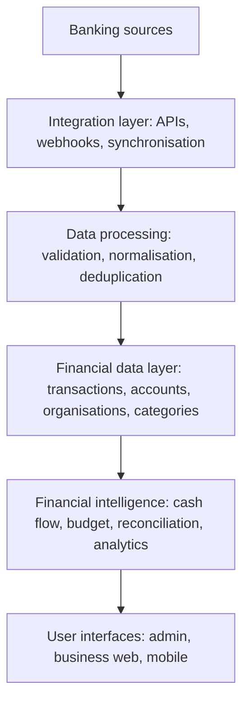

| Layer | Responsibility |
| --- | --- |
| Banking sources | KCB, NCBA, Equity and Stanbic accounts and channels |
| Integration layer | Provider APIs, webhook receivers and scheduled synchronisation |
| Data processing | Validation, normalisation and duplicate suppression |
| Financial data layer | Transactions, accounts, organisations and categories |
| Financial intelligence | Cash flow, budgets, reconciliation, collections and analytics |
| User interfaces | Admin portal, business portal and mobile application |

## 5. Domain architecture and components

There are four major applications or components: the admin web application, the business web
application, the mobile application and the backend.

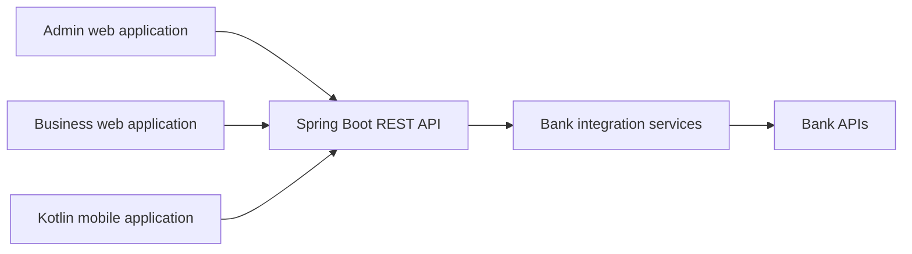

### 5.1 Admin web application

Technology: Angular. The admin application operates the platform and monitors organisations,
users, bank integrations, bank accounts, transactions, reconciliation, notifications, system
activity, reports and audit logs.

### 5.2 Business web application

Technology: Angular. Used by the business customer, covering financial overview, transactions,
reconciliation, budgeting, collections and financial intelligence.

### 5.3 Mobile application

Technology: Kotlin. Provides dashboard access, transaction notifications, account information,
collection monitoring, cash flow overview, alerts and reconciliation updates. It consumes the same
Spring Boot APIs as the Angular applications.

### 5.4 Backend

Technology: Spring Boot. The central business logic layer manages authentication, authorisation,
organisations, users, bank integrations, bank accounts, transactions, transaction processing,
reconciliation, financial calculations, notifications, audit logs, reporting and APIs.

The Angular frontend must not communicate with banks directly.

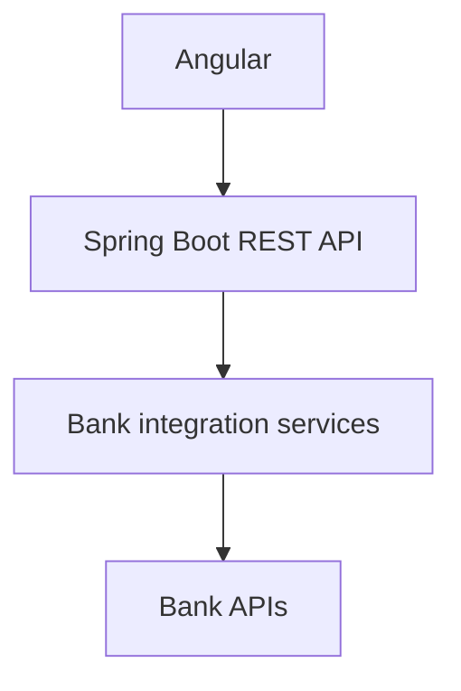

## 6. Database and core entities

Technology: PostgreSQL. It stores the structured financial and operational information of the
platform.

```text
Organisation            User                   Role
Bank                    BankIntegration        BankAccount
Transaction             TransactionCategory    Reconciliation
Notification            AuditLog               Budget
Collection              Report                 SystemEvent
```

## 7. Organisation and multi tenancy

An organisation represents a business using SmartMoney. Organisations are isolated from one
another because the platform is multi tenant.

```text
SmartMoney
    Organisation A
        Users, Accounts, Transactions
    Organisation B
        Users, Accounts, Transactions
    Organisation C
        Users, Accounts, Transactions
```

Organisation A must never see the financial information of Organisation B.

An organisation record carries a name, a business type, a user count, a bank account count and a
status. Example: Kamau Properties Ltd, property management, twelve users, eight bank accounts,
active.

## 8. Bank integration domain

This is one of the most important parts of the platform. The application must not assume that
every bank exposes an identical API. Instead, a common internal integration interface is created
and each bank implements it.

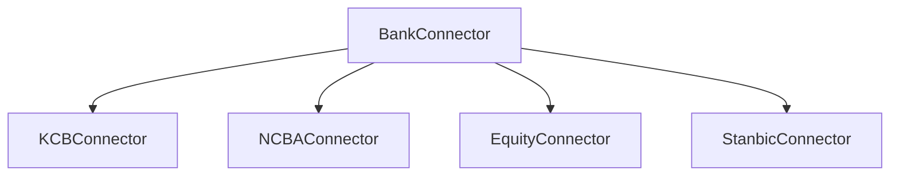

Each connector translates the bank API format into the internal SmartMoney format.

KCB provides a developer portal with a sandbox, API authentication, API subscriptions and account
service APIs, and it lists real time access to account information and instant payment
notifications among its capabilities. Stanbic provides a developer portal with API products
including instant payment notifications for reconciliation.

The architecture is therefore designed around provider specific capabilities rather than around
an assumption that all banks behave the same way.

## 9. API compared with webhook

An API lets SmartMoney request information from a bank. A webhook lets the bank notify SmartMoney
that an event has happened.

| Concept | Direction | Typical use | Timing |
| --- | --- | --- | --- |
| API | SmartMoney requests, bank responds | Transaction history, account details | On demand or scheduled |
| Webhook | Bank pushes, SmartMoney receives | New transaction, payment notification | Near real time where supported |

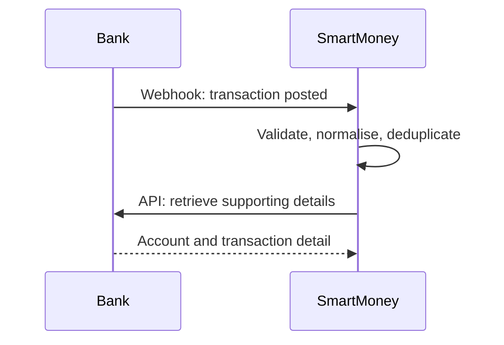

## 10. Transaction processing pipeline

Every incoming transaction passes through a controlled pipeline. This is one of the most important
domain concepts in the project.

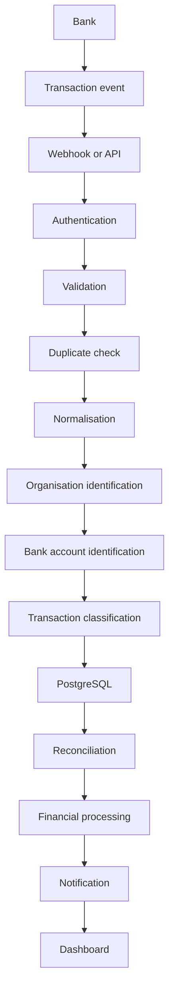

## 11. Transaction model

A transaction represents a financial movement.

| Field | Meaning |
| --- | --- |
| Transaction ID | Internal identifier |
| External reference | Identifier supplied by the bank |
| Organisation ID | Owning organisation |
| Bank ID | Originating bank |
| Bank account ID | Originating or receiving account |
| Transaction date | Date the transaction occurred |
| Value date | Date the funds are valued |
| Amount | Value of the movement |
| Currency | Currency of the movement |
| Transaction type | Income, expense or transfer |
| Description | Narration or narration as received |
| Category | Internal classification |
| Status | Processing state of the record |
| Source | Channel that delivered the record |
| Created at, updated at | Record timestamps |

### 11.1 Transaction types

| Type | Definition | Examples |
| --- | --- | --- |
| Income | Money entering the business | Rent received, customer payment, sales revenue |
| Expense | Money leaving the business | Supplier payment, utility bill, operating expense |
| Transfer | Movement between the business own accounts | Account A to account B |

A transfer must not be treated as revenue or as an expense. That distinction is essential for
accurate financial analysis.

## 12. Normalisation

Different banks return different formats. Bank A may return `amount`, `transactionRef`, `txnDate`
and `description`. Bank B may return `transactionAmount`, `reference`, `date` and `narration`.
SmartMoney converts both into a single internal format.

| Bank field example | Internal field |
| --- | --- |
| `amount`, `transactionAmount` | `amount` |
| `transactionRef`, `reference` | `externalReference` |
| `txnDate`, `date` | `transactionDate` |
| `description`, `narration` | `description` |

Normalisation allows the rest of the application to work independently of any specific bank API
format.

## 13. Idempotency and duplicate transactions

A bank or integration service may deliver the same transaction more than once. Financial systems
must therefore define a unique transaction identity, typically the combination of the bank and the
external transaction reference.

If the same reference is received again, the system must not create a new financial record.
Instead it records the duplicate event, updates the integration log, and returns a successful
processing response.

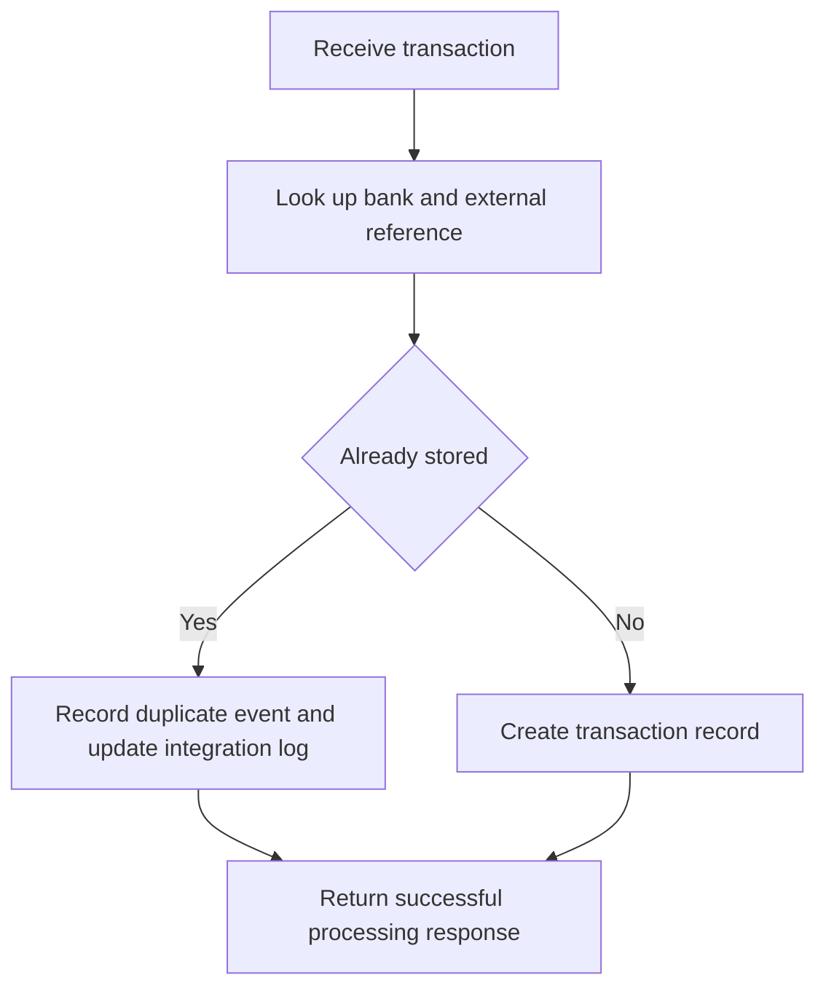

## 14. Reconciliation

Reconciliation means comparing two financial records to determine whether they agree. A business
may expect a rent payment of KES 50,000 while the bank records KES 50,000 against a different
reference. SmartMoney matches the two and records the outcome.

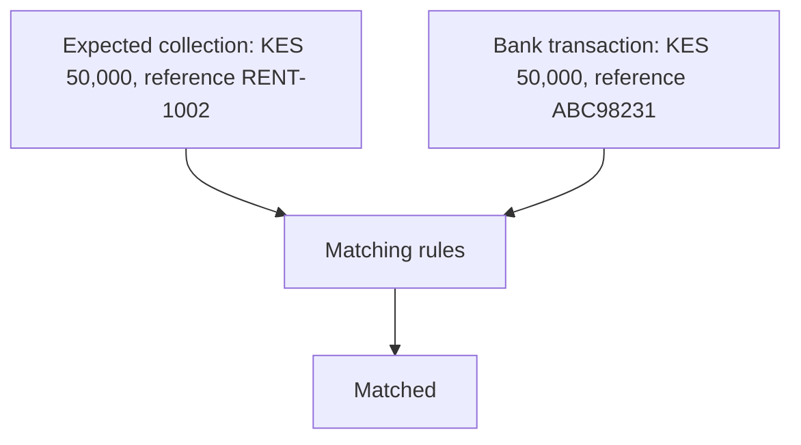

### 14.1 Reconciliation states

| State | Meaning |
| --- | --- |
| Matched | Expected and actual records agree |
| Unmatched | A transaction exists with no corresponding expected record |
| Duplicate | The same transaction appears more than once |
| Needs review | The system cannot determine the correct result with confidence |
| Failed | The reconciliation process could not complete |
| Partially paid | Part of an expected amount has been received |

### 14.2 Matching rules

Matching may consider amount, reference, date, account, payer, and invoice or collection
identifier. These rules must be configurable rather than permanently hard coded.

## 15. Cash flow

Cash flow measures the movement of money into and out of a business.

```text
Cash inflows minus cash outflows equals net cash flow

Income        KES 800,000
Expenses      KES 500,000
Net flow      KES 300,000
```

The platform reports cash flow across a day, week, month, quarter or year.

## 16. Budgeting

A budget represents planned financial activity. If a marketing budget is KES 100,000 and actual
spending is KES 75,000, the remaining amount is KES 25,000. Budget variance is the difference
between actual and planned values, and it is the primary signal for overspending.

## 17. Collections

Collections matter most to rental and property users. If expected rent is KES 1,000,000, received
rent is KES 820,000 and outstanding rent is KES 180,000, the platform must distinguish between
expected, received, outstanding, overdue and partially paid amounts. This turns the system into
more than a transaction viewer.

## 18. Financial intelligence

The intelligence layer converts raw transactions into useful information. One thousand raw
transactions become monthly revenue, monthly expenses, largest expense categories, cash flow
trend, collection rate, budget variance, recurring expenses and unusual changes.

The goal is not to display transactions. The goal is to help the business understand its financial
position.

## 19. Forecasting

Forecasting uses historical data to project future financial conditions: historical cash flow,
historical expenses, expected collections and upcoming obligations produce a projected cash
position.

```text
Current cash                KES 400,000
Expected collections        KES 600,000
Expected expenses           KES 350,000
Projected position          KES 650,000
```

Forecasts must always be labelled as projections or estimates and never presented as guaranteed
outcomes.

## 20. Financial opportunities

The platform can identify financing, lending, investment and asset acquisition opportunities and
prepare the financial information that supports an application or a decision. It must not promise
that a bank will approve financing.

## 21. Data integrity

| Property | Requirement |
| --- | --- |
| Accuracy | Transactions represent the source transaction correctly |
| Completeness | Required fields are present |
| Consistency | The same transaction carries consistent information throughout |
| Uniqueness | Duplicate transactions are detected |
| Traceability | Changes are recorded |
| Security | Sensitive information is protected |

## 22. Audit trail

Every important administrative action produces an audit record containing the actor, the action,
the affected resource, the timestamp and the result.

Examples of audited actions: organisation created, user suspended, bank integration connected,
transaction reviewed, reconciliation completed, settings changed, administrator login.

## 23. Risk and loss mitigation

The platform reduces financial risk through transaction validation, duplicate detection,
reconciliation, anomaly flags, budget monitoring, collection monitoring, audit trails, integration
monitoring and failed transaction monitoring.

Risk monitoring is not the same as guaranteeing the prevention of financial loss. The system
identifies issues and provides controls. It does not claim that losses can never occur.

## 24. Admin domain responsibilities

The administrator is the platform operations officer.

| Area | Question the admin answers |
| --- | --- |
| Organisations | Who uses SmartMoney |
| Users | Who has access |
| Banks | Which integrations are connected |
| Accounts | Which bank accounts are connected |
| Transactions | What financial data is flowing through the platform |
| Reconciliation | Are transactions matching correctly |
| Integration health | Are APIs and webhooks working |
| Audit | Who performed which administrative action |

## 25. Admin dashboard mental model

The admin dashboard answers six questions, and those questions drive the entire user experience.

| Question | Domain area |
| --- | --- |
| Who | Organisations and users |
| Where | Banks and accounts |
| What | Transactions |
| Is it correct | Reconciliation |
| Is it working | Integration and system health |
| What needs attention | Alerts and exceptions |

## 26. Bank integration health

For each bank the platform monitors API status, webhook status, authentication status, last
successful request, last webhook, transaction count, failed transactions, processing errors and
synchronisation status.

Possible states: healthy, connected, pending, warning, error and disconnected.

## 27. Integration error handling

Do not present a bare error. Provide operational information.

```text
KCB Integration

Status                  WARNING
Problem                 7 transactions failed processing
Last successful event   09:41
Affected organisations  3
Recommended action      Review failed transactions
```

## 28. Security domain

The platform handles sensitive financial information and therefore requires authentication,
authorisation, role based access control, secure API communication, encrypted credentials, masked
account numbers, audit logs, session management, secure webhook handling, input validation, rate
limiting and error logging that does not expose secrets.

The frontend must never contain bank client secrets, bank API secrets or webhook secrets. Bank
credentials remain server side.

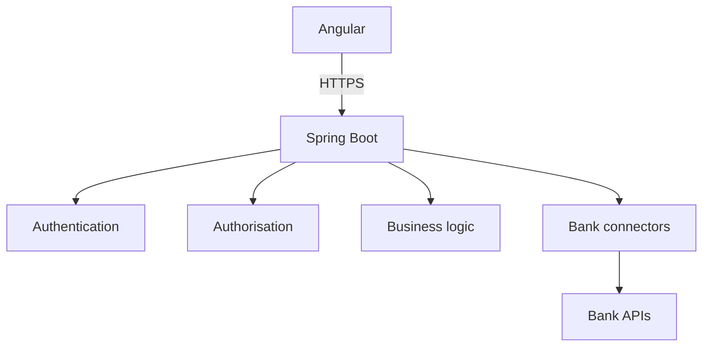

## 29. Multi tenant security

Every business financial data set must be scoped to its organisation. A request carries a token
which resolves to a user, which resolves to an organisation, which owns bank accounts and
transactions. If a user belongs to Organisation A, their API requests return Organisation A data
unless their role explicitly permits broader access.

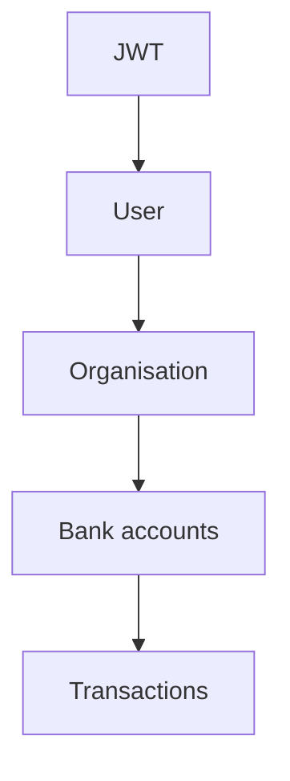

## 30. Core data relationships

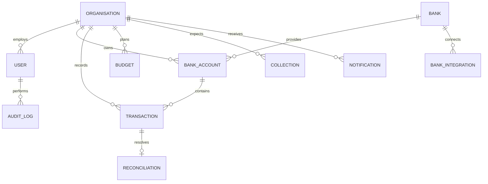

## 31. Recommended backend modules

```text
auth                organisation        user
bank                bankintegration     bankaccount
transaction         reconciliation      budget
collection          notification        audit
report              analytics
```

Within the bank integration module: `BankConnector`, `KcbConnector`, `NcbaConnector`,
`EquityConnector` and `StanbicConnector`. This allows a new bank to be added without redesigning
the system.

## 32. Recommended API structure

```text
/api/v1/auth
/api/v1/organisations
/api/v1/users
/api/v1/banks
/api/v1/bank-integrations
/api/v1/bank-accounts
/api/v1/transactions
/api/v1/reconciliation
/api/v1/budgets
/api/v1/collections
/api/v1/notifications
/api/v1/audit-logs
/api/v1/reports
```

Bank webhooks are separated by provider:

```text
/api/v1/webhooks/kcb
/api/v1/webhooks/ncba
/api/v1/webhooks/equity
/api/v1/webhooks/stanbic
```

The final paths must follow each provider integration requirements.

## 33. Bank integration strategy

Do not embed provider code into every service. Introduce one internal contract and let each
provider implement it.

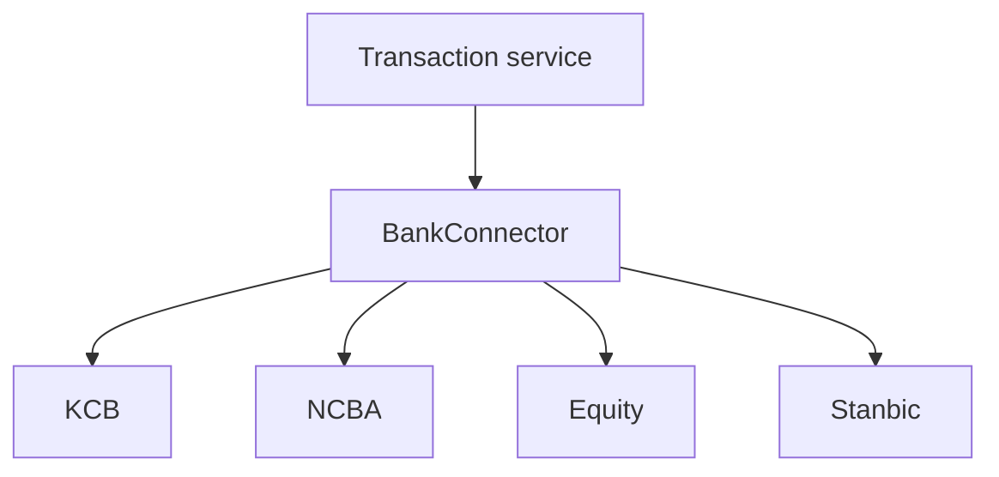

This is one of the most important architectural decisions for the platform.

## 34. MVP scope

| Area | Included in the first implementation |
| --- | --- |
| Authentication | Admin login, business login, role based access |
| Organisation management | Create organisation, users, organisation status |
| Bank integration | KCB, NCBA, Equity, Stanbic with sandbox or mock adapters where credentials are unavailable |
| Bank accounts | Connect account, account status, last synchronisation |
| Transactions | Receive, normalise, store, classify, display |
| Reconciliation | Match, unmatched, duplicate, review |
| Dashboard | Income, expenses, cash flow, transaction volume, reconciliation status |
| Admin monitoring | Integration health, errors, audit logs, notifications |

## 35. Statements to avoid

Do not state that SmartMoney is already connected to KCB, NCBA, Equity and Stanbic in production.

Instead state that SmartMoney is designed with a multi bank integration architecture supporting
KCB, NCBA, Equity and Stanbic, subject to each bank API access, sandbox availability and
production onboarding requirements.

KCB provides a sandbox for development, and production access requires completing the KCB
onboarding process. Until production credentials exist, the MVP legitimately demonstrates KCB in
sandbox and NCBA, Equity and Stanbic through sandbox or mock adapters.

## 36. Glossary

| Term | Meaning |
| --- | --- |
| Organisation | A business using SmartMoney |
| Bank integration | Connection between SmartMoney and a bank technology platform |
| Bank account | Financial account connected to SmartMoney |
| API | Interface used to exchange data between systems |
| Webhook | Event notification sent from one system to another |
| Transaction | Financial movement |
| Income | Money entering a business |
| Expense | Money leaving a business |
| Transfer | Movement between accounts |
| Reconciliation | Comparing financial records to determine whether they match |
| Matching | Linking an expected record to an actual transaction |
| Duplicate | Same transaction received more than once |
| Normalisation | Converting different bank data formats into one internal format |
| Cash flow | Movement of money into and out of a business |
| Budget | Planned financial spending or income |
| Collection | Money expected from customers or tenants |
| Financial intelligence | Analysis that converts financial data into useful information |
| Forecast | Estimate of future financial conditions based on available information |
| Audit log | Record of system and user activity |
| Multi tenancy | Multiple businesses using one platform with isolated data |
| Connector | Bank specific integration implementation |
| Idempotency | Processing the same event repeatedly without creating duplicate records |

## 37. One minute mental model

SmartMoney Intelligence is a multi tenant fintech SaaS platform that connects business bank
accounts to a centralised financial intelligence layer. It receives and normalises transaction
data from banking integrations, validates and stores the transactions, supports reconciliation
and collections, monitors cash flow and budgets, and turns financial activity into useful
business intelligence. The Angular web applications and the Kotlin mobile application consume
services from a Spring Boot backend, with PostgreSQL serving as the central data store.

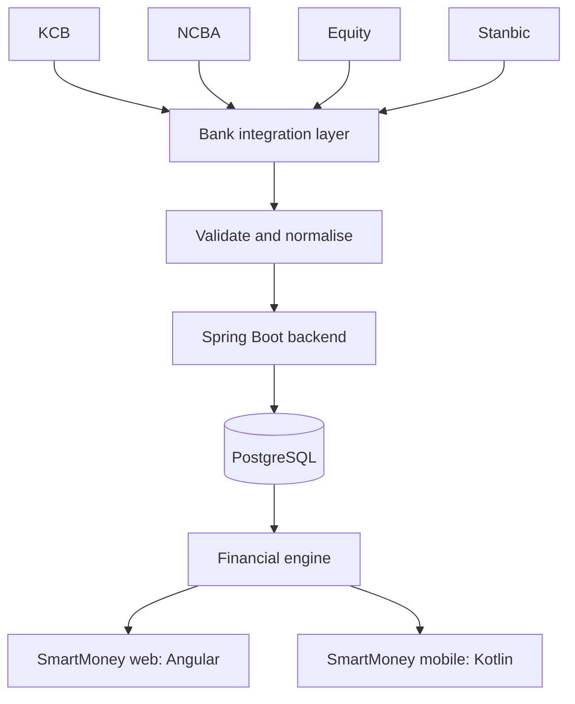

## 38. References

| Reference | Address |
| --- | --- |
| KCB BUNI developer portal | https://buni.kcbgroup.com/getting-started |
| Stanbic Bank API developer portal | https://sandbox.stanbicbank.co.ke/ |

## Revision history

| Version | Date | Summary |
| --- | --- | --- |
| 1.0 | 10 September 2026 | Initial domain and system reference |
