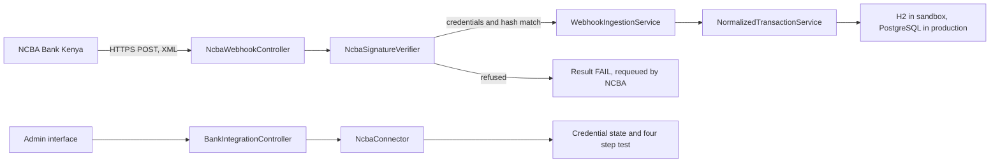

# SmartMoney Intelligence: NCBA Integration Setup

How to stand up the Spring Boot service for NCBA account level push notifications, prove the
endpoint locally, and hand NCBA the five values their configuration needs.

## Document control

| Field | Value |
| --- | --- |
| Document type | Integration runbook |
| Version | 1.0 |
| Status | Working. Endpoint verified locally end to end on 18 September 2026 |
| Owner | Eclectics, SmartMoney Intelligence |
| Last updated | 18 September 2026 |
| Related documents | [API contract](api-contract.md), [Stanbic integration setup](../admin-interface/docs/stanbic-integration-setup.md), [KCB real time trial](../admin-interface/docs/kcb-real-time-trial.md), [Public endpoint and trial runbook](public-endpoint-and-trial-runbook.md), [Service README](../backend/README.md) |
| Prerequisites | Java 21, Maven 3.9 or later, a public HTTPS address for the trial |

## 1. What NCBA gives and what NCBA needs

NCBA does not offer an API for this integration. There is nothing to call and nothing to
poll. NCBA pushes a notification to an address this service publishes, and the service has to
answer in a shape NCBA understands.

| Direction | Carried by | Controlled by |
| --- | --- | --- |
| NCBA to SmartMoney | An HTTPS POST carrying an XML body, on every credit and every debit on a watched account | The address and the credentials on our side |
| SmartMoney to NCBA | An XML response whose `Result` element carries the outcome | The acknowledgement rule in section 4 |

The integration therefore stands on five values, four of which we generate and one of which the
account holder supplies.

| Value | Source | Notes |
| --- | --- | --- |
| Notification endpoint URL | This service, from `PUBLIC_BASE_URL` | Must be HTTPS and must stay the same. NCBA configures it on their side |
| Secret key | Generated here, at least 16 alphanumeric characters | Never change it after it is submitted. Every `HashVal` depends on it |
| Username | Generated here | Sent in the body of every notification and checked against this value |
| Password | Generated here | Sent in the body of every notification and checked against this value |
| Account number | The account holder | The account NCBA watches. The service does not need it to receive, but NCBA needs it to route |

## 2. What this service implements

| Method | Path | Purpose |
| --- | --- | --- |
| GET | `/api/v1/webhooks/ncba` | Probe. Returns a short plain text page naming the provider, so NCBA or a reviewer can confirm the address in a browser |
| POST | `/api/v1/webhooks/ncba` | The notification endpoint. Accepts any content type, caps the body at 512 KB, and always answers HTTP 200 with an XML envelope |
| GET | `/api/v1/admin/bank-integrations/ncba` | Health for the NCBA tile: counts, last receipt, errors |
| GET | `/api/v1/admin/bank-integrations/ncba/credentials` | Which of the three endpoint credentials are loaded, masked. Never a value |
| GET | `/api/v1/admin/bank-integrations/ncba/webhook-url` | The address for the request letter, and whether it can actually be reached |
| POST | `/api/v1/admin/bank-integrations/ncba/test` | Four step connection test, see section 6 |

## 3. How a notification is verified

NCBA sends the username, the password and a `HashVal` in every notification. The service checks all
three before it stores anything.

`HashVal` is built in a fixed order and then encoded twice.

1. Concatenate, with no separator: the secret key, `TransType`, `TransID`, `TransTime`,
   `TransAmount`, `AccountNr`, `Narrative`, `PhoneNr`, `CustomerName`, `Status`.
2. Take the SHA-256 digest of that string.
3. Write the digest as lowercase hexadecimal, for example `9f2c...`.
4. Base64 encode that hexadecimal text, which is the string that travels in the notification.

The double encoding is unusual, but it is what all three of the NCBA code samples do, so it is
reproduced exactly. The service recomputes the hash from its own copy of the secret key and the
values in the notification, and compares. A mismatch is refused.

Two more rules follow from the specification.

- The sign on `TransAmount` carries the direction. A negative amount is a debit, and the stored
  transaction keeps the amount as a magnitude with the direction recorded separately.
- `TransTime` is `YYMMDDhhmm` with no zone. An unzoned value is read as East Africa Time, UTC+3.

Verification fails closed. With the check switched on and no secret key loaded, every notification
is refused rather than stored as though it were genuine.

## 4. How the endpoint answers

NCBA reads the `Result` element and requeues anything that does not contain the string `OK`, so a
refusal is answered with HTTP 200 and a value that says so, never with an error status.

| Situation | `Result` | Stored |
| --- | --- | --- |
| The credentials match and the hash verifies | `OK` | Yes |
| The same `TransID` has already been stored | `OK: Duplicate Notification` | No, the first copy is kept |
| The username or password does not match | `FAIL:` followed by the reason | No |
| The hash does not verify, or is missing | `FAIL:` followed by the reason | No |
| The body is not XML the service can read | `FAIL:` followed by the reason | No |
| The body is larger than 512 KB | `FAIL:` followed by the reason | No |

The duplicate check uses `TransID`, and it runs before anything is stored, so a notification
delivered twice is processed once. That duplicate check is also what NCBA's own user acceptance
testing asks for, because it can be demonstrated by sending the same `TransID` twice.

## 5. Configuration

Credentials live in `backend/bank-integration-service/.env.local`, which git ignores. Edit it through the
helper, which asks for each value and never writes a byte order mark:

```powershell
cd admin-interface\backend
.\set-credentials.ps1
```

| Variable | Meaning |
| --- | --- |
| `NCBA_SECRET_KEY` | The secret key sent to NCBA. At least 16 alphanumeric characters |
| `NCBA_USERNAME` | The username sent to NCBA |
| `NCBA_PASSWORD` | The password sent to NCBA |
| `NCBA_ACCOUNT_NUMBER` | The account NCBA watches. Optional for receiving, required for NCBA to route |
| `PUBLIC_BASE_URL` | The public HTTPS address NCBA can reach. The tunnel address during a trial |
| `NCBA_SIGNATURE_VERIFICATION` | Optional seed for the verification switch. Defaults to on |

The matching block in `application.yml` is:

```yaml
  ncba:
    environment: ${NCBA_ENV:SANDBOX}
    webhook-path: /api/v1/webhooks/ncba
    secret-key: ${NCBA_SECRET_KEY:}
    username: ${NCBA_USERNAME:}
    password: ${NCBA_PASSWORD:}
    account-number: ${NCBA_ACCOUNT_NUMBER:}
    signature-verification: ${NCBA_SIGNATURE_VERIFICATION:true}
```

### Where the verification switch lives

The switch in the admin interface, on the NCBA panel under Settings, is the authority. Saving it
changes what the endpoint does immediately, with no restart. The environment variable only supplies
the value until something has been saved, which is what keeps a fresh checkout failing closed.

Turning the switch off is a testing convenience. It stops the `HashVal` check, so a notification
that would otherwise be refused is stored unchecked. Leave it on for anything that is not a
deliberate trial.

## 6. The four step connection test

There is nothing at NCBA to call, so the test reports what this service has been given rather than
asking NCBA anything. It is on the NCBA panel, and it is also one request to the API.

| Step key | What it proves |
| --- | --- |
| `token` | The secret key, the username and the password are all loaded |
| `account-probe` | The account NCBA will watch is set |
| `webhook-registration` | The callback address resolves, so NCBA can deliver to it |
| `signature-verification` | A notification that arrives will be verified rather than refused |

The notification address step fails when the address is a stopped tunnel. A Cloudflare quick tunnel
is issued a new hostname every time it starts and the previous address stops resolving, so the value
in `PUBLIC_BASE_URL` is the first thing to go stale.

## 7. How the pieces fit together



The administrator sees whether notifications are arriving and whether they verify. Amounts,
balances and counterparties belong to the tenant application, which is a separate service and a
separate team, and no NCBA endpoint here returns them to the admin interface.

## 8. Running the trial

### Step 1, fill in the credentials

```powershell
cd "C:\Users\user\Desktop\ECLECTICS\SM-Intelligence\admin-interface\backend"
.\set-credentials.ps1
```

Enter the three NCBA values and the account number. The script prints only the last four characters
of each value, so the file never has to be opened.

### Step 2, start the service

```powershell
.\run-local.ps1 -Offline
```

The banner prints the NCBA credential state and the addresses to give the bank. Every NCBA value
shows as `set` or `MISSING`, so a missing value is obvious before anything else happens.

### Step 3, prove the address locally

```powershell
Invoke-WebRequest -Uri "http://localhost:8080/api/v1/webhooks/ncba" -UseBasicParsing
```

The answer names NCBA Bank Kenya. An address that answers on localhost still cannot be used by the
bank, which is step 4.

### Step 4, publish the address

Start a tunnel against the port the service runs on, put the address it prints into
`PUBLIC_BASE_URL`, and restart the service.

```powershell
cloudflared tunnel --url http://localhost:8080
```

Then probe the public address, not localhost, before it goes anywhere near NCBA:

```powershell
Invoke-WebRequest -Uri "https://your-tunnel-host/api/v1/webhooks/ncba" -UseBasicParsing
Invoke-RestMethod -Uri "http://localhost:8080/api/v1/admin/bank-integrations/ncba/webhook-url"
```

The second command reports `publiclyReachable` as `true` only when the address is public HTTPS and
its host resolves. That is a resolution check, not a delivery test, but it catches the failure that
actually happens, which is a tunnel that has stopped.

If `cloudflared` is not on the path, open a new terminal after the install so the updated path is
read, or call it by its full path. A quick tunnel prints a new hostname on every start, which is
workable for a trial and not workable for production.

For production, the address given to NCBA is
`https://globalsmartspaces.com/api/v1/webhooks/ncba`, served from cPanel by a PHP
port of this endpoint. Deployment and checks are in [NCBA endpoint on cPanel](../admin-interface/backend/deploy/cpanel/README.md).

### Step 5, rehearse a real notification

The rehearsal script computes the `HashVal` from the secret key in `.env.local`, so it exercises the
same check NCBA will exercise:

```powershell
.\tools\send-ncba-notification.ps1 -Amount 15000 -Direction Credit -Count 2
```

Two notifications are accepted with `OK`, and the NCBA tile then shows two more notifications and a
last webhook time that has just moved.

### Step 6, prove the refusal path

```powershell
.\tools\send-ncba-notification.ps1 -BreakHash
```

This sends a hash that cannot be right. The answer is `FAIL: HashVal did not match the values
sent`, nothing is stored, and the notification counts do not move. That is the endpoint working.

### Step 7, prove duplicate suppression

Run the same notification twice by naming the transaction:

```powershell
.\tools\send-ncba-notification.ps1 -TransId NCBA-DUPLICATE-TEST
.\tools\send-ncba-notification.ps1 -TransId NCBA-DUPLICATE-TEST
```

The second answer is `OK: Duplicate Notification` and the notification counts move once. NCBA's
acceptance testing asks for a duplicate checker, and this is it.

### Step 8, check what the administrator sees

```powershell
Invoke-RestMethod -Uri "http://localhost:8080/api/v1/admin/bank-integrations/ncba"
Invoke-RestMethod -Uri "http://localhost:8080/api/v1/admin/stats"
```

The first answer carries `notificationsTotal`, `notificationsToday`, `lastWebhookReceived`, and
`errorsLast24h`. The second is the platform view the dashboard reads. Both are measured, never
seeded, so an empty platform reports zeros.

## 9. What to give NCBA

Send these five values. Nothing else is required for the endpoint itself.

| Field | Value |
| --- | --- |
| Endpoint URL | The `PUBLIC_BASE_URL` address plus `/api/v1/webhooks/ncba` |
| Secret key | `NCBA_SECRET_KEY` |
| Username | `NCBA_USERNAME` |
| Password | `NCBA_PASSWORD` |
| Account number | The account to be watched |

The request letter template is held with the bank documentation as
`Bank Documentations\API Push Notification Request Letter.doc`. NCBA requires the endpoint to be
HTTPS and to answer POST with XML, which this endpoint does. Their optional OAuth 2.0 client
credentials flow is not implemented, because the endpoint with the three credentials is the
configuration they document as sufficient.

Two practical points, because both have cost a trial before.

1. Send the address that the service is actually listening on at the time of the test. A quick
   tunnel hostname changes on every restart, so agree a test window, or move to a stable address,
   before the letter goes out.
2. Keep a copy of the secret key. It can be rotated, but every notification in flight during the
   change fails the hash check, so a rotation is a coordinated change rather than a quiet one.

## 10. What a sandbox cannot prove

NCBA's integration is per account and is configured on their side, so the address and the
credentials have to be registered by them before a single real notification arrives. There is no
sandbox key that makes a test account produce notifications on its own.

| Question | Answered by local rehearsal | Answered only by NCBA |
| --- | --- | --- |
| Does the endpoint accept and verify an NCBA shaped notification | Yes | Also, with their own sender |
| Does a refused notification stay out of the database | Yes | Also |
| Is a repeated delivery stored once | Yes | Also |
| Are real credits and debits on the account delivered | No | Yes |
| Does the production address stay reachable | No | Yes |

The administrator does not see the account holder's balances or counterparties at any point. The
admin surface is operational: is the integration healthy, are notifications arriving, do they
verify.

## 11. Troubleshooting

| Symptom | Cause | What to do |
| --- | --- | --- |
| `FAIL: Signature verification is enabled but no secret key is configured` | `NCBA_SECRET_KEY` is empty and the switch is on | Set the secret key in `.env.local` and restart |
| `FAIL: The User element does not match the configured username` | The sender is using a different username | Confirm the exact value given to NCBA |
| `FAIL: HashVal did not match the values sent` | The secret key differs, or a field was reformatted in transit | Confirm the secret key, and that the sender concatenates in the documented order |
| Nothing arrives at all | The address is not public, the tunnel has stopped, or NCBA has not configured the account yet | Probe the public address, then confirm with NCBA that the subscription is active |
| The tile shows notifications but the address step fails | The tunnel restarted and took a new hostname | Put the new address in `PUBLIC_BASE_URL`, restart, and tell NCBA |
| `publiclyReachable` is `false` on a tunnel address | The hostname no longer resolves | Start the tunnel again and use the address it prints |

## Revision history

| Version | Date | Summary |
| --- | --- | --- |
| 1.0 | 18 September 2026 | NCBA endpoint, HashVal verification, four step connection test, rehearsal script and the request letter values. Verified locally end to end |
| 1.1 | 28 September 2026 | Production address on cPanel through a PHP port of the endpoint, see `admin-interface/backend/deploy/cpanel` |
