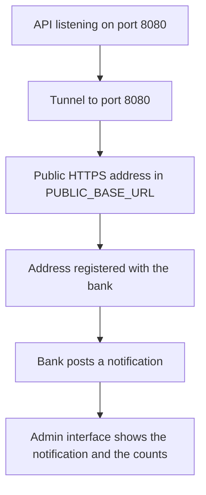

# SmartMoney Intelligence: Public Endpoint and Trial Runbook

The order to start things, how to give a bank a public address, and what to check when a trial
does not move. It covers Stanbic, KCB and NCBA, because all three depend on the same public
endpoint.

## Document control

| Field | Value |
| --- | --- |
| Document type | Runbook |
| Version | 1.0 |
| Status | Working, verified locally on 18 September 2026 |
| Owner | Eclectics, SmartMoney Intelligence |
| Last updated | 18 September 2026 |
| Related documents | [KCB real time trial](../admin-interface/docs/kcb-real-time-trial.md), [Stanbic integration setup](../admin-interface/docs/stanbic-integration-setup.md), [NCBA integration setup](ncba-integration-setup.md), [API contract](api-contract.md), [Service README](../backend/README.md) |
| Prerequisites | Java 21, Maven 3.9 or later, cloudflared, a paging file on the machine |

## 1. What has to be running, and in what order

The pieces depend on each other in one direction. The bank posts to a public address, the tunnel
forwards that address to port 8080, the API receives and stores the notification, and the admin
interface reads what the API stored.



Two windows, both left open while a trial runs.

| Step | Window | Command | What it proves |
| --- | --- | --- | --- |
| 1 | A | `.\run-local.ps1` in `admin-interface\backend` | The API answers on `http://localhost:8080` |
| 2 | B | `.\start-tunnel.ps1` in `admin-interface\backend` | The public address exists and is written to `.env.local` |
| 3 | A | Stop with Ctrl+C, then run `.\run-local.ps1` again | The API now prints the new public addresses |
| 4 | any | `.\run-collection.ps1` in `admin-interface\bruno` | The API answers the way the interface expects |

Step 3 exists because the API reads `PUBLIC_BASE_URL` once, at start up. Starting the tunnel first
and the API second is the same thing in one pass. With a named tunnel the restart happens once,
because the address does not change afterwards.

### Stopping everything again

```powershell
.\stop-local.ps1                # the API on port 8080 and any tunnel
.\stop-local.ps1 -KeepTunnel    # the API only
```

Do not reach for `Get-NetTCPConnection ... | Stop-Process -Force`. A connection object carries the
owner as `OwningProcess`, not as `Id`, so `Stop-Process` binds nothing and fails with
`Cannot bind argument to parameter 'Name' because it is null`, leaving the API running. The script
reads the owner first and also clears the Maven launcher that `spring-boot:run` leaves behind.

Stopping the tunnel makes the address in `PUBLIC_BASE_URL` dead. Start the tunnel again before the
API if the address matters for a trial.

## 2. Machine prerequisites

| Item | Why it matters |
| --- | --- |
| Java 21 and Maven 3.9 or later | The service and the test suite |
| cloudflared | The tunnel. Install with `winget install --id Cloudflare.cloudflared`, then open a new terminal |
| A paging file | Without one, Windows commit memory is capped at the installed RAM |

The paging file is not a preference. On a machine with 16 GB of RAM and no paging file, the commit
limit is about 15.8 GB, and three JVMs plus a browser reach it. The test run then fails in a way
that reads like a code fault:

```text
[ERROR] The forked VM terminated without properly saying goodbye. VM crash or System.exit called?
[WARNING] Corrupted channel by directly writing to native stream in forked JVM 1.
[INFO] Tests run: 0, Failures: 0, Errors: 0, Skipped: 0
```

The real cause is in the surefire dumpstream and in `hs_err_pidNNNN.log` in the `backend` folder:
`There is insufficient memory for the Java Runtime Environment to continue`, then
`Native memory allocation (malloc) failed to allocate ... Error detail: Chunk::new`.

Two defences, both worth having.

1. Add a paging file. Run `SystemPropertiesAdvanced.exe` as administrator, then Performance
   Settings, Advanced, Virtual memory Change, and set 4096 MB initial with 16384 MB maximum on C:.
   Reboot. This removes the ceiling.
2. Keep the test JVM small. `pom.xml` already caps it at `-Xmx1g` with a 384 MB metaspace and a
   192 MB code cache, so it no longer sizes itself from installed memory. The same suite then runs
   in about 30 seconds instead of several minutes of garbage collection.

## 3. The public address

A bank cannot reach `localhost`. Every trial needs an HTTPS address that resolves from the public
internet. `start-tunnel.ps1` opens the tunnel, reads the address back, and writes it into
`PUBLIC_BASE_URL`, which is the only setting involved.

### Quick tunnel, for a short trial

```powershell
cd "C:\Users\user\Desktop\ECLECTICS\SM-Intelligence\admin-interface\backend"
.\start-tunnel.ps1
```

Cloudflare issues a random address such as `https://calm-river-1234.trycloudflare.com`. It changes
every time the tunnel starts, which means any callback URL already handed to a bank stops working.
Use it to prove the path once, not to register.

If the tunnel connects and then drops every couple of minutes with
`Serve tunnel error ... timeout: no recent network activity`, and the start up pre-check table
shows `ERROR: Allow outbound QUIC traffic on port 7844`, the network is filtering Cloudflare's QUIC
transport. HTTP/2 over TCP 443 is then the working path, and it is the same port a browser uses:

```powershell
.\start-tunnel.ps1 -Protocol http2
```

Verified on this machine: the same command then reports `Initial protocol http2` and holds one
connection. The transport choice is written to `.tunnel-config.yml` next to the script, which git
ignores. cloudflared 2026.9.1 has no `--protocol` flag, so the script passes a small config file.

### Named tunnel, for a real trial

A named tunnel keeps one address for as long as the tunnel exists. Create it once, on a domain the
Cloudflare account controls:

```powershell
cloudflared tunnel login
cloudflared tunnel create sm-intelligence
cloudflared tunnel route dns sm-intelligence sm-intelligence.example.com
```

Then start it with the hostname each time:

```powershell
.\start-tunnel.ps1 -Hostname sm-intelligence.example.com
```

The address stays `https://sm-intelligence.example.com` across restarts, so the bank keeps the same
registered callback and nothing has to be re-registered after a reboot.

### When the tunnel runs somewhere else

If the tunnel is already running, as a service or on another machine, set the value and stop:

```powershell
.\start-tunnel.ps1 -PublicUrl https://sm-intelligence.example.com -NoTunnel
.\start-tunnel.ps1 -NoTunnel      # print what is set now, without changing it
```

## 4. Addresses to give each bank

| Bank | Addresses | What else they need |
| --- | --- | --- |
| Stanbic | `<PUBLIC_BASE_URL>/api/v1/webhooks/stanbic` and `<PUBLIC_BASE_URL>/oauth/stanbic/callback` | Account number, and the Token URL from the API product page |
| KCB | `<PUBLIC_BASE_URL>/api/v1/webhooks/kcb` | The notification address registered in BUNI against the sandbox Key and Secret |
| NCBA | `<PUBLIC_BASE_URL>/api/v1/webhooks/ncba` | The secret key, the username and the password, issued on the request letter, plus the account number to watch |

Every endpoint answers a GET with a readable confirmation naming the provider, so the address can be
checked in a phone browser before it is registered. That is the fastest way to prove the tunnel
address is live and reaching this service rather than something else.

## 5. Verifying, in the order that isolates a failure

| Level | Command | Expected |
| --- | --- | --- |
| 1 | `mvn -o test` in `admin-interface\backend` | `Tests run: 21, Failures: 0, Errors: 0`, no service needed |
| 2 | `Invoke-RestMethod http://localhost:8080/actuator/health` | `status: UP` |
| 3 | `GET /api/v1/webhooks/stanbic`, `/kcb`, `/ncba` | HTTP 200 with the provider banner |
| 4 | `.\run-collection.ps1` in `admin-interface\bruno` | 28 requests, 58 tests, PASS |
| 5 | `.\tools\send-kcb-notification.ps1 -Amount 15000 -Direction Credit -Count 3` | HTTP 200, `Accepted 3, rejected 0` |
| 6 | `.\tools\send-ncba-notification.ps1 -Amount 15000 -Direction Credit -Count 2` | HTTP 200, `Accepted 2, refused 0` |
| 7 | `POST /api/v1/admin/bank-integrations/<bank>/test` | A `steps` array; read each step, not only the `ok` flag |
| 8 | Open `<PUBLIC_BASE_URL>/actuator/health` on a phone | The same response as step 2, from outside the machine |

Levels 1 to 6 need nothing from a bank. Level 7 reaches the bank for Stanbic and KCB. Level 8 is the
only proof that the address handed to a bank is reachable.

## 6. Troubleshooting, from symptoms seen on this project

| Symptom | Cause | Fix |
| --- | --- | --- |
| Bruno summary reads 28 failed, `Tests 0/0`, every status blank, under 200 ms | Nothing was listening on 8080 | Start the API first, in its own window, and leave it running |
| `The forked VM terminated without properly saying goodbye`, `Tests run: 0` | Windows refused memory to the test JVM | Close the API and the editor language server, or add the paging file in section 2 |
| HTTP 415 Unsupported Media Type on a connection test | The request had no JSON content type | Send `-ContentType 'application/json' -Body '{}'` |
| A webhook POST answers 401 | Signature verification is on and the body is not signed with the matching key | Expected. Use the rehearsal script for a signed body, or switch verification off in Settings for a manual probe |
| The webhook endpoint answers 200 with a GET and the bank still cannot deliver | The registered callback was a quick tunnel address that has since been replaced | Move to a named tunnel and re-register, see section 3 |
| `Callback URL ... does not resolve` in a connection test | The tunnel printed a new address, or it is not running | Restart the tunnel, write the new value, restart the API |
| The tunnel connects, then drops every couple of minutes with `Serve tunnel error ... no recent network activity` | The network blocks Cloudflare QUIC on UDP 7844 | Rerun with `-Protocol http2`, which uses TCP 443 |
| Stanbic token request returns HTTP 404 `API not found for requested URI` | `STANBIC_TOKEN_URL` is empty, so the specification default is used | Copy the Token URL from the API product page into `.env.local` |
| KCB connection test says the credentials are not configured | No sandbox Key and Secret have been generated in BUNI | Generate them on the application page, then set `KCB_CLIENT_KEY` and `KCB_CLIENT_SECRET` |
| A key field holds something that starts with `https://` | A tunnel address was pasted into a key field | `set-credentials.ps1` now refuses that, and warns at start up if the file already holds one. Type `clear` at the prompt, then paste the real value |

## 7. Values a person still has to supply

Everything else in `.env.local` has a working default or has already been supplied.

| Value | Where it comes from |
| --- | --- |
| `STANBIC_TOKEN_URL` | The API product page on the Stanbic sandbox portal, next to `STANBIC_TOKEN_URL` |
| `KCB_CLIENT_KEY` and `KCB_CLIENT_SECRET` | Generated in BUNI for the application, once the sandbox Key and Secret are issued. The `KCB_CLIENT_KEY` entry currently holds a web address and should be cleared |
| `NCBA_ACCOUNT_NUMBER` | The account NCBA is asked to watch |
| `PUBLIC_BASE_URL` | Written by `start-tunnel.ps1` |

Never paste a bank secret into a chat, a document or a commit. `set-credentials.ps1` writes only to
`.env.local`, which git ignores.
