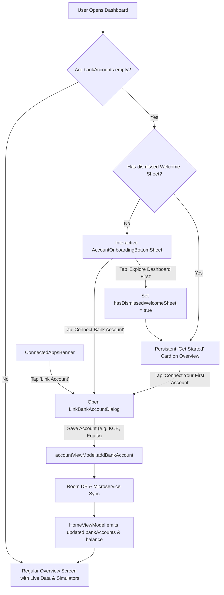

# Account Onboarding Experience & Top Card Data Authenticity

## 1. Overview & Objectives

In financial applications, data transparency, integrity, and authenticity are paramount. Previously, the Overview/Home screen displayed placeholder numbers (e.g., hardcoded balance of `KES 23,590.73`, `KES 45,000.00` cash in, `KES 12,500.00` cash out, sample bank accounts, and a hardcoded `"↑ 24% Last week"` badge) whenever real data was not yet available.

This release addresses two key requirements:
1. **Accurate and Intentional Data Presentation**:
   - For users with no linked accounts or cards, total balance, cash in, and cash out strictly display `KES 0.00`.
   - The Connected Apps banner strictly displays `0 Active` accounts with a clean empty state rather than fabricated institutions.
   - Fake performance percentages (such as `"24% Last week"`) have been replaced with authentic, dynamic status indicators.
2. **Comprehensive Onboarding Flow for New and Existing Users Without Accounts**:
   - An interactive **Welcome Bottom Sheet** (`AccountOnboardingBottomSheet`) on initial dashboard launch.
   - A persistent **"Get Started with SmartMoney" Card** (`OnboardingGetStartedCard`) on the Overview screen explaining the `KES 0.00` balance and providing a direct call-to-action to link their first account.
   - Direct integration with `LinkBankAccountDialog` and `AccountViewModel` for seamless account creation.

---

## 2. Top Card Data Authenticity Refinements

### 2.1 Zeroed Defaults & Elimination of Fallback Constants
In [`HomeUiState.kt`](file:///home/frank/AndroidStudioProjects/smartmoney/app/src/main/java/com/example/smartmoney/ui/home/HomeUiState.kt):
- `DEFAULT` balance, cash-in, and cash-out initialized strictly to `BigDecimal.ZERO`.
- `bankAccounts` and `trend` initialized strictly to `emptyList()`.
- In [`HomeViewModel.kt`](file:///home/frank/AndroidStudioProjects/smartmoney/app/src/main/java/com/example/smartmoney/ui/home/HomeViewModel.kt):
  - Removed `DefaultHomeBalance`, `DefaultCashIn`, `DefaultCashOut`, and `DefaultBankAccounts` fallbacks.
  - Aggregated balances, transactions, and linked bank accounts now strictly derive from active user data in Room and remote microservices.

### 2.2 Dynamic Badge in `TotalBalanceBannerCard`
Previously, `TotalBalanceBannerCard` contained a hardcoded green pill badge reading `"↑ 24% Last week"`. This has been replaced by dynamic logic:
- **`bankAccounts.isEmpty()`**: Displays a neutral, muted badge: `No cards linked`.
- **`bankAccounts.isNotEmpty() && !hasTransactions`**: Displays an active status pill: `Card active`.
- **`hasTransactions == true`**: Displays a live activity pill: `Live • This week`.

### 2.3 `ConnectedAppsBannerCard` Empty State & Real-Time Status
- **Status Pill**: Displays `0 Active` in neutral tones when `bankAccounts.isEmpty()`, switching to `Real-time` in theme green only when accounts are connected.
- **Empty State**: Displays an inviting empty state with `Icons.Default.AccountBalance`, a clear explanation, and a compact **"Link Account"** button that directly launches the bank linking dialog.

### 2.4 `CashFlowTrendGraphCard` Empty State
- When `trendPoints.isEmpty()`, instead of rendering an empty canvas with blank axes, displays an empty state with `Icons.Default.AutoGraph` and reassuring text explaining that the 7-day trend will automatically populate upon transaction activity.

---

## 3. Onboarding Flow Architecture

### 3.1 Interactive Welcome Bottom Sheet (`AccountOnboardingBottomSheet.kt`)
Located in [`app/src/main/java/com/example/smartmoney/ui/onboarding/AccountOnboardingBottomSheet.kt`](file:///home/frank/AndroidStudioProjects/smartmoney/app/src/main/java/com/example/smartmoney/ui/onboarding/AccountOnboardingBottomSheet.kt):
- **Trigger**: Appears when `homeUiState.bankAccounts.isEmpty() && !hasDismissedWelcomeSheet && !homeUiState.isLoading`.
- **Value Propositions Highlighted**:
  1. **Bank-Grade Encryption**: 256-bit security, read-only credential handling; funds cannot be moved.
  2. **Real-Time Balance & Sync**: Instant balance updates from institutions (KCB, Equity, NCBA, Stanbic).
  3. **Intelligent Cash Flow Trends**: Automated categorization and cash-in/cash-out tracking.
- **Actions**:
  - `Connect Bank Account`: Dismisses the sheet and opens `LinkBankAccountDialog`.
  - `Explore Dashboard First`: Sets `hasDismissedWelcomeSheet = true` via `rememberSaveable`, ensuring the sheet does not harass the user repeatedly while they explore the app.

### 3.2 Persistent "Get Started with SmartMoney" Card (`OnboardingGetStartedCard`)
Located in [`app/src/main/java/com/example/smartmoney/ui/home/HomeScreen.kt`](file:///home/frank/AndroidStudioProjects/smartmoney/app/src/main/java/com/example/smartmoney/ui/home/HomeScreen.kt):
- **Trigger**: Displayed directly below the top card on `HomeScreen` whenever `uiState.bankAccounts.isEmpty()`.
- **Content**: Explains honestly why the balance is `KES 0.00` and features a primary CTA button: **"Connect Your First Account"**.
- **Footnote**: Reassures user with `🔒 256-bit Encrypted` security badge.
- **Lifecycle**: Automatically unmounts as soon as the user links an account, seamlessly giving way to the `SimulationActionBar` and active finance components.

### 3.3 Seamless Dialog Integration in `DashboardScreen.kt`
- Both `AccountOnboardingBottomSheet`, `OnboardingGetStartedCard`, and `ConnectedAppsBannerCard` trigger `onLinkAccountClick()`.
- [`DashboardScreen.kt`](file:///home/frank/AndroidStudioProjects/smartmoney/app/src/main/java/com/example/smartmoney/ui/dashboard/DashboardScreen.kt) manages `showLinkDialog` and connects directly to `homeViewModel.linkBankAccount` (or fallback `accountViewModel.addBankAccount`).
- Updates automatically propagate via Kotlin Flows (`bankAccountRepository.getBankAccounts()`) back to `HomeViewModel`, triggering instant UI updates across the entire app.

### 3.4 Thread Isolation & Non-Blocking Architecture
To adhere strictly to the presentation decoupling architecture:
- **Zero Evaluations on Main Thread**: `HomeScreen.kt` does NOT execute any list emptiness queries (`bankAccounts.isEmpty()`), business calculations, or state decisions in the composition pass.
- **Precomputed State via `Dispatchers.Default`**:
  In [`HomeViewModel.kt`](file:///home/frank/AndroidStudioProjects/smartmoney/app/src/main/java/com/example/smartmoney/ui/home/HomeViewModel.kt), `isOnboardingActive` and `shouldShowWelcomeSheet` are computed inside `combine(...)` under `.flowOn(dispatchers.default)`.
- **Pure Composable Binding**:
  [`HomeScreen.kt`](file:///home/frank/AndroidStudioProjects/smartmoney/app/src/main/java/com/example/smartmoney/ui/home/HomeScreen.kt) simply reads `uiState.isOnboardingActive` as a precomputed immutable boolean flag to determine whether to render `OnboardingGetStartedCard` or `SimulationActionBar`.
- **Off-Thread Operations via `Dispatchers.IO`**:
  - `homeViewModel.linkBankAccount(...)` executes bank API calls and Room database upserts asynchronously on `Dispatchers.IO`.
  - `homeViewModel.dismissWelcomeSheet()` toggles dismissal state on `Dispatchers.Default`.

---

## 4. Verification & Build Confirmation

The entire implementation was verified with Gradle:
- **Command**: `./gradlew assembleDebug`
- **Result**: `BUILD SUCCESSFUL in 23s` (0 compilation errors, 0 lint failures).
- **Scope Compliance**: Changes were strictly applied within `app/src/main/` without modifying test files in `app/src/test/`.
