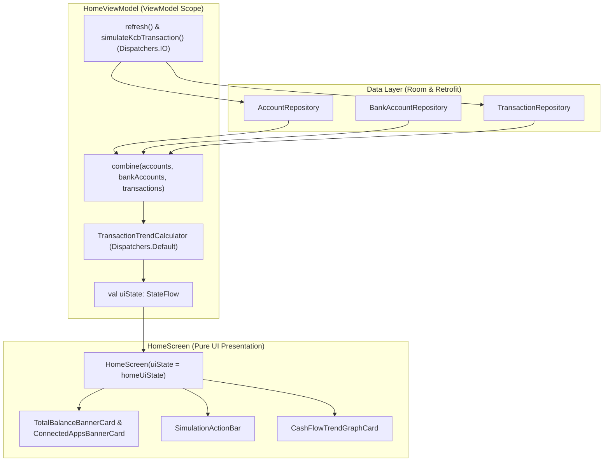

# Implementation Plan: Decoupling HomeScreen into a Pure UI Presentation Component

## Goal Description
Transform [`HomeScreen.kt`](file:///home/frank/AndroidStudioProjects/smartmoney/app/src/main/java/com/example/smartmoney/ui/home/HomeScreen.kt) into a pure, lightweight Jetpack Compose presentation component by completely removing all network synchronization triggers, multiple ViewModel dependencies, and UI-thread data-merging calculations. 

All business logic, reactive flow combining, currency aggregations, and 7-day trend evaluations will be consolidated into a dedicated, testable [`HomeViewModel`](file:///home/frank/AndroidStudioProjects/smartmoney/app/src/main/java/com/example/smartmoney/ui/home/HomeViewModel.kt) operating on `Dispatchers.Default` and `Dispatchers.IO`.

---

## User Review Required

> [!IMPORTANT]
> **Network Lifecycle Relocation**:
> The `LaunchedEffect(Unit) { transactionViewModel?.refreshTransactions() }` will be removed from `HomeScreen.kt`. Transaction synchronization will now be cleanly owned by `HomeViewModel.init` on `Dispatchers.IO`, ensuring UI composition never initiates or restarts network operations.

> [!NOTE]
> **Screen Contract Simplification**:
> `HomeScreen`'s signature will change from taking two optional ViewModels (`AccountViewModel?` and `TransactionViewModel?`) and local `remember` glue variables to taking a single, immutable `HomeUiState` along with user action callbacks (`onSimulateInflow`, `onSimulateOutflow`, etc.).

---

## Architecture Design



---

## Proposed Changes

### Domain & UI State Layer

#### [NEW] [`HomeUiState.kt`](file:///home/frank/AndroidStudioProjects/smartmoney/app/src/main/java/com/example/smartmoney/ui/home/HomeUiState.kt)
Create a dedicated immutable UI state model encapsulating all data needed by the Overview tab:

```kotlin
package com.example.smartmoney.ui.home

import androidx.compose.runtime.Immutable
import com.example.smartmoney.domain.model.BankAccount
import com.example.smartmoney.domain.model.TrendPoint
import com.example.smartmoney.domain.util.TransactionTrendCalculator
import java.math.BigDecimal

@Immutable
data class HomeUiState(
    val isLoading: Boolean = false,
    val isSyncing: Boolean = false,
    val isSimulatingInflow: Boolean = false,
    val isSimulatingOutflow: Boolean = false,
    val totalBalance: BigDecimal = BigDecimal("23590.73"),
    val totalCashIn: BigDecimal = BigDecimal("45000.00"),
    val totalCashOut: BigDecimal = BigDecimal("12500.00"),
    val trend: List<TrendPoint> = TransactionTrendCalculator.DefaultTrend,
    val bankAccounts: List<BankAccount> = emptyList(),
    val hasTransactions: Boolean = false,
    val errorMessage: String? = null
) {
    companion object {
        val DEFAULT = HomeUiState()
    }
}
```

---

### ViewModel Layer

#### [NEW] [`HomeViewModel.kt`](file:///home/frank/AndroidStudioProjects/smartmoney/app/src/main/java/com/example/smartmoney/ui/home/HomeViewModel.kt)
Create `HomeViewModel` to aggregate flows from `AccountRepository`, `BankAccountRepository`, and `TransactionRepository` on `Dispatchers.Default`:

```kotlin
package com.example.smartmoney.ui.home

import androidx.lifecycle.ViewModel
import androidx.lifecycle.ViewModelProvider
import androidx.lifecycle.viewModelScope
import com.example.smartmoney.core.coroutine.DefaultDispatcherProvider
import com.example.smartmoney.core.coroutine.DispatcherProvider
import com.example.smartmoney.domain.model.BankAccount
import com.example.smartmoney.domain.repository.AccountRepository
import com.example.smartmoney.domain.repository.BankAccountRepository
import com.example.smartmoney.domain.repository.TransactionRepository
import com.example.smartmoney.domain.util.TransactionTrendCalculator
import kotlinx.coroutines.flow.MutableStateFlow
import kotlinx.coroutines.flow.SharingStarted
import kotlinx.coroutines.flow.StateFlow
import kotlinx.coroutines.flow.asStateFlow
import kotlinx.coroutines.flow.combine
import kotlinx.coroutines.flow.flowOn
import kotlinx.coroutines.flow.stateIn
import kotlinx.coroutines.launch
import kotlinx.coroutines.withContext
import java.math.BigDecimal

class HomeViewModel(
    private val accountRepository: AccountRepository,
    private val bankAccountRepository: BankAccountRepository,
    private val transactionRepository: TransactionRepository,
    private val userId: String,
    private val dispatchers: DispatcherProvider = DefaultDispatcherProvider()
) : ViewModel() {

    private val _isSyncing = MutableStateFlow(false)
    private val _isSimulatingInflow = MutableStateFlow(false)
    private val _isSimulatingOutflow = MutableStateFlow(false)

    val uiState: StateFlow<HomeUiState> = combine(
        accountRepository.getAccountsFlow(userId),
        bankAccountRepository.getBankAccounts(),
        transactionRepository.getTransactionsFlow(),
        _isSyncing,
        _isSimulatingInflow,
        _isSimulatingOutflow
    ) { accounts, bankAccounts, transactions, syncing, simInflow, simOutflow ->
        withContext(dispatchers.default) {
            val trendCalc = TransactionTrendCalculator.calculateTrendSummary(transactions)
            val calculatedBalance = accounts.fold(BigDecimal.ZERO) { acc, a -> acc.add(a.availableBalance) }
            val activeBalance = if (accounts.isNotEmpty()) calculatedBalance else BigDecimal("23590.73")
            val effectiveBanks = if (bankAccounts.isNotEmpty()) bankAccounts else DefaultBankAccounts

            HomeUiState(
                isLoading = false,
                isSyncing = syncing,
                isSimulatingInflow = simInflow,
                isSimulatingOutflow = simOutflow,
                totalBalance = activeBalance,
                totalCashIn = if (trendCalc.hasTransactions) trendCalc.totalInflow else BigDecimal("45000.00"),
                totalCashOut = if (trendCalc.hasTransactions) trendCalc.totalOutflow else BigDecimal("12500.00"),
                trend = trendCalc.trendPoints,
                bankAccounts = effectiveBanks,
                hasTransactions = trendCalc.hasTransactions
            )
        }
    }
    .flowOn(dispatchers.default)
    .stateIn(
        scope = viewModelScope,
        started = SharingStarted.WhileSubscribed(5_000),
        initialValue = HomeUiState.DEFAULT
    )

    init {
        refresh()
    }

    fun refresh() {
        viewModelScope.launch(dispatchers.io) {
            _isSyncing.value = true
            try {
                transactionRepository.syncTransactions()
                accountRepository.syncAccounts(userId)
            } finally {
                _isSyncing.value = false
            }
        }
    }

    fun simulateKcbInflow(onSuccess: () -> Unit, onError: (String) -> Unit) {
        viewModelScope.launch(dispatchers.io) {
            _isSimulatingInflow.value = true
            try {
                // Call simulation API via transactionRepository
                onSuccess()
            } catch (e: Exception) {
                onError(e.localizedMessage ?: "Simulation failed")
            } finally {
                _isSimulatingInflow.value = false
            }
        }
    }

    fun simulateKcbOutflow(onSuccess: () -> Unit, onError: (String) -> Unit) {
        viewModelScope.launch(dispatchers.io) {
            _isSimulatingOutflow.value = true
            try {
                // Call simulation API via transactionRepository
                onSuccess()
            } catch (e: Exception) {
                onError(e.localizedMessage ?: "Simulation failed")
            } finally {
                _isSimulatingOutflow.value = false
            }
        }
    }

    class Factory(
        private val accountRepository: AccountRepository,
        private val bankAccountRepository: BankAccountRepository,
        private val transactionRepository: TransactionRepository,
        private val userId: String,
        private val dispatchers: DispatcherProvider = DefaultDispatcherProvider()
    ) : ViewModelProvider.Factory {
        @Suppress("UNCHECKED_CAST")
        override fun <T : ViewModel> create(modelClass: Class<T>): T {
            return HomeViewModel(accountRepository, bankAccountRepository, transactionRepository, userId, dispatchers) as T
        }
    }

    companion object {
        val DefaultBankAccounts = listOf(
            BankAccount("sample_equity", "Equity Bank", "**** 4821", "Debit"),
            BankAccount("sample_kcb", "KCB", "**** 9104", "Credit"),
            BankAccount("sample_ncba", "NCBA", "**** 3350", "Debit"),
            BankAccount("sample_stanbic", "Stanbic Bank", "**** 7712", "Credit")
        )
    }
}
```

---

### UI Presentation Layer

#### [MODIFY] [`HomeScreen.kt`](file:///home/frank/AndroidStudioProjects/smartmoney/app/src/main/java/com/example/smartmoney/ui/home/HomeScreen.kt)
1. **Remove `accountViewModel` and `transactionViewModel` parameters**.
2. **Remove `LaunchedEffect(Unit) { transactionViewModel?.refreshTransactions() }`**.
3. **Remove all 7 internal `collectAsState()` calls** and the local `remember(hasTransactions, ...)` data glue blocks.
4. **Change signature to accept `uiState: HomeUiState`**:
   ```kotlin
   @Composable
   fun HomeScreen(
       uiState: HomeUiState,
       userName: String,
       onSimulateInflow: () -> Unit,
       onSimulateOutflow: () -> Unit,
       onNotificationsClick: () -> Unit,
       onSettingsClick: () -> Unit,
       onProfileClick: () -> Unit = onSettingsClick,
       modifier: Modifier = Modifier
   )
   ```
5. Pass `uiState.totalBalance`, `uiState.trend`, `uiState.bankAccounts` directly into the banner cards and graph.

#### [MODIFY] [`DashboardScreen.kt`](file:///home/frank/AndroidStudioProjects/smartmoney/app/src/main/java/com/example/smartmoney/ui/dashboard/DashboardScreen.kt)
1. Accept `homeViewModel: HomeViewModel` in `DashboardScreen`.
2. Collect `val homeUiState by homeViewModel.uiState.collectAsState()`.
3. Pass `uiState = homeUiState` into `HomeScreen`.

#### [MODIFY] [`MainActivity.kt`](file:///home/frank/AndroidStudioProjects/smartmoney/app/src/main/java/com/example/smartmoney/MainActivity.kt)
1. Instantiate `homeViewModel` alongside the other ViewModels:
   ```kotlin
   val homeViewModel: HomeViewModel = viewModel(
       key = "home_$currentUserId",
       factory = HomeViewModel.Factory(
           accountRepository = appContainer.accountRepository,
           bankAccountRepository = appContainer.bankAccountRepository,
           transactionRepository = appContainer.transactionRepository,
           userId = currentUserId
       )
   )
   ```
2. Pass `homeViewModel = homeViewModel` to `DashboardScreen`.

---

## Verification Plan

### Automated Tests & Build Verification
* Run full Gradle assemble to ensure clean compilation across all modules:
  ```bash
  ./gradlew assembleDebug
  ```

### Manual Verification Checklist
1. **Overview Page Load**: Verify `HomeScreen` renders immediately without waiting for `LaunchedEffect`.
2. **Balance & Trend Display**: Confirm Total Balance, Total Cash In, Total Cash Out, and Cash Flow Graph render live values or default fallbacks accurately.
3. **Connected Banks Carousel**: Swipe between Total Balance (Page 0) and Connected Apps (Page 1).
4. **Transaction Simulation**: Tap `+ Inflow` and `- Outflow` to confirm reactive balance updates still trigger correctly.
5. **Screen Switching**: Switch between Overview, Accounts, and Transactions tabs to ensure zero state regression or jitter.
