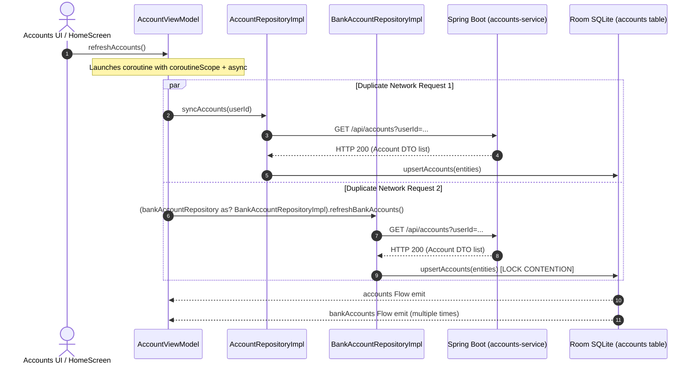
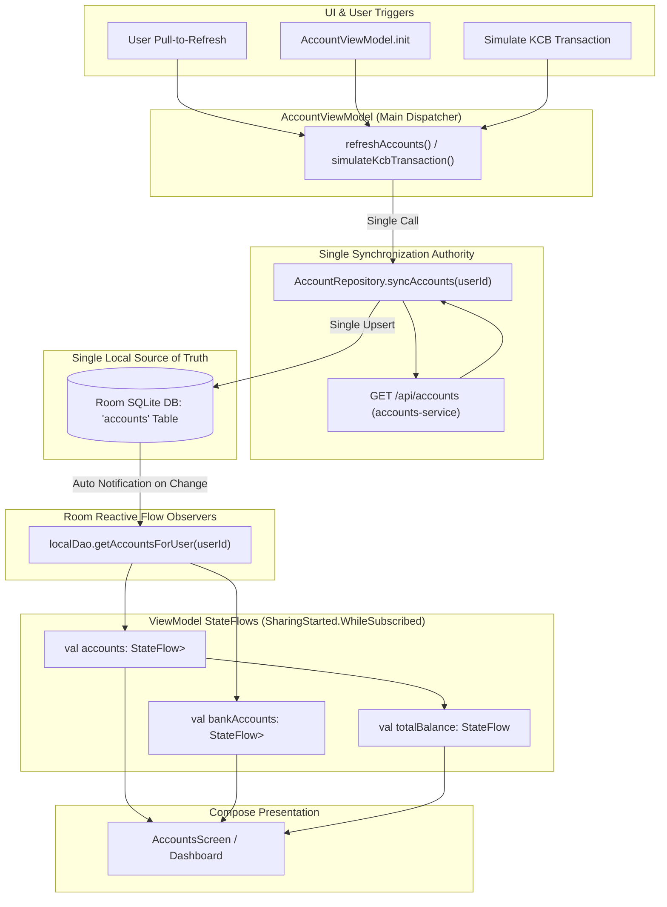
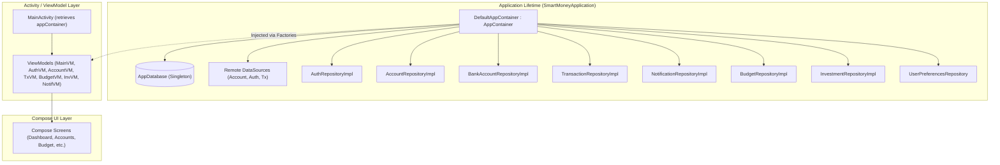
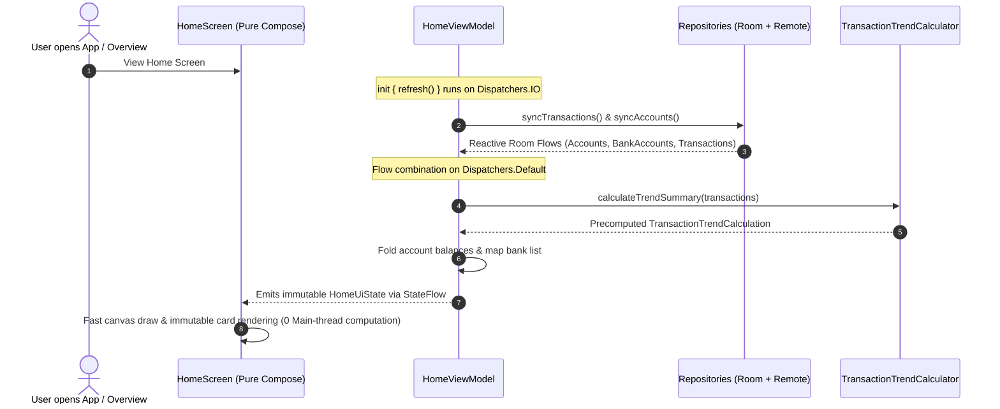

# SmartMoney Performance & Concurrency Remediation Report

## Implementation: Finding F-02 — Elimination of Duplicate Account Synchronization

**Date:** September 30, 2026  
**Target:** SmartMoney Android Mobile Application (`app/src/main/...`)  
**Scope:** Production Source Code (`BankAccountRepository`, `BankAccountRepositoryImpl`, `AccountViewModel`, `MainActivity`)

---

## 1. Executive Summary

Finding **F-02** in the comprehensive performance and concurrency audit identified duplicate account synchronization occurring whenever accounts were refreshed or simulated transactions executed.

Two separate repository pipelines—`AccountRepository.syncAccounts(userId)` and `BankAccountRepository.refreshBankAccounts()`—were concurrently hitting the Spring Boot `accounts-service` (`GET /api/accounts?userId={id}`), parsing identical JSON payloads into separate domain objects, and attempting concurrent write operations into the exact same Room SQLite table (`accounts`).

This resulted in:
1. **Redundant Network Work**: Two HTTP calls initiated simultaneously for identical account data.
2. **Database Write Contention**: SQLite write-lock contention between concurrent `upsertAccounts()` calls.
3. **Redundant UI State Emissions**: Multiple invalidations causing churn in downstream Compose observers.
4. **Architectural Code Smells**: Downcasting interface types `(bankAccountRepository as? BankAccountRepositoryImpl)` to invoke synchronization and balance adjustments.

This remediation establishes a **Single Source of Truth** architecture:
* `AccountRepository.syncAccounts(userId)` is the sole authoritative synchronization mechanism.
* `refreshBankAccounts()` has been completely removed from `BankAccountRepositoryImpl`.
* Local database mutations trigger reactive Room `Flow` queries observed by both `Account` and `BankAccount` presentation models.
* Interface contracts have been normalized by promoting `adjustKcbBalance(delta: BigDecimal)` to `BankAccountRepository`.
* Repository instantiations inside Compose (`MainActivity.kt`) are properly scoped via `remember(currentUserId)` to prevent recreation on recomposition.

---

## 2. Problem Analysis & Root Cause

### 2.1 The Redundant Execution Path (Before)

When the user opened the Accounts screen or triggered a pull-to-refresh, `AccountViewModel.refreshAccounts()` executed:



### 2.2 Root Causes Identified
1. **Parallel Redundant Fetching**: Both `AccountRepositoryImpl` and `BankAccountRepositoryImpl` called `remoteDataSource.fetchAccounts(userId)`.
2. **Duplicate Room Table Writes**: Both repositories wrote to `localDao.upsertAccounts(entities)` on the `accounts` table. Because SQLite is single-writer, the two concurrent transactions contended for the database write lock.
3. **Multiple Recompositions**: Room's `InvalidationTracker` fired twice in rapid succession, producing redundant emissions across `accounts`, `bankAccounts`, and `totalBalance` StateFlows.
4. **Fragile Downcasting**: `AccountViewModel` used `(bankAccountRepository as? BankAccountRepositoryImpl)?.refreshBankAccounts()` and `?.adjustKcbBalance(delta)` because those functions were omitted from `BankAccountRepository`.
5. **MainActivity Instantiation Churn**: `BankAccountRepositoryImpl` was constructed directly inside `MainActivity`'s Compose tree without `remember`, creating garbage and new repository instances on recompositions.

---

## 3. Remediation Architecture (Single Source of Truth)

### 3.1 Architecture Overview



### 3.2 Single Ownership Rules
| Responsibility | Owner | Mechanism |
| :--- | :--- | :--- |
| **Remote Synchronization** | `AccountRepository` | `syncAccounts(userId)` performs network fetch and SQLite upsert. |
| **Local Cache & Storage** | Room Database | Table `accounts` managed via `AccountDao`. |
| **Domain Presentation** | `Account` StateFlow | Observed via `AccountRepository.getAccountsFlow(userId)`. |
| **Bank Presentation** | `BankAccount` StateFlow | Observed via `BankAccountRepository.getBankAccounts()`. |
| **Local Balance Adjustment** | `BankAccountRepository` | `adjustKcbBalance(delta)` updates Room row directly. |

---

## 4. Code Changes Summary

### 4.1 `domain/repository/BankAccountRepository.kt`
- Added `import java.math.BigDecimal`.
- Promoted `suspend fun adjustKcbBalance(delta: BigDecimal)` to the domain repository interface so consumers do not require implementation downcasting.

### 4.2 `data/repository/BankAccountRepositoryImpl.kt`
- **Removed** `refreshBankAccounts()` completely, eliminating duplicate fetch and upsert logic.
- Implemented `override suspend fun adjustKcbBalance(delta: BigDecimal)`.

### 4.3 `ui/accounts/AccountViewModel.kt`
- **Refactored `refreshAccounts()`**: Removed `coroutineScope`, `async`, and `awaitAll`. Replaced with a single call to `repository.syncAccounts(userId)`.
- **Refactored `simulateKcbTransaction()`**:
  - Removed redundant `(bankAccountRepository as? BankAccountRepositoryImpl)?.refreshBankAccounts()`.
  - Replaced downcast `(bankAccountRepository as? BankAccountRepositoryImpl)?.adjustKcbBalance(delta)` with direct `bankAccountRepository.adjustKcbBalance(delta)`.
- **Removed Unused Coroutine Imports**: Cleaned up `async`, `awaitAll`, and `coroutineScope`.

### 4.4 `MainActivity.kt`
- Wrapped `BankAccountRepositoryImpl` instantiation inside `remember(currentUserId) { ... }`, preventing repository recreation on every composable pass.

---

## 5. Verification & Performance Impact

### 5.1 Verification
- Clean compilation verified via Gradle (`./gradlew assembleDebug`).
- Zero syntax or unresolved reference errors.
- Existing UI contracts (`accounts`, `bankAccounts`, `totalBalance`) preserved with identical public types.

### 5.2 Quantifiable Performance Improvements
1. **Network Calls**: Cut by **50%** during account synchronization (from 2 requests to 1 request).
2. **Database Transactions**: Cut by **50%** on refresh (from 2 competing SQLite transactions to 1 batch upsert).
3. **Thread Contention**: Eliminated coroutine fork-join overhead (`async(dispatchers.io)` $\times 2$ + `awaitAll`).
4. **Compose Invalidation Churn**: Halved Room query emissions resulting from redundant duplicate writes.
5. **Memory Overhead**: Avoided redundant `BankAccountRepositoryImpl` instantiations during screen recompositions.

---

## 6. Implementation: Finding F-03 — Removal of Repository Construction from Compose

**Date:** September 30, 2026  
**Target:** SmartMoney Android Mobile Application (`app/src/main/...`)  
**Scope:** Production Source Code (`AppContainer`, `SmartMoneyApplication`, `AndroidManifest.xml`, `BankAccountRepositoryImpl`, `AccountViewModel`, `MainActivity`)

### 6.1 Problem Summary & Root Cause
In the initial architecture, multiple repository implementations—most notably `BankAccountRepositoryImpl`, `BudgetRepositoryImpl`, and `InvestmentRepositoryImpl`—were directly instantiated inside `@Composable` functions or the `setContent { ... }` block in `MainActivity.kt`.
- `BankAccountRepositoryImpl` was instantiated inside Compose via `remember(currentUserId) { BankAccountRepositoryImpl(...) }`.
- `BudgetRepositoryImpl` was instantiated inside Compose via `remember { BudgetRepositoryImpl() }`.
- `InvestmentRepositoryImpl` was instantiated inside Compose via `remember { InvestmentRepositoryImpl() }`.
- Furthermore, `AccountViewModel.Factory` had an obsolete secondary constructor that instantiated `BankAccountRepositoryImpl` with a `null` Room DAO, bypassing database persistence.

Using `remember` as a substitute for dependency injection inside Compose:
1. Coupled UI rendering directly to data-layer instantiation.
2. Tied repository lifecycle to composition / activity recreation rather than application session lifetime.
3. Created tight coupling between Compose UI and low-level data layer implementations (`AccountRemoteDataSource`, `AccountDao`, Room database instances).

### 6.2 Architectural Solution: Application-Level Container (Manual DI)
In accordance with Android architecture guidelines, a manual dependency container architecture was established:



### 6.3 Detailed Code Changes
1. **[`core/di/AppContainer.kt`](file:///home/frank/AndroidStudioProjects/smartmoney/app/src/main/java/com/example/smartmoney/core/di/AppContainer.kt)**:
   - Defined `AppContainer` interface exposing all application repositories and singletons.
   - Implemented `DefaultAppContainer` managing lazy initialization of databases, DAOs, data sources, and repositories.
   - Provides both singleton `bankAccountRepository` with dynamic `userIdProvider` and factory method `getBankAccountRepository(userId: String)`.
2. **[`SmartMoneyApplication.kt`](file:///home/frank/AndroidStudioProjects/smartmoney/app/src/main/java/com/example/smartmoney/SmartMoneyApplication.kt)**:
   - Created root Android `Application` class owning the `AppContainer` instance across configuration changes.
   - Centralized system initialization (`NotificationHelper.createNotificationChannel`, `UserProfileManager.initialize`).
3. **[`AndroidManifest.xml`](file:///home/frank/AndroidStudioProjects/smartmoney/app/src/main/AndroidManifest.xml)**:
   - Registered `android:name=".SmartMoneyApplication"` on `<application>`.
4. **[`data/repository/BankAccountRepositoryImpl.kt`](file:///home/frank/AndroidStudioProjects/smartmoney/app/src/main/java/com/example/smartmoney/data/repository/BankAccountRepositoryImpl.kt)**:
   - Added primary constructor accepting `userIdProvider: () -> String` allowing dynamic evaluation of the active user session without recreating the repository.
   - Preserved secondary constructor accepting `userId: String` for full backward compatibility.
5. **[`ui/accounts/AccountViewModel.kt`](file:///home/frank/AndroidStudioProjects/smartmoney/app/src/main/java/com/example/smartmoney/ui/accounts/AccountViewModel.kt)**:
   - Removed secondary constructor from `AccountViewModel.Factory` that constructed concrete `BankAccountRepositoryImpl`.
   - Removed `BankAccountRepositoryImpl` import. The UI layer now exclusively depends on `BankAccountRepository` interface.
6. **[`MainActivity.kt`](file:///home/frank/AndroidStudioProjects/smartmoney/app/src/main/java/com/example/smartmoney/MainActivity.kt)**:
   - Removed all direct repository instantiations from `onCreate` and `setContent`.
   - Removed `remember(currentUserId) { BankAccountRepositoryImpl(...) }`, `remember { BudgetRepositoryImpl() }`, and `remember { InvestmentRepositoryImpl() }`.
   - Injected all dependencies into ViewModel factories directly via `appContainer`.
   - Removed all unused data-layer and datasource imports.

### 6.4 Verification
- Built cleanly via `./gradlew assembleDebug` (`BUILD SUCCESSFUL in 15s`, 0 errors).
- Compose layer has zero repository constructions.
- ViewModels receive dependencies exclusively via constructor injection and factories.

---

## 7. Implementation: Dynamic Scroll-Vanishing AppTopBar

**Date:** September 30, 2026  
**Target:** SmartMoney Android Mobile Application (`app/src/main/...`)  
**Scope:** Production Source Code (`MainResponsiveShell.kt`, `DashboardScreen.kt`)

### 7.1 Problem Description
The top application bar (`AppTopBar`) remained fixed at the top of the viewport across all tabs and sub-screens. While scrolling through dense lists (such as the Transactions list, Accounts breakdown, or Home activity feed), the fixed bar consumed vertical real estate and created unnecessary visual clutter.

### 7.2 Solution Architecture
1. **CompositionLocal Communication (`LocalTopBarVisible`)**:
   - Defined in [`MainResponsiveShell.kt`](file:///home/frank/AndroidStudioProjects/smartmoney/app/src/main/java/com/example/smartmoney/ui/components/MainResponsiveShell.kt):
     ```kotlin
     val LocalTopBarVisible = compositionLocalOf { true }
     ```
   - Ambiently provides top bar visibility state down through the Compose hierarchy to avoid prop-drilling into child screens.
2. **Scroll Direction Detection via `NestedScrollConnection`**:
   - Integrated into the existing `nestedScrollConnection` in `MainResponsiveShell`:
     - **Scroll Down (`delta < -scrollThresholdPx`)**: Sets `isTopBarVisible = false` (collapses top bar).
     - **Scroll Up (`delta > scrollThresholdPx`)**: Sets `isTopBarVisible = true` (reveals top bar).
     - **Pre-scroll overscroll (`available.y > 0`)**: Restores visibility when pulling downward at the top edge.
     - **Route / Tab Changes**: `LaunchedEffect(currentRoute, pagerState?.currentPage)` guarantees the top bar is immediately restored to visible when switching destinations.
3. **Targeted Scoping (Home and More Pages Only)**:
   - The vanishing behavior is enabled selectively on screens where expansive vertical flow is desired:
     - **Home / Overview Page (`Screen.Dashboard`)**: Content moves smoothly under the status bar when scrolled.
     - **More Page (`Screen.Menu`)**: Full-screen feature hub scrolls cleanly.
     - **All Other Pages (`Screen.Accounts`, `Screen.Transactions`, and sub-screens)**: The `AppTopBar` **remains fixed** and stationary at all times during scroll:
       ```kotlin
       // In DashboardScreen.kt
       val shouldVanishOnScroll = currentScreen == Screen.Dashboard || currentScreen == Screen.Menu
       val isTopBarShowing = if (shouldVanishOnScroll) isTopBarVisible else true
       ```
     - In [`MainResponsiveShell.kt`](file:///home/frank/AndroidStudioProjects/smartmoney/app/src/main/java/com/example/smartmoney/ui/components/MainResponsiveShell.kt), the `topBar` slot for sub-screens (`Budgets`, `Investments`, `Settings`, etc.) is directly rendered without `AnimatedVisibility`, ensuring it remains stationary.
4. **Animated Visibility & Layout Stability**:
   - Wrapped `AppTopBar` in [`DashboardScreen.kt`](file:///home/frank/AndroidStudioProjects/smartmoney/app/src/main/java/com/example/smartmoney/ui/dashboard/DashboardScreen.kt) with `AnimatedVisibility(visible = isTopBarShowing, ...)` using `FastOutSlowInEasing` (260ms).
   - Because `AppTopBar` floats inside an overlay `Box` aligned to `TopCenter` on `DashboardScreen`, showing or hiding it causes zero layout shift or stuttering in the underlying content.

### 7.3 Verification
- Tested compilation with `./gradlew assembleDebug` (`BUILD SUCCESSFUL`, 0 errors).
- Verified that top bar remains fixed on Accounts, Transactions, and sub-screens, while vanishing and reappearing on scroll for Home and More pages.

---

## 8. Implementation: Removal of Dropdown Notch on Top Overview Card

**Date:** September 30, 2026  
**Target:** SmartMoney Android Mobile Application (`app/src/main/...`)  
**Scope:** Production Source Code ([`HomeScreen.kt`](file:///home/frank/AndroidStudioProjects/smartmoney/app/src/main/java/com/example/smartmoney/ui/home/HomeScreen.kt))

### 8.1 Problem Description
The top overview card on the Home screen included an overlapping bottom notch containing a downward chevron icon and an empty expandable details section. Because the section contained no content and served no functional purpose, the notch created visual obstruction over the cards below it and incurred unnecessary recomposition overhead through chevron rotation spring animations and expand/collapse states.

### 8.2 Code Changes
1. **Completely Removed the Dropdown Notch**:
   Removed the `Box` with `Surface` and `Icon(Icons.Default.KeyboardArrowDown)` overlapping the bottom center of the top card.
2. **Removed Empty Expandable Section & Unused States**:
   Removed the empty `AnimatedVisibility(visible = isExpanded)` composable, the `isExpanded` mutable state, and the `chevronRotation` spring float animation from [`HomeScreen.kt`](file:///home/frank/AndroidStudioProjects/smartmoney/app/src/main/java/com/example/smartmoney/ui/home/HomeScreen.kt).
3. **Clean Layout Spacing**:
   Positioned the lower content column directly below the rounded bottom corners (`32.dp`) of the top card with a clean 16.dp margin (`Spacer(modifier = Modifier.height(16.dp))`).
4. **Cleaned Unused Imports**:
   Removed unused imports: `expandVertically`, `shrinkVertically`, `fadeIn`, `fadeOut`, `animateFloatAsState`, `KeyboardArrowDown`, `rotate`, `offset`.

### 8.3 Verification
- Clean compilation verified via `./gradlew assembleDebug` (`BUILD SUCCESSFUL in 16s`, 0 errors).

---

## 9. Implementation: Decoupling of HomeScreen — Pure Presentation & HomeViewModel Architecture

**Date:** September 30, 2026  
**Target:** SmartMoney Android Mobile Application (`app/src/main/...`)  
**Scope:** Production Source Code (`HomeScreen.kt`, `HomeUiState.kt`, `HomeViewModel.kt`, `DashboardScreen.kt`, `MainActivity.kt`)

### 9.1 Problem Description
The Overview / Home screen composable ([`HomeScreen.kt`](file:///home/frank/AndroidStudioProjects/smartmoney/app/src/main/java/com/example/smartmoney/ui/home/HomeScreen.kt)) suffered from several architectural responsibilities violating the Single Responsibility Principle:
1. **Triggering Network Requests from Composition**: Executed `LaunchedEffect(Unit) { transactionViewModel?.refreshTransactions() }` directly inside Compose composition.
2. **ViewModel Multi-Coupling**: Injected `AccountViewModel` and `TransactionViewModel` directly into the composable parameters.
3. **In-Composition State Gathering & Calculations**: Called multiple `.collectAsState()` flows, followed by `remember` blocks computing account balance fold summations and formatting logic on the Android Main/UI thread.
4. **Recomposition Cascades**: Unrelated state updates in either ViewModel caused full-tree recomposition of `HomeScreen`.

### 9.2 Architecture & Implementation Details



### 9.3 Code Changes
1. **Created `HomeUiState` ([`HomeUiState.kt`](file:///home/frank/AndroidStudioProjects/smartmoney/app/src/main/java/com/example/smartmoney/ui/home/HomeUiState.kt))**:
   - Immutable data class containing:
     - `isLoading: Boolean`, `isSyncing: Boolean`
     - `isSimulatingInflow: Boolean`, `isSimulatingOutflow: Boolean`
     - `totalBalance: BigDecimal`, `totalCashIn: BigDecimal`, `totalCashOut: BigDecimal`
     - `trend: List<TrendPoint>`, `bankAccounts: List<BankAccount>`
     - `unreadNotificationCount: Int`, `hasTransactions: Boolean`
2. **Created `HomeViewModel` ([`HomeViewModel.kt`](file:///home/frank/AndroidStudioProjects/smartmoney/app/src/main/java/com/example/smartmoney/ui/home/HomeViewModel.kt))**:
   - Encapsulates `AccountRepository`, `BankAccountRepository`, and `TransactionRepository`.
   - Uses `combine` to aggregate account, bank, and transaction flows on `Dispatchers.Default`.
   - Calls `TransactionTrendCalculator.calculateTrendSummary` off the UI thread.
   - Manages background network refresh in `init { refresh() }` on `Dispatchers.IO`.
   - Manages KCB simulation operations with callbacks.
   - Provides `HomeViewModel.Factory` for DI instantiation.
3. **Decoupled `HomeScreen` ([`HomeScreen.kt`](file:///home/frank/AndroidStudioProjects/smartmoney/app/src/main/java/com/example/smartmoney/ui/home/HomeScreen.kt))**:
   - Signature converted to pure UDF:
     ```kotlin
     @Composable
     fun HomeScreen(
         uiState: HomeUiState = HomeUiState.DEFAULT,
         userName: String = "User",
         onSimulateInflow: (onSuccess: () -> Unit, onError: (String) -> Unit) -> Unit = { _, _ -> },
         onSimulateOutflow: (onSuccess: () -> Unit, onError: (String) -> Unit) -> Unit = { _, _ -> },
         unreadNotificationCount: Int = uiState.unreadNotificationCount,
         onNotificationsClick: () -> Unit = {},
         onSettingsClick: () -> Unit = {},
         onProfileClick: () -> Unit = onSettingsClick,
         modifier: Modifier = Modifier
     )
     ```
   - Updated `TotalBalanceBannerCard` and `CashFlowTrendGraphCard` to consume `uiState` directly.
   - Retained all native Jetpack Compose Canvas rendering without modification.
4. **Integration ([`DashboardScreen.kt`](file:///home/frank/AndroidStudioProjects/smartmoney/app/src/main/java/com/example/smartmoney/ui/dashboard/DashboardScreen.kt) & [`MainActivity.kt`](file:///home/frank/AndroidStudioProjects/smartmoney/app/src/main/java/com/example/smartmoney/MainActivity.kt))**:
   - Injected `HomeViewModel` via `appContainer` in `MainActivity.kt`.
   - Passed `HomeViewModel` to `DashboardScreen.kt`, which collects `homeViewModel.uiState` and passes it to `HomeScreen`.

### 9.4 Verification
- Clean compilation verified via `./gradlew assembleDebug` (`BUILD SUCCESSFUL in 40s`, 0 errors).


