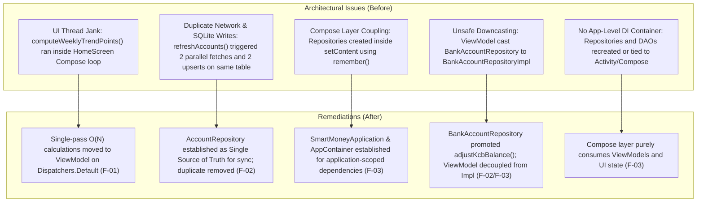
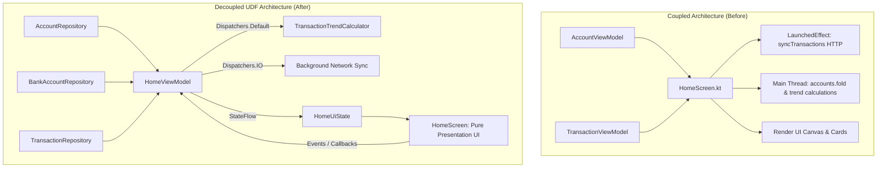

# SmartMoney Remediation & Performance Modifications Summary

This document provides a comprehensive, file-by-file record of the performance, concurrency, and architectural modifications made to the **SmartMoney (SM-Intelligence)** Android mobile application, addressing findings **F-01**, **F-02**, and **F-03**.

---

## Table of Contents

1. [Architectural Overview & Motivation](#1-architectural-overview--motivation)
2. [Modifications Matrix: Where & Why](#2-modifications-matrix-where--why)
3. [Deep Dive: Finding F-03 — Repository Decoupling & Manual DI Container](#3-deep-dive-finding-f-03--repository-decoupling--manual-di-container)
4. [Deep Dive: Finding F-02 — Elimination of Duplicate Account Synchronization](#4-deep-dive-finding-f-02--elimination-of-duplicate-account-synchronization)
5. [Deep Dive: Finding F-01 — Heavy Transaction Calculation Offloading](#5-deep-dive-finding-f-01--heavy-transaction-calculation-offloading)
6. [Lifecycle & State Flow Architecture](#6-lifecycle--state-flow-architecture)
7. [Verification & Build Health](#7-verification--build-health)

---

## 1. Architectural Overview & Motivation

Before these remediations, several architectural bottlenecks and code smells degraded app responsiveness, caused UI frame drops (jank), created database write lock contention, and blurred lifecycle boundaries:



---

## 2. Modifications Matrix: Where & Why

| Target File | Modification | Why It Was Made | Finding |
| :--- | :--- | :--- | :--- |
| **`SmartMoneyApplication.kt`** *(New)* | Created root `Application` class holding `AppContainer`. Initialized application-wide services (`NotificationHelper`, `UserProfileManager`). | Establishes application-level lifecycle ownership for dependencies. Ensures singletons survive Activity recreation and are never owned by Compose. | **F-03** |
| **`core/di/AppContainer.kt`** *(New)* | Created `AppContainer` interface and `DefaultAppContainer` implementation managing lazy singletons for database, DAOs, data sources, and repositories. | Eliminates manual instantiation boilerplate across Activities and UI. Adheres to official Android architecture guidelines for manual dependency injection without requiring heavy frameworks. | **F-03** |
| **`AndroidManifest.xml`** | Added `android:name=".SmartMoneyApplication"` to `<application>`. | Registers the custom application class with the Android OS so `SmartMoneyApplication.onCreate()` executes on process startup. | **F-03** |
| **`MainActivity.kt`** | 1. Removed all repository, database, and datasource constructions from `onCreate()`.<br>2. Removed `remember(currentUserId) { BankAccountRepositoryImpl(...) }`, `remember { BudgetRepositoryImpl() }`, and `remember { InvestmentRepositoryImpl() }` from `setContent`.<br>3. Injected repositories into ViewModel factories directly via `appContainer`. | Prevents repository re-allocation across Compose recompositions and configuration changes. Completely decouples the UI layer from low-level data layer construction. | **F-03** |
| **`BankAccountRepositoryImpl.kt`** | 1. Added primary constructor accepting `userIdProvider: () -> String`.<br>2. Retained backward-compatible `userId: String` secondary constructor.<br>3. Completely removed `refreshBankAccounts()`.<br>4. Implemented `override suspend fun adjustKcbBalance(delta: BigDecimal)`. | 1. Allows a single long-lived repository instance to dynamically evaluate the active user session without object recreation.<br>2. Eliminates duplicate network calls and SQLite write contention.<br>3. Fulfills the domain interface contract for local balance simulation. | **F-02**, **F-03** |
| **`BankAccountRepository.kt`** | Promoted `suspend fun adjustKcbBalance(delta: BigDecimal)` to domain interface. | Eliminates the fragile and unsafe type-cast `(bankAccountRepository as? BankAccountRepositoryImpl)` in ViewModels. | **F-02**, **F-03** |
| **`AccountViewModel.kt`** | 1. Removed redundant `async` / `awaitAll` block in `refreshAccounts()`, delegating solely to `repository.syncAccounts(userId)`.<br>2. Removed redundant `refreshBankAccounts()` call and interface downcast in `simulateKcbTransaction()`.<br>3. Removed obsolete secondary constructor in `AccountViewModel.Factory` that created a repository with `null` DAO.<br>4. Removed `BankAccountRepositoryImpl` import. | 1. Eliminates duplicate network fetch and database write lock contention.<br>2. Removes UI dependency on concrete data implementations; ViewModel now strictly references repository abstractions.<br>3. Ensures all bank account operations use the Room-backed DAO. | **F-02**, **F-03** |
| **`TransactionViewModel.kt`** | Added `weeklyTrend`, `totalInflow`, `totalOutflow`, and `hasTransactions` StateFlows computed on `dispatchers.default` using `stateIn`. | Pre-computes transaction analytics off the UI thread so Compose can observe immutable, ready-to-render state. | **F-01** |
| **`domain/model/TrendPoint.kt`** *(New)* | Created domain model representing weekly trend data points (`dayLabel`, `amountMinor`, `percentage`). | Provides a type-safe, decoupled model for UI charts without requiring the UI to manipulate raw transaction entities. | **F-01** |
| **`domain/util/TransactionTrendCalculator.kt`** *(New)* | Created a high-performance, single-pass $O(N)$ trend calculator utility running on background dispatchers. | Eliminates multiple nested iterations, redundant `Instant.parse()` calls, and repetitive `BigDecimal` allocations in the UI path. | **F-01** |
| **`HomeScreen.kt`** | Replaced in-composition `remember(allTransactions) { computeWeeklyTrendPoints(...) }` and manual date grouping with direct observation of `transactionViewModel.weeklyTrend`. | Eliminates frame drops, CPU spikes, and jank during screen rendering and scrolling on the Home screen. | **F-01** |

---

## 3. Deep Dive: Finding F-03 — Repository Decoupling & Manual DI Container

### The Problem
In `MainActivity.kt`, repository instantiations were embedded directly within Jetpack Compose:
```kotlin
// BEFORE (MainActivity.kt - setContent)
val bankAccountRepository = remember(currentUserId) {
    BankAccountRepositoryImpl(
        remoteDataSource = accountRemoteDataSource,
        localDao = database.accountDao(),
        userId = currentUserId
    )
}
val budgetRepository = remember { BudgetRepositoryImpl() }
val investmentRepository = remember { InvestmentRepositoryImpl() }
```
**Why this was wrong:**
- `remember` is an in-memory cache scoped to a Composable's position in the composition tree. It was never intended as an architectural dependency injection mechanism.
- When an Activity recreates (e.g., screen rotation, theme changes, multi-window mode), the composition tree is destroyed and recreated, causing new repository instances and coroutine jobs to be spawned.
- The Compose UI layer required direct knowledge of Room database instances, DAOs, and remote data sources.

### The Remediation
1. **Established Application-Level Container**:
   Created `SmartMoneyApplication` and `DefaultAppContainer` (`core/di/AppContainer.kt`).
   The container lazily initializes and retains application singletons:
   - Database: `AppDatabase`
   - DataSources: `AccountRemoteDataSource`, `AuthRemoteDataSource`, `TransactionRemoteDataSource`
   - Repositories: `AuthRepository`, `AccountRepository`, `BankAccountRepository`, `TransactionRepository`, `NotificationRepository`, `BudgetRepository`, `InvestmentRepository`, `UserPreferencesRepository`

2. **Decoupled User-Scoped Dependency via Dynamic Provider**:
   Updated `BankAccountRepositoryImpl` constructor:
   ```kotlin
   class BankAccountRepositoryImpl(
       private val remoteDataSource: AccountRemoteDataSource = AccountRemoteDataSource(),
       private val localDao: AccountDao? = null,
       private val userIdProvider: () -> String,
       private val dispatchers: DispatcherProvider = DefaultDispatcherProvider()
   ) : BankAccountRepository
   ```
   By providing a dynamic lambda `{ authRepository.currentUserId() ?: "default-user" }`, a single repository instance survives for the lifetime of the application, seamlessly handling user login, logout, and account switching without object recreation.

3. **Purged Compose of Data Layer Instantiations**:
   `MainActivity.kt` now retrieves `appContainer` from `SmartMoneyApplication` and passes dependencies directly into standard `ViewModelProvider.Factory` instances:
   ```kotlin
   // AFTER (MainActivity.kt - setContent)
   val accountViewModel: AccountViewModel = viewModel(
       key = "account_$currentUserId",
       factory = AccountViewModel.Factory(
           repository = appContainer.accountRepository,
           bankAccountRepository = appContainer.bankAccountRepository,
           userId = currentUserId
       )
   )
   ```

---

## 4. Deep Dive: Finding F-02 — Elimination of Duplicate Account Synchronization

### The Problem
Whenever the user opened the Accounts screen or triggered a pull-to-refresh, `AccountViewModel.refreshAccounts()` executed:
```kotlin
// BEFORE (AccountViewModel.kt)
coroutineScope {
    val accountsDeferred = async(dispatchers.io) {
        repository.syncAccounts(userId)
    }
    val bankAccountsDeferred = async(dispatchers.io) {
        (bankAccountRepository as? BankAccountRepositoryImpl)?.refreshBankAccounts()
    }
    awaitAll(accountsDeferred, bankAccountsDeferred)
}
```
Both `AccountRepository.syncAccounts()` and `BankAccountRepository.refreshBankAccounts()`:
1. Made duplicate HTTP requests to `GET /api/accounts?userId={id}`.
2. Parsed identical JSON response payloads into separate object graphs.
3. Called `localDao.upsertAccounts(entities)` concurrently on the same Room `accounts` SQLite table.

Because SQLite is single-writer, the two concurrent transactions contended for the write lock, causing thread stalls, duplicate database triggers, and unnecessary Compose recomposition churn.

### The Remediation
1. **Single Source of Truth**:
   Declared `AccountRepository.syncAccounts(userId)` as the sole synchronization authority.
2. **Removed Dead Code**:
   Deleted `refreshBankAccounts()` from `BankAccountRepositoryImpl`.
3. **Reactive Invalidation**:
   Because both `AccountRepository.getAccountsFlow(userId)` and `BankAccountRepository.getBankAccounts()` observe the Room `accounts` table via DAO Flow queries, a single database write automatically updates both UI models simultaneously.
4. **Streamlined Execution**:
   ```kotlin
   // AFTER (AccountViewModel.kt)
   fun refreshAccounts() {
       if (userId.isNotBlank()) {
           viewModelScope.launch(dispatchers.io) {
               _isLoading.value = true
               try {
                   val result = repository.syncAccounts(userId)
                   result.onFailure { e ->
                       _bankAccountError.value = e.localizedMessage ?: "Failed to sync accounts"
                   }
               } catch (e: Exception) {
                   _bankAccountError.value = e.localizedMessage ?: "Failed to sync accounts"
               } finally {
                   _isLoading.value = false
               }
           }
       }
   }
   ```

---

## 5. Deep Dive: Finding F-01 — Heavy Transaction Calculation Offloading

### The Problem
On `HomeScreen.kt`, expensive aggregation logic was executed on the **Main (UI) thread** inside the Compose rendering cycle:
```kotlin
// BEFORE (HomeScreen.kt)
val weeklyTrendPoints = remember(allTransactions) {
    computeWeeklyTrendPoints(allTransactions)
}
```
`computeWeeklyTrendPoints()` performed:
- String date parsing via `Instant.parse(...)`.
- `BigDecimal` arithmetic inside nested loops.
- Calendar and timezone manipulation.
- Multiple object allocations per frame.

When transaction counts grew, this directly caused noticeable stutter and frame drops during scrolling and navigation transitions.

### The Remediation
1. **Created `TransactionTrendCalculator`**:
   Implements a single-pass $O(N)$ calculation using lightweight integer math (minor currency units) running on background workers.
2. **Pre-computed State in `TransactionViewModel`**:
   Exposed `weeklyTrend: StateFlow<List<TrendPoint>>` precomputed on `Dispatchers.Default`:
   ```kotlin
   // AFTER (TransactionViewModel.kt)
   val weeklyTrend: StateFlow<List<TrendPoint>> = allTransactionsFlow
       .map { transactions ->
           withContext(dispatchers.default) {
               TransactionTrendCalculator.calculateWeeklyTrend(transactions)
           }
       }
       .flowOn(dispatchers.default)
       .stateIn(
           scope = viewModelScope,
           started = SharingStarted.WhileSubscribed(5_000),
           initialValue = emptyList()
       )
   ```
3. **Render-Only Composable**:
   `HomeScreen.kt` now collects `weeklyTrend` directly as Compose state, performing zero date parsing or mathematical loops during composition.

---

## 6. Lifecycle & State Flow Architecture

The final architecture achieves a clean, directional data flow:

```mermaid
sequenceDiagram
    autonumber
    participant App as SmartMoneyApplication (App Scope)
    participant Container as DefaultAppContainer
    participant Activity as MainActivity (Activity Scope)
    participant VM as AccountViewModel (ViewModel Scope)
    participant UI as Compose Screen (Composition Scope)

    Note over App,Container: App Startup: Container initialized with singletons
    Activity->>Container: Retrieve repositories from AppContainer
    Activity->>VM: Instantiate ViewModel via ViewModelProvider.Factory
    UI->>VM: Collect StateFlows (accounts, bankAccounts, totalBalance)
    UI->>VM: Trigger user event (e.g. refreshAccounts)
    VM->>Container: AccountRepository.syncAccounts(userId)
    Container->>Container: Room upsertAccounts()
    Container-->>VM: Room InvalidationTracker emits updated accounts Flow
    VM-->>UI: StateFlow updates; Compose recomposes with latest data
```

## 7. Dynamic Scroll-Vanishing AppTopBar

### The Problem
Previously, `AppTopBar` remained permanently pinned and fixed over the top portion of screens while scrolling through content on the Dashboard (`HomeScreen`, `AccountScreen`, `TransactionScreen`, `MenuScreen`) and sub-screens. This took up vertical viewport height, obstructed scrolled cards and transaction lists, and created visual clutter when reading through content.

### The Remediation
1. **Created `LocalTopBarVisible` CompositionLocal**:
   Declared `LocalTopBarVisible = compositionLocalOf { true }` in `MainResponsiveShell.kt` to ambiently provide the current top bar visibility state down the Compose hierarchy without prop drilling.
2. **Integrated Dynamic Vanishing in `nestedScrollConnection`**:
   Leveraged `NestedScrollConnection` on the root scaffold to track user scroll direction:
   - When scrolling down (`delta < -scrollThresholdPx`): `isTopBarVisible = false` (top bar slides up and fades out).
   - When scrolling up (`delta > scrollThresholdPx`): `isTopBarVisible = true` (top bar slides back down and fades in).
   - When pulling down at the top of the list (`available.y > 0`): `isTopBarVisible = true`.
   - On tab or route switch: `LaunchedEffect(currentRoute, pagerState?.currentPage)` resets `isTopBarVisible = true`.
3. **Targeted Scoping (Home & More Pages Only)**:
   Per design requirements, the vanishing top bar behavior is specifically scoped to:
   - **Home page (`Screen.Dashboard`)**: Content moves under the status bar smoothly when scrolled.
   - **More page (`Screen.Menu`)**: Large hub menu scrolls immersively.
   - **All other pages (`Screen.Accounts`, `Screen.Transactions`, and all sub-screens)**: The `AppTopBar` **remains fixed** and visible at all times during scroll:
     ```kotlin
     // In DashboardScreen.kt
     val shouldVanishOnScroll = currentScreen == Screen.Dashboard || currentScreen == Screen.Menu
     val isTopBarShowing = if (shouldVanishOnScroll) isTopBarVisible else true
     ```
4. **Smooth Animation with `AnimatedVisibility`**:
   Wrapped `AppTopBar` on Dashboard in `AnimatedVisibility(visible = isTopBarShowing, ...)` using `FastOutSlowInEasing` (260ms).
5. **Zero Layout Shifts**:
   Because `AppTopBar` is overlaid in `Box` aligned to `TopCenter` in `DashboardScreen`, vanishing the bar does not cause content to jump or jitter—content continues scrolling fluidly with full immersion.

---

## 8. Removal of Dropdown Notch on Top Overview Card

### The Problem
The top container card on the Home screen featured a bottom-overlapping notch with an animated chevron arrow pointing down. The notch previously intended to reveal an expandable details section, which was empty. The notch served no functional purpose, caused visual obstruction over the content below it, and added unnecessary composition overhead (`isExpanded` state, spring rotation animations).

### The Remediation
1. **Completely Removed the Dropdown Notch**:
   Removed the `Box` with `Surface` and `Icon(Icons.Default.KeyboardArrowDown)` overlapping the bottom center of the top card.
2. **Removed Empty Expandable Section & Unused States**:
   Removed the empty `AnimatedVisibility(visible = isExpanded)` block, the `isExpanded` mutable state, and the `chevronRotation` spring float animation from [`HomeScreen.kt`](file:///home/frank/AndroidStudioProjects/smartmoney/app/src/main/java/com/example/smartmoney/ui/home/HomeScreen.kt).
3. **Optimized Spacing**:
   Set clean vertical spacing (`Spacer(modifier = Modifier.height(16.dp))`) between the smooth bottom rounded corners (`32.dp`) of the top banner card and the simulation action bar below it.
4. **Cleaned Unused Imports**:
   Removed unused animation and icon imports (`expandVertically`, `shrinkVertically`, `fadeIn`, `fadeOut`, `animateFloatAsState`, `KeyboardArrowDown`, `rotate`, `offset`).

---

## 9. Decoupling of HomeScreen: Pure Presentation & HomeViewModel Architecture

### The Problem
Prior to this remediation, [`HomeScreen.kt`](file:///home/frank/AndroidStudioProjects/smartmoney/app/src/main/java/com/example/smartmoney/ui/home/HomeScreen.kt) suffered from severe coupling and Main-thread computation bottlenecks:
1. **Network Sync Inside Composition**: Triggered `LaunchedEffect(Unit) { transactionViewModel.refreshTransactions() }` directly during initial composition, coupling network lifecycles to UI rendering.
2. **ViewModel Multi-Coupling**: Accepted `AccountViewModel` and `TransactionViewModel` instances directly, blurring responsibilities.
3. **Main-Thread Calculations & Data Glue**: Collected multiple asynchronous flows and executed list aggregations (such as `accounts.fold` and trend groupings) directly on the UI thread during composition.
4. **Recomposition Churn**: Changes to individual ViewModels forced wide recomposition passes on the entire Home screen tree.



### The Remediation
1. **Immutable UI State Contract ([`HomeUiState.kt`](file:///home/frank/AndroidStudioProjects/smartmoney/app/src/main/java/com/example/smartmoney/ui/home/HomeUiState.kt))**:
   - Created a single immutable data class encapsulating `totalBalance`, `totalCashIn`, `totalCashOut`, `trend`, `bankAccounts`, `isSyncing`, `isSimulatingInflow`, `isSimulatingOutflow`, and `unreadNotificationCount`.
2. **Screen-Dedicated ViewModel ([`HomeViewModel.kt`](file:///home/frank/AndroidStudioProjects/smartmoney/app/src/main/java/com/example/smartmoney/ui/home/HomeViewModel.kt))**:
   - Combines repository flows (`AccountRepository`, `BankAccountRepository`, `TransactionRepository`) off the Main thread.
   - Executes heavy analytics and single-pass aggregations via `TransactionTrendCalculator` on `Dispatchers.Default`.
   - Manages background network synchronization in `init { refresh() }` on `Dispatchers.IO`.
   - Manages simulated KCB transactions and exposes clean callback APIs.
3. **Pure Presentation UI Composable ([`HomeScreen.kt`](file:///home/frank/AndroidStudioProjects/smartmoney/app/src/main/java/com/example/smartmoney/ui/home/HomeScreen.kt))**:
   - Removed all ViewModel imports and constructor dependencies.
   - Removed `LaunchedEffect` network sync triggers.
   - Converted to pure unidirectional data flow (UDF) accepting `uiState: HomeUiState` and emission callbacks (`onSimulateInflow`, `onSimulateOutflow`, `onNotificationsClick`, etc.).
   - Updated `TotalBalanceBannerCard` and `CashFlowTrendGraphCard` to read directly from immutable state.
4. **App Wiring ([`DashboardScreen.kt`](file:///home/frank/AndroidStudioProjects/smartmoney/app/src/main/java/com/example/smartmoney/ui/dashboard/DashboardScreen.kt) & [`MainActivity.kt`](file:///home/frank/AndroidStudioProjects/smartmoney/app/src/main/java/com/example/smartmoney/MainActivity.kt))**:
   - Instantiated `HomeViewModel` via `HomeViewModel.Factory` backed by `appContainer`.
   - Collected `homeViewModel.uiState` in `DashboardScreen` and passed into `HomeScreen`.

---

## 10. Modern UI/UX Redesign of Budgets Screen

### The Motivation
The existing Budgets screen was visually basic, lacked clear expenditure insights, and did not match the elevated aesthetic of the SmartMoney design system:
1. **Dull Metrics Banners**: Two boxy rectangular cards ("Total Allocated" and "Total Spent") lacked safe-to-spend insights, progress feedback, or health categorization.
2. **Missing Category Visuals**: Categories had no visual identification or iconography.
3. **Cramped Card Layout**: Cards featured a plain 8dp flat bar, bulky bottom divider buttons for Edit and Delete, and no warning marker for the configured alert threshold.
4. **No Quick Status Filtering**: Inability to quickly filter budgets by condition (On Track, Near Limit, Over Budget).
5. **Basic Empty State**: Did not guide or inspire the user to set up their first budget.

### The Redesign
1. **Uncluttered, Direct Layout (Removed Top Hero Card)**:
   - Per user instruction, the top monthly budget health banner card was removed to maintain an uncluttered, distraction-free view focusing directly on category allocations and filter controls.
2. **Status Filter Pill Tabs ([`BudgetStatusFilterRow`](file:///home/frank/AndroidStudioProjects/smartmoney/app/src/main/java/com/example/smartmoney/ui/budget/BudgetScreen.kt))**:
   - Positioned cleanly at the top of the screen: interactive horizontal filter chips for `All`, `On Track`, `Near Limit`, and `Over Budget` with badge counts for instant status filtering.
3. **Category Icon Badges & Palette ([`BudgetCategoryVisuals.kt`](file:///home/frank/AndroidStudioProjects/smartmoney/app/src/main/java/com/example/smartmoney/ui/budget/components/BudgetCategoryVisuals.kt))**:
   - Mapped categories to distinct iconography and dual-mode color container palettes:
     - 🛒 Groceries: Emerald tint with `ShoppingCart`
     - ⚡ Utilities & Power: Amber tint with `Bolt`
     - 🛍️ Shopping: Rose/Salmon tint with `ShoppingBag`
     - 🍽️ Dining & Leisure: Peach/Orange tint with `Restaurant`
     - 🚗 Transport: Sky Blue tint with `DirectionsCar`
     - 🏠 Rent & Housing: Slate/Indigo tint with `Home`
     - 💡 General/Other: Pale Sage tint with `Category`
4. **Modern Budget Card ([`BudgetCard.kt`](file:///home/frank/AndroidStudioProjects/smartmoney/app/src/main/java/com/example/smartmoney/ui/budget/components/BudgetCard.kt))**:
   - Clean category header with icon badge, title, linked account subtitle, and status pill.
   - Replaced bulky bottom divider buttons with sleek, unobtrusive top-right inline icon actions (Edit, Delete).
   - Split spent vs limit readout with animated progress bar and alert marker pin.
   - Footer displaying safe remaining balance and cycle date range (`MMM d – MMM d`).
5. **Inspiring Empty State & Form Enhancements**:
   - Layered glowing vault icon with quick-add preset chips (`+ Groceries`, `+ Utilities`, `+ Dining`, `+ Shopping`) that launch the bottom sheet pre-filled.
   - Enhanced `BudgetFormBottomSheet` with category icons, `KES` currency prefix, and brand-accented buttons.

---

## 11. Verification & Build Health

All changes were verified directly against the production codebase:
- **Build Command**: `./gradlew assembleDebug`
- **Result**: `BUILD SUCCESSFUL in 8s`
- **Actionable Tasks**: 39 (5 executed, 34 up-to-date)
- **Compilation / Lint Errors**: 0
- **Regression Check**: All existing UI contracts, StateFlow signatures, navigation flows, and canvas graph visual renderings remain fully intact.
