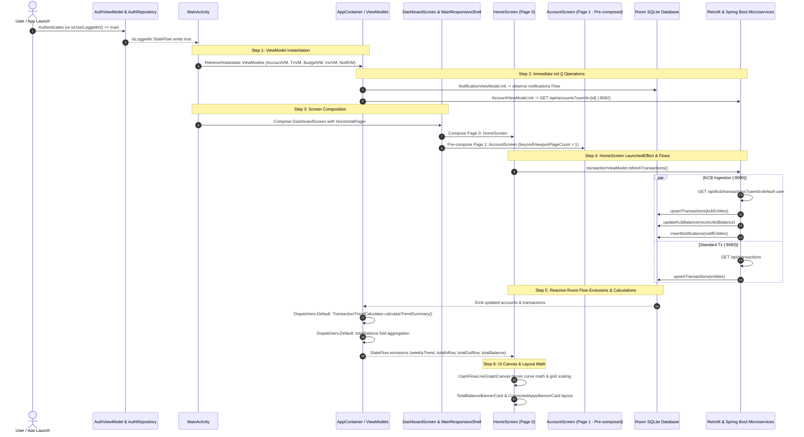

# Post-Authentication & Overview Page Lifecycle Technical Audit

## Overview & Execution Context
This technical document maps the exact sequence of **network requests**, **database queries/writes**, **background calculations**, and **UI composition functions** that execute immediately after a user authenticates in SmartMoney (or launches the app with an existing authenticated session) and lands on the **Overview** (`HomeScreen`) tab of the `DashboardScreen`.

---

## Architecture Sequence Diagram



---

## Detailed Breakdown by Phase

### Phase 1: Authentication Resolution & ViewModel Factories
**Location:** [`MainActivity.kt`](file:///home/frank/AndroidStudioProjects/smartmoney/app/src/main/java/com/example/smartmoney/MainActivity.kt#L82-L136)

When `authViewModel.isLoggedIn` evaluates to `true`:
1. **User Identity Resolution**:
   - `val currentUserId = authViewModel.currentUserId() ?: "default-user"`
   - `val userName = authViewModel.currentUserName() ?: "User"`
   - `val userEmail = authViewModel.currentUserEmail()`
2. **ViewModel Lazy Retrieval / Construction**:
   - [`AccountViewModel`](file:///home/frank/AndroidStudioProjects/smartmoney/app/src/main/java/com/example/smartmoney/ui/accounts/AccountViewModel.kt): Keyed by `"account_$currentUserId"`.
   - [`TransactionViewModel`](file:///home/frank/AndroidStudioProjects/smartmoney/app/src/main/java/com/example/smartmoney/ui/transactions/TransactionViewModel.kt): Keyed by `"transaction_$currentUserId"`.
   - [`BudgetViewModel`](file:///home/frank/AndroidStudioProjects/smartmoney/app/src/main/java/com/example/smartmoney/ui/budget/BudgetViewModel.kt): Keyed by `"budget_$currentUserId"`.
   - [`InvestmentViewModel`](file:///home/frank/AndroidStudioProjects/smartmoney/app/src/main/java/com/example/smartmoney/ui/investment/InvestmentViewModel.kt): Keyed by `"investment_$currentUserId"`.
   - [`NotificationViewModel`](file:///home/frank/AndroidStudioProjects/smartmoney/app/src/main/java/com/example/smartmoney/ui/notifications/NotificationViewModel.kt): Keyed by `"notification_$currentUserId"`.

---

### Phase 2: Operations Executed in `ViewModel.init {}` Blocks

#### 1. `AccountViewModel.init`
* **Trigger:** Instantiation of `AccountViewModel`.
* **Execution Thread:** `Dispatchers.IO` via `viewModelScope.launch(dispatchers.io)`.
* **Request Dispatched:**
  * **HTTP Method & URL:** `GET http://127.0.0.1:8082/api/accounts?userId={currentUserId}` (Spring Boot `accounts-service`).
  * **Data Source:** [`AccountRemoteDataSource.fetchAccounts(userId)`](file:///home/frank/AndroidStudioProjects/smartmoney/app/src/main/java/com/example/smartmoney/data/remote/datasource/AccountRemoteDataSource.kt#L28).
* **Database Operations:**
  * Maps response `List<AccountDto>` to `List<AccountEntity>`.
  * Executes Room SQLite batch upsert: `localDao.upsertAccounts(entities)` on the `accounts` table.
* **Reactive Flow Trigger:**
  * Invalidation of `accounts` table triggers Room reactive flow `localDao.getAccountsForUser(userId)`.

#### 2. `NotificationViewModel.init`
* **Trigger:** Instantiation of `NotificationViewModel`.
* **Execution Thread:** `Dispatchers.Default` via `viewModelScope.launch(dispatchers.default)`.
* **Database Operation:**
  * Subscribes to Room `notificationDao.getNotifications()` Flow.
  * Ingests historical notification IDs into `seenNotificationIds: MutableSet<String>` on the first emission without showing popups.

---

### Phase 3: Dashboard & Viewport Pre-Composition
**Location:** [`DashboardScreen.kt`](file:///home/frank/AndroidStudioProjects/smartmoney/app/src/main/java/com/example/smartmoney/ui/dashboard/DashboardScreen.kt#L178-L215)

1. **Top Bar State Collection**:
   - `val unreadNotifCount by notificationViewModel.unreadCount.collectAsState()` (subscribes to `notificationDao.getUnreadCount()`).
   - `val activeBanner by notificationViewModel.activeBanner.collectAsState()`.
2. **`HorizontalPager` Pre-Composition (`beyondViewportPageCount = 1`)**:
   > [!IMPORTANT]
   > Because `beyondViewportPageCount = 1`, the Jetpack Compose pager eagerly composes **both Page 0 (`HomeScreen`) AND Page 1 (`AccountScreen`)** simultaneously upon entry!
   - **Page 0:** Composes [`HomeScreen`](file:///home/frank/AndroidStudioProjects/smartmoney/app/src/main/java/com/example/smartmoney/ui/home/HomeScreen.kt).
   - **Page 1:** Composes [`AccountScreen`](file:///home/frank/AndroidStudioProjects/smartmoney/app/src/main/java/com/example/smartmoney/ui/accounts/AccountScreen.kt), which immediately begins collecting `viewModel.accounts` and `viewModel.bankAccounts`.

---

### Phase 4: `HomeScreen` Opening & LaunchedEffects
**Location:** [`HomeScreen.kt`](file:///home/frank/AndroidStudioProjects/smartmoney/app/src/main/java/com/example/smartmoney/ui/home/HomeScreen.kt#L140-L200)

#### 1. Background Transaction Synchronization
Inside [`HomeScreen.kt`](file:///home/frank/AndroidStudioProjects/smartmoney/app/src/main/java/com/example/smartmoney/ui/home/HomeScreen.kt#L160-L162):
```kotlin
LaunchedEffect(Unit) {
    transactionViewModel?.refreshTransactions()
}
```
This triggers [`TransactionRepositoryImpl.syncTransactions()`](file:///home/frank/AndroidStudioProjects/smartmoney/app/src/main/java/com/example/smartmoney/data/repository/TransactionRepositoryImpl.kt#L50), which runs two concurrent pipelines on `Dispatchers.IO`:

1. **Pipeline A: KCB Bank Integration Ingestion**:
   - **HTTP Request:** `GET http://127.0.0.1:8090/api/kcb/transactions?userId=default-user` (`bank-integration-service`).
   - **Calculations & Parsing:**
     - Parses string amounts into `BigDecimal`.
     - Maps raw KCB DTOs to `TransactionEntity` objects with IDs prefixed with `kcb_`.
   - **Database Writes:**
     - Room: `transactionDao.upsertTransactions(kcbEntities)`.
   - **Balance Reconciliation Math:**
     ```kotlin
     reconciledBalance = BigDecimal("10000.00").add(totalCredits).subtract(totalDebits)
     ```
     - Room: `accountDao.updateKcbBalance(reconciledBalance)`.
   - **Notification Ingestion:**
     - Maps transactions to `NotificationEntity` (`"KCB Inflow Received"` / `"KCB Outflow Paid"`).
     - Room: `notificationDao.insertNotifications(notifEntities)`.
2. **Pipeline B: General Transactions Fetch**:
   - **HTTP Request:** `GET http://127.0.0.1:8083/api/transactions` (`transactions-service`).
   - **Database Writes:**
     - Room: `transactionDao.upsertTransactions(entities)`.

---

### Phase 5: Off-Main-Thread Calculations (StateFlow Pipelines)

When Room emits the newly fetched transactions and accounts, the following background calculations execute on `Dispatchers.Default`:

#### 1. Account Total Balance Aggregation
**Location:** [`AccountViewModel.kt`](file:///home/frank/AndroidStudioProjects/smartmoney/app/src/main/java/com/example/smartmoney/ui/accounts/AccountViewModel.kt#L53-L60)
* **Calculation:**
  ```kotlin
  accounts.map { list ->
      list.fold(BigDecimal.ZERO) { acc, account -> acc.add(account.availableBalance) }
  }.flowOn(dispatchers.default)
  ```
* **Output:** `totalBalance: StateFlow<BigDecimal>` emitted to `HomeScreen`.

#### 2. 7-Day Trend & Cash Flow Summary Calculation
**Location:** [`TransactionTrendCalculator.kt`](file:///home/frank/AndroidStudioProjects/smartmoney/app/src/main/java/com/example/smartmoney/domain/util/TransactionTrendCalculator.kt#L58-L105)
* **Execution:** Executed on `Dispatchers.Default` via `TransactionViewModel.trendCalculation`:
* **Calculations:**
  1. Single-pass O(N) loop over all transaction records.
  2. ISO-8601 timestamp parsing (`Instant.parse()`) and date conversion to `ZoneId.systemDefault()`.
  3. `DayOfWeek` bucketing (Monday through Sunday).
  4. Summation of `totalInflow` (`CREDIT`) and `totalOutflow` (`DEBIT`) using `BigDecimal`.
  5. Generating 7 `TrendPoint` instances (`Mon`...`Sun`) for graph plotting.

---

### Phase 6: UI Composition & Canvas Calculations
**Location:** [`HomeScreen.kt`](file:///home/frank/AndroidStudioProjects/smartmoney/app/src/main/java/com/example/smartmoney/ui/home/HomeScreen.kt#L930-L1085)

Once state reaches the Compose layer, the following functions run on the Main/UI thread:
1. **Dynamic Metric Scaling & Grid Intervals ([`CashFlowLineGraphCanvas`](file:///home/frank/AndroidStudioProjects/smartmoney/app/src/main/java/com/example/smartmoney/ui/home/HomeScreen.kt#L959-L974))**:
   - Derives `maxVal` from `floatIn` and `floatOut`.
   - Computes dynamic step increments (`1k`, `2k`, `3k`, `5k`, `10k`, or `20k`).
   - Calculates number of horizontal grid lines (`coerceIn(1, 6)`).
2. **Text Measurement & Positioning**:
   - Measures string labels (`"1k"`, `"2k"`, etc.) with `TextMeasurer` to compute centering offsets.
3. **Cubic Bezier Path Generation**:
   - Iterates through the 7 `TrendPoint` values:
   - Evaluates `controlX = prevX + (x - prevX) / 2f`.
   - Generates smooth curved paths via `path.cubicTo(controlX, prevY, controlX, y, x, y)`.
   - Creates gradient fill path with `Brush.verticalGradient`.
4. **Currency Formatting**:
   - `CurrencyUtils.formatKes(amount)` with `DecimalFormat("#,##0.00")` for balance and preview cards.

---

## Summary Matrix of Operations

| Operation Type | Component / Method | Thread / Dispatcher | Destination / Target |
| :--- | :--- | :--- | :--- |
| **Network (HTTP)** | `AccountRemoteDataSource.fetchAccounts` | `Dispatchers.IO` | `GET :8082/api/accounts` |
| **Network (HTTP)** | `BankIntegrationApi.getKcbTransactions` | `Dispatchers.IO` | `GET :8090/api/kcb/transactions` |
| **Network (HTTP)** | `TransactionRemoteDataSource.fetchTransactions` | `Dispatchers.IO` | `GET :8083/api/transactions` |
| **Database (Room)** | `AccountDao.upsertAccounts` | `Dispatchers.IO` | SQLite table `accounts` |
| **Database (Room)** | `TransactionDao.upsertTransactions` | `Dispatchers.IO` | SQLite table `transactions` |
| **Database (Room)** | `AccountDao.updateKcbBalance` | `Dispatchers.IO` | SQLite table `accounts` |
| **Database (Room)** | `NotificationDao.insertNotifications` | `Dispatchers.IO` | SQLite table `notifications` |
| **Calculation** | `TransactionTrendCalculator.calculateTrendSummary` | `Dispatchers.Default` | Day-of-week bucketing & sums |
| **Calculation** | `AccountViewModel.totalBalance` | `Dispatchers.Default` | `fold` addition of balances |
| **Calculation** | `KCB Balance Reconciliation` | `Dispatchers.IO` | `10000 + credits - debits` |
| **UI / Canvas** | `CashFlowLineGraphCanvas` | Main (Compose) | Bezier math, dynamic step, grid |
| **UI / Text** | `CurrencyUtils.formatKes` | Main (Compose) | `DecimalFormat` monetary strings |

---

## Observations & Optimization Opportunities

1. **Pre-composition of `AccountScreen`**:
   `beyondViewportPageCount = 1` in `DashboardScreen.kt` causes `AccountScreen` to compose immediately when `HomeScreen` opens. This activates Room observers for `AccountScreen` concurrently with `HomeScreen`.
2. **Double Ingestion on Home Launch**:
   `HomeScreen`'s `LaunchedEffect(Unit)` calls `refreshTransactions()`, which queries both `:8090` (KCB) and `:8083` (general transactions). If the backend services are waking up (e.g. Render/cold starts), these calls hit 120-second OkHttp timeouts asynchronously.
3. **Dispatcher Offloading Verification**:
   All heavy JSON parsing, database batch writes, and 7-day trend calculations are already properly isolated on `Dispatchers.IO` and `Dispatchers.Default`, ensuring the Main thread only executes frame rendering and Canvas drawing.
