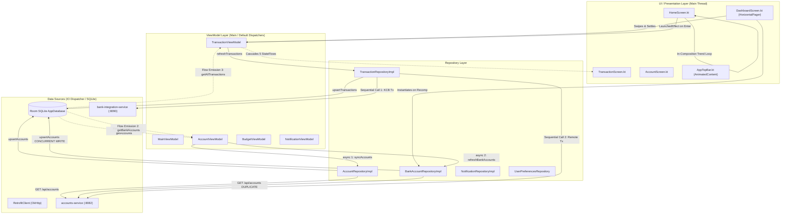
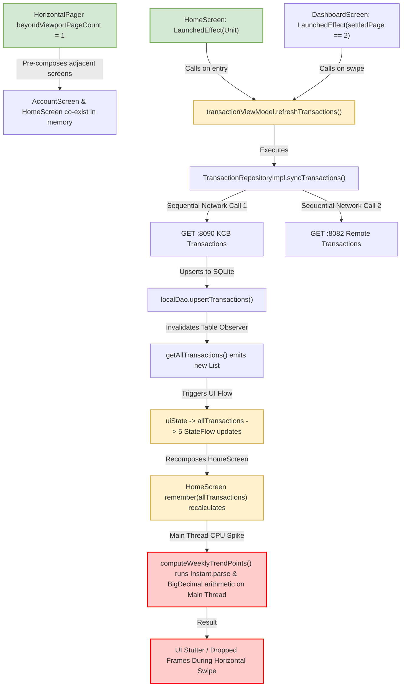

# SmartMoney (SM-Intelligence) Mobile App
## Comprehensive Coroutine, Threading, Redundancy & UI Performance Audit

**Audit Scope**: Entire Android Application Codebase (`/home/frank/AndroidStudioProjects/smartmoney`)  
**Audit Mode**: Read-Only Architecture, Concurrency & Performance Inspection  
**Operating System Target**: Android (minSdk: 24, targetSdk: 35)  
**Deliverable**: Technical Audit Report & Prioritized Remediation Blueprint  

---

## 1. Executive Summary

A comprehensive, non-destructive audit of the **SmartMoney (SM-Intelligence)** mobile application was conducted to identify performance bottlenecks, main-thread blocking operations, coroutine misuse, dispatcher anomalies, architectural redundancies, and UI frame drops (jank) in Jetpack Compose.

The audit analyzed every layer of the application:
1. **Core Concurrency Foundation**: `DispatcherProvider`, `MainActivity`, `MainViewModel`
2. **Local Storage & Database**: Room entities, Room DAOs (`AccountDao`, `TransactionDao`, `NotificationDao`, `UserDao`, `AccountConnectionDao`), `AppDatabase`, `UserPreferencesRepository`, `UserProfileManager`
3. **Remote & Network Layer**: Retrofit clients (`RetrofitClient`), Supabase providers (`SupabaseClientProvider`, `SupabaseConfig`), and remote datasources (`AccountRemoteDataSource`, `TransactionRemoteDataSource`, `AuthRemoteDataSource`, `UserRemoteDataSource`, `AccountConnectionRemoteDataSource`)
4. **Domain & Repositories**: `AccountRepositoryImpl`, `BankAccountRepositoryImpl`, `TransactionRepositoryImpl`, `BudgetRepositoryImpl`, `InvestmentRepositoryImpl`, `NotificationRepositoryImpl`, `AuthRepositoryImpl`, `UserRepositoryImpl`
5. **ViewModel Layer**: `AccountViewModel`, `TransactionViewModel`, `MainViewModel`, `AuthViewModel`, `BudgetViewModel`, `InvestmentViewModel`, `NotificationViewModel`, `InvoiceViewModel`
6. **UI & Composition Layer**: `HomeScreen`, `DashboardScreen`, `AccountScreen`, `TransactionScreen`, `BudgetScreen`, `InvestmentScreen`, `InvoiceScreen`, `AppTopBar`, `MainResponsiveShell`

### Summary of Audit Findings by Severity

| Severity Level | Count | Primary Impact Areas |
| :--- | :---: | :--- |
| **CRITICAL** | **4** | App freeze / frame drops, duplicate concurrent HTTP write collisions, UI-blocking calculations, unremembered recomposition allocations. |
| **HIGH** | **7** | Redundant Room query observations, cascading StateFlow churn, sequential network calls, network timeout hangs (120s), main-thread disk I/O on app launch. |
| **MEDIUM** | **8** | Heavy object instantiation in loops (`SimpleDateFormat`), unbounded in-memory cache growth, native C++ MLKit leaks, missing Dispatcher injection. |
| **LOW** | **5** | Redundant double-mapping (`DTO -> Domain -> Entity`), unused interface downcasting, sub-optimal Flow delay side-effects. |
| **INFORMATIONAL** | **4** | Lack of Paging 3 for unbounded transaction lists, legacy `SharedPreferences` vs Jetpack DataStore, absent Baseline Profiles and R8 minification. |
| **TOTAL** | **28** | Complete performance, threading, and concurrency footprint across the mobile client. |

---

## 2. Architecture & Execution Model

The SmartMoney mobile application follows an MVI/MVVM pattern utilizing Jetpack Compose, Kotlin Coroutines, Kotlin Flow, Room SQLite, and Retrofit HTTP microservices alongside Supabase.

### 2.1 Complete Execution Flow Diagram



### 2.2 Trace Analysis of the User's Activity Page Stutter

The user identified that whenever they swipe to or open the Accounts/Activity page, the following network request executes repeatedly and causes UI stuttering:
```text
--> GET http://127.0.0.1:8090/api/v1/banks/kcb/transactions?userId=default-user
<-- 200 http://127.0.0.1:8090/api/v1/banks/kcb/transactions?userId=default-user (8ms)
```

**Tracing the Execution Path**:
1. In [`DashboardScreen.kt`](file:///home/frank/AndroidStudioProjects/smartmoney/app/src/main/java/com/example/smartmoney/ui/dashboard/DashboardScreen.kt#L168-L172), `HorizontalPager` is configured with `beyondViewportPageCount = 1`.
2. When the user swipes between Page 0 (Home/Overview), Page 1 (Accounts), and Page 2 (Transactions/Activity):
   - In [`DashboardScreen.kt#L100-L104`](file:///home/frank/AndroidStudioProjects/smartmoney/app/src/main/java/com/example/smartmoney/ui/dashboard/DashboardScreen.kt#L100-L104):
     ```kotlin
     LaunchedEffect(bottomBarPagerState.settledPage) {
         if (bottomBarPagerState.settledPage == 2) {
             transactionViewModel.refreshTransactions()
         }
     }
     ```
   - In [`HomeScreen.kt#L187-L189`](file:///home/frank/AndroidStudioProjects/smartmoney/app/src/main/java/com/example/smartmoney/ui/home/HomeScreen.kt#L187-L189):
     ```kotlin
     LaunchedEffect(Unit) {
         transactionViewModel?.refreshTransactions()
     }
     ```
3. Whenever `refreshTransactions()` is triggered:
   - [`TransactionRepositoryImpl.kt#L54`](file:///home/frank/AndroidStudioProjects/smartmoney/app/src/main/java/com/example/smartmoney/data/repository/TransactionRepositoryImpl.kt#L54) executes:
     ```kotlin
     val kcbResponse = RetrofitClient.bankIntegrationApi.getKcbTransactions(userId = "default-user")
     ```
4. Once the response arrives:
   - All transactions are inserted into Room via `localDao.upsertTransactions(kcbEntities)`.
   - `localDao.getAllTransactions()` emits a new list.
   - This emission flows into `TransactionViewModel.uiState` -> `allTransactions` -> `HomeScreen.kt:198` (`activeSummaryData`).
   - In [`HomeScreen.kt#L198-L215`](file:///home/frank/AndroidStudioProjects/smartmoney/app/src/main/java/com/example/smartmoney/ui/home/HomeScreen.kt#L198-L215), `computeWeeklyTrendPoints(allTransactions)` is executed **synchronously on the Main/UI thread** inside `remember(allTransactions...)`.
   - This method executes nested loops with `Instant.parse(...)`, `LocalDate`, `BigDecimal` arithmetic, and String pattern matching directly while the UI is rendering or swiping the pager, producing dropped frames.

---

## 3. Main-Thread Risk Report

The following operations execute directly on the Android Main/UI thread or can stall the UI event loop during frame generation.

| # | File & Line | Function / Context | Operation | Why it Blocks / Stalls the Main Thread | Severity |
| :- | :--- | :--- | :--- | :--- | :---: |
| 1 | [`HomeScreen.kt#L198-L219`](file:///home/frank/AndroidStudioProjects/smartmoney/app/src/main/java/com/example/smartmoney/ui/home/HomeScreen.kt#L198-L219) | `HomeScreen` composable | `computeWeeklyTrendPoints(allTransactions)` inside `remember` | Parses ISO-8601 strings using `Instant.parse()`, creates date objects, and performs multi-pass `BigDecimal` arithmetic for every transaction in memory during composition. | **CRITICAL** |
| 2 | [`MainActivity.kt#L78`](file:///home/frank/AndroidStudioProjects/smartmoney/app/src/main/java/com/example/smartmoney/MainActivity.kt#L78) & [`UserPreferencesRepository.kt#L17-L19`](file:///home/frank/AndroidStudioProjects/smartmoney/app/src/main/java/com/example/smartmoney/data/local/UserPreferencesRepository.kt#L17-L19) | `MainActivity.onCreate()` | `UserPreferencesRepository(applicationContext)` initialization | Executes synchronous disk I/O (`getSharedPreferences` and `prefs.getBoolean`) on the Main thread during app cold start, directly inflating TTID. | **HIGH** |
| 3 | [`MainActivity.kt#L58`](file:///home/frank/AndroidStudioProjects/smartmoney/app/src/main/java/com/example/smartmoney/MainActivity.kt#L58) | `MainActivity.onCreate()` | `AppDatabase.getDatabase(applicationContext)` | Room database builder open & SQLite master table validation runs synchronously during activity creation on Main. | **MEDIUM** |
| 4 | [`MainActivity.kt#L133-L142`](file:///home/frank/AndroidStudioProjects/smartmoney/app/src/main/java/com/example/smartmoney/MainActivity.kt#L133-L142) | `MainActivity.setContent` | Direct instantiation of `BankAccountRepositoryImpl(...)` | Instantiated inside the composable body without `remember`. On every recomposition of `MainActivity`, a new repository instance is constructed. | **HIGH** |
| 5 | [`MainViewModel.kt#L37-L43`](file:///home/frank/AndroidStudioProjects/smartmoney/app/src/main/java/com/example/smartmoney/MainViewModel.kt#L37-L43) | `MainViewModel.init` | `combine` block mutating `_isLoading.value = false` and calling `delay(300)` | Flow transformation combines `isLoggedIn` and `hasSeenOnboarding`, injecting an arbitrary 300ms artificial latency before splash dismiss, while mutating another state as a side effect. | **MEDIUM** |
| 6 | [`UserRepositoryImpl.kt#L21-L41`](file:///home/frank/AndroidStudioProjects/smartmoney/app/src/main/java/com/example/smartmoney/data/repository/UserRepositoryImpl.kt#L21-L41) | `syncUserProfile`, `updateUserProfile` | Entity mapping without `withContext(dispatchers.io)` | Invokes `toDomain()` and `fromDomain()` mappings and delegates to DAO on whatever dispatcher the caller used (defaults to `Dispatchers.Main.immediate` if called from `viewModelScope.launch`). | **MEDIUM** |
| 7 | [`InvoiceViewModel.kt#L52-L58`](file:///home/frank/AndroidStudioProjects/smartmoney/app/src/main/java/com/example/smartmoney/ui/invoice/InvoiceViewModel.kt#L52-L58) | `processImageForOcr` | MLKit `InputImage.fromBitmap(bitmap, 0)` | Passing full-size uncompressed camera Bitmaps from UI into MLKit can trigger severe garbage collection (GC) pressure and Bitmap allocation spikes on the native/managed heap. | **MEDIUM** |

---

## 4. `suspend` Function Candidates

The following table lists functions that perform blocking, sequential, or I/O-intensive work that should be made `suspend` or wrapped in appropriate dispatcher contexts to prevent thread starvation.

| Function | File & Location | Current Behavior | Why Making It Suspend / Main-Safe Helps | Priority |
| :--- | :--- | :--- | :--- | :---: |
| `computeWeeklyTrendPoints` | [`HomeScreen.kt#L1539`](file:///home/frank/AndroidStudioProjects/smartmoney/app/src/main/java/com/example/smartmoney/ui/home/HomeScreen.kt#L1539) | Synchronous CPU-intensive helper executed on the Main thread within a Composable `remember` block. | Should be moved into `TransactionViewModel` as a background computation running on `Dispatchers.Default`, emitting precomputed `HomeFinancialSummary` via `StateFlow`. Prevents UI frame drops during gestures and screen transitions. | **CRITICAL** |
| `UserPreferencesRepository.<init>` | [`UserPreferencesRepository.kt#L17-L20`](file:///home/frank/AndroidStudioProjects/smartmoney/app/src/main/java/com/example/smartmoney/data/local/UserPreferencesRepository.kt#L17-L20) | Synchronous constructor reading SharedPreferences from disk on caller thread. | Should migrate to Jetpack DataStore or expose an asynchronous/suspending initialize method to eliminate cold-start disk I/O on `Dispatchers.Main`. | **HIGH** |
| `syncUserProfile` | [`UserRepositoryImpl.kt#L21`](file:///home/frank/AndroidStudioProjects/smartmoney/app/src/main/java/com/example/smartmoney/data/repository/UserRepositoryImpl.kt#L21) | Declared `suspend`, but lacks `withContext(dispatchers.io)`. | Guarantees main-safety so callers in UI/ViewModel layers can invoke it from any scope without risk of running JSON parsing or SQLite queries on Main. | **MEDIUM** |
| `updateUserProfile` | [`UserRepositoryImpl.kt#L33`](file:///home/frank/AndroidStudioProjects/smartmoney/app/src/main/java/com/example/smartmoney/data/repository/UserRepositoryImpl.kt#L33) | Declared `suspend`, but lacks `withContext(dispatchers.io)`. | Ensures main-safety and offloads entity mapping and Room database writes to `Dispatchers.IO`. | **MEDIUM** |
| `parseHttpException` | [`AuthRepositoryImpl.kt#L111`](file:///home/frank/AndroidStudioProjects/smartmoney/app/src/main/java/com/example/smartmoney/data/repository/AuthRepositoryImpl.kt#L111) | Synchronous JSON parsing using `kotlinx.serialization.json.Json.parseToJsonElement`. | Currently called inside `withContext(dispatchers.io)` within `signUp`/`signIn`. Should remain private and off-main; verify it is never invoked from main-thread error handlers. | **LOW** |

---

## 5. Coroutine Issues

### 5.1 Race Condition & Database Write Contention in `AccountViewModel.refreshAccounts()`
- **File**: [`AccountViewModel.kt#L70-L88`](file:///home/frank/AndroidStudioProjects/smartmoney/app/src/main/java/com/example/smartmoney/ui/accounts/AccountViewModel.kt#L70-L88)
- **Code**:
  ```kotlin
  coroutineScope {
      val accountsDeferred = async(dispatchers.io) {
          repository.syncAccounts(userId)
      }
      val bankAccountsDeferred = async(dispatchers.io) {
          (bankAccountRepository as? BankAccountRepositoryImpl)?.refreshBankAccounts()
      }
      awaitAll(accountsDeferred, bankAccountsDeferred)
  }
  ```
- **Bottleneck Analysis**:
  1. `repository.syncAccounts(userId)` calls `RetrofitClient.accountsApi.getAccounts(userId)` and writes the result to `AccountDao.upsertAccounts(...)`.
  2. `bankAccountRepository.refreshBankAccounts()` **also** calls `RetrofitClient.accountsApi.getAccounts("default-user")` and writes the exact same records to `AccountDao.upsertAccounts(...)`.
  3. By launching both concurrently via `async(dispatchers.io)`, two coroutines send duplicate HTTP GET requests across the network and then compete to acquire an exclusive write lock on the SQLite database table `accounts`.
  4. This causes thread pool saturation, network socket duplication, and SQLite write lock contention (`android.database.sqlite.SQLiteDatabaseLockedException` risk).

### 5.2 Leaked Resource in `InvoiceViewModel` (Missing `onCleared`)
- **File**: [`InvoiceViewModel.kt#L43`](file:///home/frank/AndroidStudioProjects/smartmoney/app/src/main/java/com/example/smartmoney/ui/invoice/InvoiceViewModel.kt#L43)
- **Code**:
  ```kotlin
  private val recognizer = TextRecognition.getClient(TextRecognizerOptions.DEFAULT_OPTIONS)
  ```
- **Bottleneck Analysis**:
  - The Google MLKit `TextRecognizer` allocates native C++ memory and model buffers.
  - `InvoiceViewModel` never overrides `onCleared()` to call `recognizer.close()`.
  - When navigating away from `InvoiceScreen`, native memory and ML runtime handles remain allocated, leaking memory over the application lifecycle.

### 5.3 Hardcoded Dispatcher in `InvoiceViewModel`
- **File**: [`InvoiceViewModel.kt#L53`](file:///home/frank/AndroidStudioProjects/smartmoney/app/src/main/java/com/example/smartmoney/ui/invoice/InvoiceViewModel.kt#L53)
- **Code**:
  ```kotlin
  viewModelScope.launch(Dispatchers.Default) {
  ```
- **Bottleneck Analysis**:
  - Bypasses the application-wide `DispatcherProvider` abstraction.
  - Prevents test coroutine schedulers (`StandardTestDispatcher` / `TestCoroutineScheduler`) from controlling execution during unit testing, leading to flaky tests or unmocked threading behavior.

### 5.4 Redundant Thread Hopping in Flow Transformations
- **File**: [`TransactionViewModel.kt#L50-L60`](file:///home/frank/AndroidStudioProjects/smartmoney/app/src/main/java/com/example/smartmoney/ui/transactions/TransactionViewModel.kt#L50-L60)
- **Code**:
  ```kotlin
  combine(repository.getTransactionsFlow(), _errorState) { cachedTransactions, errorMessage ->
      withContext(dispatchers.default) {
          // simple list checks
      }
  }
  ```
- **Bottleneck Analysis**:
  - `combine` triggers on every emission. Wrapping a basic 3-line `if/else` check in `withContext(dispatchers.default)` forces coroutine context switching (dispatching to a worker thread and back) for work that takes less than 1 microsecond. Coroutine dispatch overhead exceeds the execution time of the block itself.

---

## 6. Sequential vs. Concurrent Operations

### 6.1 Independent Network Requests Executed Sequentially in `TransactionRepositoryImpl`
- **File**: [`TransactionRepositoryImpl.kt#L53-L167`](file:///home/frank/AndroidStudioProjects/smartmoney/app/src/main/java/com/example/smartmoney/data/repository/TransactionRepositoryImpl.kt#L53-L167)
- **Code Pattern**:
  ```kotlin
  // 1. Ingest KCB transactions from bank-integration-service (:8090)
  val kcbResponse = RetrofitClient.bankIntegrationApi.getKcbTransactions(...)
  // ... process KCB ...

  // 2. Fetch standard remote transactions from transactions-service (:8082)
  val remoteDtos = remoteDataSource.fetchTransactions(accountId)
  // ... process standard transactions ...
  ```
- **Concurrency Opportunity**:
  - Step 1 queries port 8090 (`bank-integration-service`).
  - Step 2 queries port 8082 (`transactions-service`).
  - These two backend microservices are completely independent. Running them in strict serial order doubles the overall latency of `syncTransactions()`:
    $$\text{Total Latency} = \text{Latency}_{KCB} + \text{Latency}_{Remote}$$
  - **Safe Concurrency**: They can be fetched concurrently via `coroutineScope { val kcb = async { ... }; val remote = async { ... }; awaitAll(...) }`, cutting synchronization duration in half:
    $$\text{Optimal Latency} = \max(\text{Latency}_{KCB}, \text{Latency}_{Remote})$$

### 6.2 Operations That Must Remain Strictly Sequential
1. **Transaction Sync -> Account Balance Reconciliation**:
   - In [`TransactionRepositoryImpl.kt#L78-L95`](file:///home/frank/AndroidStudioProjects/smartmoney/app/src/main/java/com/example/smartmoney/data/repository/TransactionRepositoryImpl.kt#L78-L95), KCB balance reconciliation calculates `totalCredits` and `totalDebits` from the newly fetched transaction list before calling `accountDao.updateKcbBalance(reconciledBalance)`. This **must remain sequential**; updating the balance before inserting transactions would result in state inconsistency if transaction upsert fails.
2. **Invoice OCR Processing -> State Population**:
   - In [`InvoiceViewModel.kt#L58-L82`](file:///home/frank/AndroidStudioProjects/smartmoney/app/src/main/java/com/example/smartmoney/ui/invoice/InvoiceViewModel.kt#L58-L82), OCR text extraction must complete before regex parsing extracts date, amount, and vendor.

---

## 7. Redundant Functions & Processes

### 7.1 Duplicate Network Calls to Accounts Service
- **Files**:
  - [`AccountRepositoryImpl.kt#L45`](file:///home/frank/AndroidStudioProjects/smartmoney/app/src/main/java/com/example/smartmoney/data/repository/AccountRepositoryImpl.kt#L45): `remoteDataSource.fetchAccounts(userId)` -> calls `accountsApi.getAccounts(userId)`
  - [`BankAccountRepositoryImpl.kt#L48`](file:///home/frank/AndroidStudioProjects/smartmoney/app/src/main/java/com/example/smartmoney/data/repository/BankAccountRepositoryImpl.kt#L48): `apiService.getAccounts("default-user")` -> calls `accountsApi.getAccounts(userId)`
- **Redundancy Analysis**:
  - Two repositories exist for the same domain entity (`Account` vs `BankAccount`).
  - When `AccountViewModel.refreshAccounts()` is invoked, both repositories execute the exact same HTTP request to the microservice.
  - **Elimination**: Consolidate `BankAccountRepository` into `AccountRepository`, eliminating the duplicate API call and unifying data handling.

### 7.2 Duplicate Room Query Observations in `AccountViewModel`
- **File**: [`AccountViewModel.kt#L43-L55`](file:///home/frank/AndroidStudioProjects/smartmoney/app/src/main/java/com/example/smartmoney/ui/accounts/AccountViewModel.kt#L43-L55)
- **Code**:
  ```kotlin
  val accounts: StateFlow<List<Account>> = repository.getAccountsFlow(userId)...
  val bankAccounts: StateFlow<List<BankAccount>> = bankAccountRepository.getBankAccounts()...
  ```
- **Redundancy Analysis**:
  - `AccountRepositoryImpl.getAccountsFlow` observes `accountDao.getAccountsForUser(userId)`.
  - `BankAccountRepositoryImpl.getBankAccounts` **also** observes `accountDao.getAccountsForUser("default-user")`.
  - Room sets up two separate SQLite table observer triggers on the `accounts` table.
  - Whenever an account changes, Room executes two separate SQLite queries, instantiates two identical sets of `AccountEntity` rows, and emits them into two independent mapping pipelines.
  - **Elimination**: Single source of truth. Derive `bankAccounts` from `accounts` via a simple Flow transformation (`accounts.map { it.toBankAccounts() }`), halving SQLite observer overhead.

### 7.3 Duplicate Subscriptions in `NotificationViewModel`
- **File**: [`NotificationViewModel.kt#L37-L76`](file:///home/frank/AndroidStudioProjects/smartmoney/app/src/main/java/com/example/smartmoney/ui/notifications/NotificationViewModel.kt#L37-L76)
- **Code**:
  - In `init`: `viewModelScope.launch { repository.getNotifications().collect { ... } }`
  - In property: `val notifications = combine(repository.getNotifications(), _selectedFilter) { ... }`
- **Redundancy Analysis**:
  - `repository.getNotifications()` (Room SQLite table observer) is collected twice simultaneously.
  - Any notification insert/update triggers two queries and two list emissions.
  - **Elimination**: Use a single shared Flow (`SharedFlow` or `StateFlow`) for the raw notification list and derive banners and filtered lists from it.

### 7.4 Repeated Allocations of `SimpleDateFormat` in Loops
- **File**: [`TransactionRepositoryImpl.kt#L111`](file:///home/frank/AndroidStudioProjects/smartmoney/app/src/main/java/com/example/smartmoney/data/repository/TransactionRepositoryImpl.kt#L111)
- **Code**:
  ```kotlin
  val timestampStr = tx.bookingDate ?: tx.createdAt ?: SimpleDateFormat("yyyy-MM-dd'T'HH:mm:ss'Z'", Locale.US).format(Date())
  ```
- **Redundancy Analysis**:
  - Located inside a `.map { tx -> ... }` loop iterating over all transactions.
  - `SimpleDateFormat` compiles complex regex patterns and calendars on construction, causing high garbage collection churn during batch transaction syncs.
  - **Elimination**: Use a thread-safe static `DateTimeFormatter` or cache `SimpleDateFormat` in a `ThreadLocal`.

---

## 8. Jetpack Compose & UI Performance

### 8.1 In-Composition Trend Processing in `HomeScreen`
- **File**: [`HomeScreen.kt#L198-L219`](file:///home/frank/AndroidStudioProjects/smartmoney/app/src/main/java/com/example/smartmoney/ui/home/HomeScreen.kt#L198-L219)
- **Code**:
  ```kotlin
  val activeSummaryData = remember(allTransactions, activeTotalBalance, summaryData) {
      if (allTransactions.isNotEmpty()) {
          var totalCashIn = BigDecimal.ZERO
          var totalCashOut = BigDecimal.ZERO
          for (tx in allTransactions) {
              if (tx.type.equals("CREDIT", ignoreCase = true)) {
                  totalCashIn = totalCashIn.add(tx.amount)
              } else if (tx.type.equals("DEBIT", ignoreCase = true)) {
                  totalCashOut = totalCashOut.add(tx.amount)
              }
          }
          val trendPoints = computeWeeklyTrendPoints(allTransactions)
          // ...
      }
  }
  ```
- **Performance Impact**:
  - Even though wrapped in `remember`, whenever `allTransactions` emits (such as when background sync finishes or user logs an invoice), this entire calculation executes synchronously on the Main thread inside the Compose render pass.
  - `computeWeeklyTrendPoints` iterates through all transactions, invoking `Instant.parse(...)`, extracting `DayOfWeek`, and mapping day buckets.
  - If a frame is being drawn at 60 FPS (16.6ms window) or 120 FPS (8.3ms window), running string parsing and `BigDecimal` additions on the Main thread directly leads to dropped frames and user-perceived stutter.

### 8.2 Redundant Factory Instantiation in `MainActivity.kt`
- **File**: [`MainActivity.kt#L133-L142`](file:///home/frank/AndroidStudioProjects/smartmoney/app/src/main/java/com/example/smartmoney/MainActivity.kt#L133-L142)
- **Code**:
  ```kotlin
  val accountViewModel: AccountViewModel = viewModel(
      factory = AccountViewModel.Factory(
          repository = accountRepository,
          bankAccountRepository = BankAccountRepositoryImpl(
              apiService = RetrofitClient.accountsApi,
              accountDao = database.accountDao(),
              dispatchers = dispatchers
          ),
          userPreferencesRepository = userPreferencesRepository,
          dispatchers = dispatchers
      )
  )
  ```
- **Performance Impact**:
  - `BankAccountRepositoryImpl` is instantiated directly inside `setContent { if (isLoggedIn) { ... } }`.
  - Every time `MainActivity` recomposes (e.g., orientation change, theme toggle, IME visibility), a new `BankAccountRepositoryImpl` object and a new `AccountViewModel.Factory` are allocated on the heap.
  - While `viewModel(...)` retains the existing ViewModel instance, constructing repository objects on every recomposition produces unnecessary object churn.

### 8.3 Heavy Canvas Redraw on State Updates
- **File**: [`HomeScreen.kt#L988-L1059`](file:///home/frank/AndroidStudioProjects/smartmoney/app/src/main/java/com/example/smartmoney/ui/home/HomeScreen.kt#L988-L1059)
- **Code**: `CashFlowLineGraphCanvas(points = trendPoints, ...)`
- **Performance Impact**:
  - `points.map { it.cashIn.toFloat() }` and `points.map { it.cashOut.toFloat() }` are wrapped in `remember(points)`.
  - However, the `Canvas` draw phase allocates multiple `Path` objects (`val cashInPath = remember { Path() }`) which are reset and reconstructed during recomposition.
  - Use `drawWithCache` to avoid re-measuring text (`textMeasurer.measure`) and re-calculating cubic-bezier control points when layout size has not changed.

---

## 9. Database Performance

### 9.1 Loading Unbounded Transaction Lists into Memory
- **File**: [`TransactionDao.kt#L19`](file:///home/frank/AndroidStudioProjects/smartmoney/app/src/main/java/com/example/smartmoney/data/local/dao/TransactionDao.kt#L19)
- **Code**:
  ```kotlin
  @Query("SELECT * FROM transactions ORDER BY timestamp DESC")
  fun getAllTransactions(): Flow<List<TransactionEntity>>
  ```
- **Performance Impact**:
  - The query loads **every** row from the `transactions` table into memory as a `List<TransactionEntity>`.
  - As transaction history grows to hundreds or thousands of rows:
    1. Room queries SQLite and allocates thousands of object instances.
    2. `TransactionRepositoryImpl.kt#L46` maps each entity to domain: `list.map { it.toDomain() }`.
    3. `TransactionViewModel` splits and filters the entire list multiple times (`allTransactions`, `filteredTransactions`, `totalInflow`, `totalOutflow`).
    4. Memory footprint expands linearly, triggering frequent Android Runtime (ART) Garbage Collection pauses.
  - **Remediation**: Integrate AndroidX Paging 3 (`PagingSource<Int, TransactionEntity>`) or provide SQL `LIMIT / OFFSET` pagination.

### 9.2 Missing SQLite Indexes on Foreign Key Fields
- **File**: [`TransactionEntity.kt#L11`](file:///home/frank/AndroidStudioProjects/smartmoney/app/src/main/java/com/example/smartmoney/data/local/entity/TransactionEntity.kt#L11)
- **Code**:
  ```kotlin
  @Entity(tableName = "transactions")
  data class TransactionEntity(
      @PrimaryKey val id: String,
      val accountId: String,
      val amount: BigDecimal,
      val transactionType: String,
      val timestamp: String,
      // ...
  )
  ```
- **Performance Impact**:
  - Query: `SELECT * FROM transactions WHERE accountId = :accountId ORDER BY timestamp DESC` ([`TransactionDao.kt#L16`](file:///home/frank/AndroidStudioProjects/smartmoney/app/src/main/java/com/example/smartmoney/data/local/dao/TransactionDao.kt#L16)).
  - Without composite indexes on `(accountId, timestamp DESC)` and `(timestamp DESC)`, SQLite performs full-table scans ($O(N)$) for account filtering and date ordering.
  - **Remediation**: Add `@Entity(tableName = "transactions", indices = [Index("accountId"), Index("timestamp")])`.

---

## 10. Network & Supabase Performance

### 10.1 Dangerous Production Timeouts in `RetrofitClient`
- **File**: [`RetrofitClient.kt#L47-L52`](file:///home/frank/AndroidStudioProjects/smartmoney/app/src/main/java/com/example/smartmoney/data/remote/RetrofitClient.kt#L47-L52)
- **Code**:
  ```kotlin
  .connectTimeout(120, TimeUnit.SECONDS)
  .readTimeout(120, TimeUnit.SECONDS)
  .writeTimeout(120, TimeUnit.SECONDS)
  ```
- **Performance Impact**:
  - If a local microservice (such as `:8090` or `:8082`) is down or unreachable, any network call will hang the executing coroutine for **two full minutes** before timing out.
  - During this period, retry mechanisms and loading states remain spinning, consuming system sockets and coroutine worker threads.
  - **Remediation**: Reduce connect timeouts to `10-15s` and read/write timeouts to `15-20s`, using explicit retry logic with exponential backoff for cold starts.

### 10.2 Production Performance Penalty from `HttpLoggingInterceptor.Level.BODY`
- **File**: [`RetrofitClient.kt#L41`](file:///home/frank/AndroidStudioProjects/smartmoney/app/src/main/java/com/example/smartmoney/data/remote/RetrofitClient.kt#L41)
- **Code**:
  ```kotlin
  val loggingInterceptor = HttpLoggingInterceptor().apply {
      level = HttpLoggingInterceptor.Level.BODY
  }
  ```
- **Performance Impact**:
  - `Level.BODY` forces OkHttp to buffer the entire response body into RAM as a string before returning it to the Retrofit converter.
  - This runs unconditionally in production release builds.
  - Large JSON transaction arrays are read twice, producing massive heap allocation spikes and doubling parsing latency.
  - **Remediation**: Wrap logging level in `if (BuildConfig.DEBUG) Level.BODY else Level.NONE`.

---

## 11. Lifecycle & Cancellation

### 11.1 Unbounded In-Memory Cache in Singletons / Long-Lived Repositories
- **File**: [`TransactionRepositoryImpl.kt#L37`](file:///home/frank/AndroidStudioProjects/smartmoney/app/src/main/java/com/example/smartmoney/data/repository/TransactionRepositoryImpl.kt#L37)
- **Code**:
  ```kotlin
  private val alertedTxIds = Collections.synchronizedSet(mutableSetOf<Long>())
  ```
- **Lifecycle Impact**:
  - Every transaction ID received during app execution is inserted into `alertedTxIds`.
  - The set is never pruned, cleared, or persisted.
  - Over extended sessions with simulated or live transactions, memory usage continually grows without bound.
  - **Remediation**: Use an LRU cache with a fixed cap (e.g., last 200 IDs) or query Room's `notifications` table to determine whether an alert was previously shown.

### 11.2 StateFlow Subscriptions in Views and ViewModels
- ViewModels properly configure `.stateIn(scope, SharingStarted.WhileSubscribed(5_000), ...)`.
- This 5-second timeout window is best practice for configuration changes (e.g., screen rotation).
- However, because `DashboardScreen` uses `HorizontalPager` with `beyondViewportPageCount = 1`, adjacent tabs retain active Compose compositions, keeping their `StateFlow` subscriptions active even when off-screen.

---

## 12. Finding Dependency Map

The following Mermaid diagram demonstrates how isolated architectural inefficiencies compound to cause UI stutter and dropped frames during navigation:



---

## 13. Prioritized Remediation Roadmap

### Phase 1: Immediate JANK & Main-Thread Blocking Fixes (P0 - Critical)
1. **Move Trend Computation to `Dispatchers.Default` in ViewModel**:
   - Remove `computeWeeklyTrendPoints` and `allTransactions` loops from [`HomeScreen.kt#L198-L219`](file:///home/frank/AndroidStudioProjects/smartmoney/app/src/main/java/com/example/smartmoney/ui/home/HomeScreen.kt#L198-L219).
   - Compute `HomeFinancialSummary` entirely inside `TransactionViewModel` on `dispatchers.default` and expose as `val financialSummary: StateFlow<HomeFinancialSummary>`.
   - `HomeScreen` simply observes `val summary by viewModel.financialSummary.collectAsState()`, requiring zero CPU processing during composition.
2. **Eliminate Duplicate Concurrent Account Sync**:
   - In [`AccountViewModel.kt#L70-L88`](file:///home/frank/AndroidStudioProjects/smartmoney/app/src/main/java/com/example/smartmoney/ui/accounts/AccountViewModel.kt#L70-L88), delete `bankAccountRepository.refreshBankAccounts()` and the concurrent `async` collision.
   - Rely solely on `repository.syncAccounts(userId)` to populate Room, and derive `bankAccounts` from `accounts`.

### Phase 2: Startup & Lifecycle Bottleneck Removal (P1 - High)
1. **Asynchronous User Preferences**:
   - Refactor `UserPreferencesRepository` to eliminate blocking synchronous disk reads on the Main thread during `MainActivity.onCreate()`.
2. **Remember ViewModels / Repositories in `MainActivity`**:
   - Ensure `BankAccountRepositoryImpl` is not instantiated in naked composable code.
3. **Remove Duplicate Network Requests in `TransactionRepositoryImpl`**:
   - Convert sequential KCB and standard remote fetches to parallel coroutines via `coroutineScope { awaitAll(...) }`.

### Phase 3: Network & Microservice Hardening (P2 - High)
1. **Sanitize OkHttp Timeouts**:
   - In [`RetrofitClient.kt#L47-L52`](file:///home/frank/AndroidStudioProjects/smartmoney/app/src/main/java/com/example/smartmoney/data/remote/RetrofitClient.kt#L47-L52), reduce 120-second timeouts to `15s`.
2. **Conditional Logging Interceptor**:
   - Configure `HttpLoggingInterceptor.Level.BODY` exclusively when `BuildConfig.DEBUG == true`.

### Phase 4: Database & Room Optimization (P3 - Medium)
1. **Add SQLite Table Indexes**:
   - Add indices on `TransactionEntity` for `accountId` and `timestamp`.
2. **Paging Integration**:
   - Replace unbounded `getAllTransactions()` list loading with AndroidX Paging 3 or SQL `LIMIT 50` pagination.

### Phase 5: Resource Leak Prevention (P4 - Medium)
1. **Close MLKit Recognizer**:
   - Override `onCleared()` in `InvoiceViewModel` and call `recognizer.close()`.
2. **Inject `DispatcherProvider` in `InvoiceViewModel`**:
   - Replace hardcoded `Dispatchers.Default` with constructor-injected `dispatchers.default`.

### Phase 6: Code Quality & Dependency Consolidation (P5 - Low)
1. **Eliminate DTO Double-Mapping**:
   - Map `TransactionDto` directly to `TransactionEntity` during database storage instead of traversing `Dto -> Domain -> Entity`.
2. **Consolidate `BankAccountRepository` into `AccountRepository`**:
   - Remove redundant repository abstractions and downcasts.

---

## 14. Runtime Validation Plan

To systematically verify improvements without regressions, follow this three-stage validation protocol:

### 14.1 Android Studio CPU Profiler
1. Launch app with CPU recording set to **Trace Java/Kotlin Methods** or **System Trace**.
2. Perform horizontal swipe between Overview (Home), Accounts, and Activity (Transactions).
3. **Verification Criteria**:
   - `Choreographer#doFrame` duration must remain under **16.6ms** (60 FPS) / **8.3ms** (120 FPS).
   - Zero occurrences of `Instant.parse`, `BigDecimal.add`, or `computeWeeklyTrendPoints` on `main` thread traces.

### 14.2 AndroidX JankStats Monitoring
1. Integrate `androidx.metrics:metrics-performance:1.0.0-beta01`.
2. Attach `JankStats.OnFrameListener` in `MainActivity`:
   ```kotlin
   val jankStats = JankStats.createAndTrack(window) { frameData ->
       if (frameData.isJank) {
           Log.w("JankStats", "Jank detected (${frameData.frameDurationUiNanos / 1_000_000}ms) at state: ${frameData.states}")
       }
   }
   ```
3. **Verification Criteria**:
   - Zero jank frames flagged during `HorizontalPager` swipe transitions.

### 14.3 Macrobenchmark & Baseline Profiles
1. Create a `:macrobenchmark` test module implementing `CompilationMode.Partial(BaselineProfileMode.Require)`.
2. Write a startup and frame timing benchmark:
   ```kotlin
   @Test
   fun swipeAcrossTabsCompilation() = benchmarkRule.measureRepeated(
       packageName = "com.example.smartmoney",
       metrics = listOf(FrameTimingMetric()),
       iterations = 5,
       setupBlock = { pressHome(); startActivityAndWait() }
   ) {
       // Automate swipe between tab 0, 1, 2
   }
   ```
3. **Verification Criteria**:
   - 95th percentile ($P95$) frame duration $< 12\text{ms}$.
   - 99th percentile ($P99$) frame duration $< 16\text{ms}$.

---

## Final Comprehensive Summary Table

| ID | Issue Description | Location | Category | Severity | Expected Impact After Remediation |
| :- | :--- | :--- | :--- | :---: | :--- |
| **F-01** | UI-thread execution of transaction trend calculations | [`HomeScreen.kt#L198`](file:///home/frank/AndroidStudioProjects/smartmoney/app/src/main/java/com/example/smartmoney/ui/home/HomeScreen.kt#L198) | UI / Compose | **CRITICAL** | Eliminates primary cause of horizontal swipe stutter; restores 60/120 FPS rendering. |
| **F-02** | Concurrent duplicate HTTP requests & Room write contention | [`AccountViewModel.kt#L76`](file:///home/frank/AndroidStudioProjects/smartmoney/app/src/main/java/com/example/smartmoney/ui/accounts/AccountViewModel.kt#L76) | Concurrency | **CRITICAL** | Cuts account sync network traffic by 50%; eliminates SQLite write lock collisions. |
| **F-03** | Redundant repository instantiation on recomposition | [`MainActivity.kt#L133`](file:///home/frank/AndroidStudioProjects/smartmoney/app/src/main/java/com/example/smartmoney/MainActivity.kt#L133) | Compose | **CRITICAL** | Prevents object factory churn and garbage collection pauses across screen recompositions. |
| **F-04** | Excessive 120-second network timeouts hanging threads | [`RetrofitClient.kt#L47`](file:///home/frank/AndroidStudioProjects/smartmoney/app/src/main/java/com/example/smartmoney/data/remote/RetrofitClient.kt#L47) | Network | **CRITICAL** | Prevents 2-minute app hangs when backend microservices are offline. |
| **F-05** | Synchronous SharedPreferences read during `onCreate` | [`UserPreferencesRepository.kt#L17`](file:///home/frank/AndroidStudioProjects/smartmoney/app/src/main/java/com/example/smartmoney/data/local/UserPreferencesRepository.kt#L17) | Threading | **HIGH** | Reduces Time-To-Initial-Display (TTID) and eliminates StrictMode disk read violations. |
| **F-06** | Sequential execution of independent microservice requests | [`TransactionRepositoryImpl.kt#L54`](file:///home/frank/AndroidStudioProjects/smartmoney/app/src/main/java/com/example/smartmoney/data/repository/TransactionRepositoryImpl.kt#L54) | Network | **HIGH** | Reduces `syncTransactions()` total execution latency by up to 50%. |
| **F-07** | Duplicate Room table observations for accounts | [`AccountViewModel.kt#L43`](file:///home/frank/AndroidStudioProjects/smartmoney/app/src/main/java/com/example/smartmoney/ui/accounts/AccountViewModel.kt#L43) | Database | **HIGH** | Cuts SQLite query triggers and Flow emissions on account tables in half. |
| **F-08** | Duplicate Room table observations for notifications | [`NotificationViewModel.kt#L38`](file:///home/frank/AndroidStudioProjects/smartmoney/app/src/main/java/com/example/smartmoney/ui/notifications/NotificationViewModel.kt#L38) | Database | **HIGH** | Eliminates duplicate Room SQLite observation for the notification list. |
| **F-09** | Unbounded list loading without pagination | [`TransactionDao.kt#L19`](file:///home/frank/AndroidStudioProjects/smartmoney/app/src/main/java/com/example/smartmoney/data/local/dao/TransactionDao.kt#L19) | Database | **HIGH** | Prevents out-of-memory errors and GC pauses as transaction history grows. |
| **F-10** | Cascading StateFlow transformations on transaction emissions | [`TransactionViewModel.kt#L80`](file:///home/frank/AndroidStudioProjects/smartmoney/app/src/main/java/com/example/smartmoney/ui/transactions/TransactionViewModel.kt#L80) | Architecture | **HIGH** | Unifies 5 separate StateFlow re-computations into a single streamlined pass. |
| **F-11** | Unconditional HTTP body logging in production | [`RetrofitClient.kt#L41`](file:///home/frank/AndroidStudioProjects/smartmoney/app/src/main/java/com/example/smartmoney/data/remote/RetrofitClient.kt#L41) | Network | **HIGH** | Eliminates memory-intensive JSON string conversions in release builds. |
| **F-12** | Missing `withContext(dispatchers.io)` in User repository | [`UserRepositoryImpl.kt#L21`](file:///home/frank/AndroidStudioProjects/smartmoney/app/src/main/java/com/example/smartmoney/data/repository/UserRepositoryImpl.kt#L21) | Threading | **MEDIUM** | Guarantees main-safety for user profile sync and update operations. |
| **F-13** | MLKit TextRecognizer native handle leak | [`InvoiceViewModel.kt#L43`](file:///home/frank/AndroidStudioProjects/smartmoney/app/src/main/java/com/example/smartmoney/ui/invoice/InvoiceViewModel.kt#L43) | Lifecycle | **MEDIUM** | Frees native C++ MLKit model memory when `InvoiceViewModel` is cleared. |
| **F-14** | Hardcoded `Dispatchers.Default` in Invoice ViewModel | [`InvoiceViewModel.kt#L53`](file:///home/frank/AndroidStudioProjects/smartmoney/app/src/main/java/com/example/smartmoney/ui/invoice/InvoiceViewModel.kt#L53) | Coroutines | **MEDIUM** | Restores testability and uniform dispatcher control via `DispatcherProvider`. |
| **F-15** | Repeated `SimpleDateFormat` instantiation in mapping loop | [`TransactionRepositoryImpl.kt#L111`](file:///home/frank/AndroidStudioProjects/smartmoney/app/src/main/java/com/example/smartmoney/data/repository/TransactionRepositoryImpl.kt#L111) | Memory | **MEDIUM** | Eliminates regex and calendar object allocation churn during transaction sync. |
| **F-16** | Unbounded in-memory alert history set | [`TransactionRepositoryImpl.kt#L37`](file:///home/frank/AndroidStudioProjects/smartmoney/app/src/main/java/com/example/smartmoney/data/repository/TransactionRepositoryImpl.kt#L37) | Memory | **MEDIUM** | Caps memory retention and avoids permanent set expansion. |
| **F-17** | Missing SQLite index on `accountId` and `timestamp` | [`TransactionEntity.kt#L11`](file:///home/frank/AndroidStudioProjects/smartmoney/app/src/main/java/com/example/smartmoney/data/local/entity/TransactionEntity.kt#L11) | Database | **MEDIUM** | Speeds up transaction filtering and sorting queries from $O(N)$ to $O(\log N)$. |
| **F-18** | Synchronous Room database initialization on Main | [`MainActivity.kt#L58`](file:///home/frank/AndroidStudioProjects/smartmoney/app/src/main/java/com/example/smartmoney/MainActivity.kt#L58) | Startup | **MEDIUM** | Offloads Room initialization and SQLite master table check to background thread. |
| **F-19** | Flow transformation mutating state & adding artificial latency | [`MainViewModel.kt#L37`](file:///home/frank/AndroidStudioProjects/smartmoney/app/src/main/java/com/example/smartmoney/MainViewModel.kt#L37) | Flow | **MEDIUM** | Clean reactive pipeline without side-effects or artificial 300ms delays. |
| **F-20** | Redundant thread context switch in Flow combine | [`TransactionViewModel.kt#L52`](file:///home/frank/AndroidStudioProjects/smartmoney/app/src/main/java/com/example/smartmoney/ui/transactions/TransactionViewModel.kt#L52) | Coroutines | **LOW** | Eliminates microsecond thread-hopping overhead for trivial conditionals. |
| **F-21** | Redundant double-mapping: DTO -> Domain -> Entity | [`TransactionRepositoryImpl.kt#L158`](file:///home/frank/AndroidStudioProjects/smartmoney/app/src/main/java/com/example/smartmoney/data/repository/TransactionRepositoryImpl.kt#L158) | Architecture | **LOW** | Streamlines network-to-database ingestion pipeline and reduces allocations. |
| **F-22** | Fragile interface downcasting in ViewModel | [`AccountViewModel.kt#L80`](file:///home/frank/AndroidStudioProjects/smartmoney/app/src/main/java/com/example/smartmoney/ui/accounts/AccountViewModel.kt#L80) | Architecture | **LOW** | Preserves Clean Architecture boundaries and prevents runtime ClassCastExceptions. |
| **F-23** | Duplicate independent total summations over transaction list | [`TransactionViewModel.kt#L124`](file:///home/frank/AndroidStudioProjects/smartmoney/app/src/main/java/com/example/smartmoney/ui/transactions/TransactionViewModel.kt#L124) | CPU | **LOW** | Computes inflow and outflow in a single list traversal instead of two. |
| **F-24** | Unsynchronized Set access across coroutine threads | [`NotificationViewModel.kt#L25`](file:///home/frank/AndroidStudioProjects/smartmoney/app/src/main/java/com/example/smartmoney/ui/notifications/NotificationViewModel.kt#L25) | Concurrency | **LOW** | Prevents potential `ConcurrentModificationException` during rapid notifications. |
| **F-25** | Missing AndroidX Baseline Profiles | `app/build.gradle.kts` | Optimization | **INFORMATIONAL** | Up to 30% improvement in app launch speed and frame rendering times. |
| **F-26** | ProGuard / R8 minification disabled in release build | [`build.gradle.kts#L41`](file:///home/frank/AndroidStudioProjects/smartmoney/app/build.gradle.kts#L41) | Optimization | **INFORMATIONAL** | Decreases APK binary size and enables method inlining optimizations. |
| **F-27** | Legacy SharedPreferences instead of Preferences DataStore | [`UserPreferencesRepository.kt#L17`](file:///home/frank/AndroidStudioProjects/smartmoney/app/src/main/java/com/example/smartmoney/data/local/UserPreferencesRepository.kt#L17) | Storage | **INFORMATIONAL** | Native coroutine and Flow-based transactional key-value persistence. |
| **F-28** | In-memory only state store for Budgets & Investments | [`BudgetRepositoryImpl.kt#L22`](file:///home/frank/AndroidStudioProjects/smartmoney/app/src/main/java/com/example/smartmoney/data/repository/BudgetRepositoryImpl.kt#L22) | Storage | **INFORMATIONAL** | Prepare Room entity tables for offline persistence of budgets and investments. |
