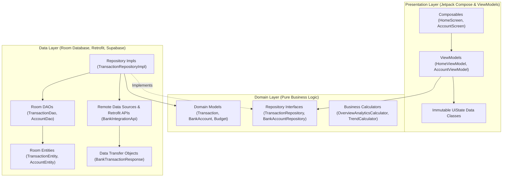

# Clean Architecture: Separation of Concerns in SmartMoney

Clean Architecture is the structural foundation of the SmartMoney mobile application. Conceived by Robert C. Martin (Uncle Bob) and adapted for modern Android by Google, Clean Architecture enforces a strict **separation of concerns** and ensures that core business logic remains independent of UI toolkits, database engines, and third-party frameworks.

---

## 1. The Three Architectural Layers

SmartMoney is divided into three distinct layers:



### A. The Presentation Layer (`com.example.smartmoney.ui`)
* **Role**: Renders pixels, handles touch inputs, formats text/currency for display, and observes application state.
* **Key Components**:
  * **Jetpack Compose Screens & Components**: Stateless or state-hoisted UI composables (e.g. `HomeScreen.kt`, `AccountScreen.kt`, `CashFlowColumnsCard.kt`).
  * **ViewModels**: Android lifecycle-aware state containers inheriting from `androidx.lifecycle.ViewModel` (e.g. `HomeViewModel.kt`, `AccountViewModel.kt`).
  * **UiState Models**: Consolidated, immutable data classes capturing every possible UI visual state (`HomeUiState.kt`, `AccountUiState.kt`).
* **Rule**: The presentation layer never interacts directly with databases (Room) or network clients (Retrofit/Supabase). It only talks to domain repository interfaces.

### B. The Domain Layer (`com.example.smartmoney.domain`)
* **Role**: Houses the enterprise business rules, core financial calculations, and contracts of the system.
* **Key Components**:
  * **Domain Models**: Pure Kotlin data classes representing real-world financial concepts (e.g., `Transaction.kt`, `BankAccount.kt`, `Budget.kt`, `Investment.kt`). These have **no Android framework dependencies** and **no database/JSON annotations**.
  * **Repository Interfaces**: Abstract contracts declaring what data operations can be performed (e.g., `TransactionRepository.kt`, `BankAccountRepository.kt`).
  * **Domain Utilities**: High-value computation engines that operate purely on domain models, such as `OverviewAnalyticsCalculator.kt` and `TransactionTrendCalculator.kt`.
* **Rule**: The domain layer is the center of the architecture. It has **zero dependencies** on external libraries or frameworks (no Android SDK, no Room, no Retrofit, no Compose).

### C. The Data Layer (`com.example.smartmoney.data`)
* **Role**: Coordinates data retrieval, offline persistence, network synchronization, and data transformation.
* **Key Components**:
  * **Repository Implementations**: Implement domain repository interfaces (e.g., `TransactionRepositoryImpl.kt`, `BankAccountRepositoryImpl.kt`).
  * **Local Persistence**: AndroidX Room Database (`AppDatabase.kt`), Room DAOs (`TransactionDao.kt`), and database table definitions (`TransactionEntity.kt`).
  * **Remote Networking**: Retrofit interfaces (`BankIntegrationApi.kt`), remote data sources (`TransactionRemoteDataSource.kt`), and JSON/XML DTOs (`BankTransactionResponse.kt`).
* **Rule**: The data layer is responsible for translating external representations (network DTOs or database rows) into clean domain models before emitting them upward.

---

## 2. The Dependency Inversion Principle (DIP)

One of the most critical principles in Clean Architecture is the **Dependency Inversion Principle**:
> *High-level modules should not depend on low-level modules. Both should depend on abstractions.*

In SmartMoney, `HomeViewModel` (a high-level presentation component) needs to load transactions. Instead of depending directly on `TransactionRepositoryImpl` (which knows about Room databases and Retrofit endpoints), `HomeViewModel` depends on the interface:

```kotlin
// In Presentation Layer (HomeViewModel.kt)
class HomeViewModel(
    private val transactionRepository: TransactionRepository // Interface in Domain Layer
) : ViewModel() {
    val uiState: StateFlow<HomeUiState> = transactionRepository.getTransactions()
        .map { transactions -> /* compute state */ }
        ...
}
```

The concrete implementation lives in the Data Layer:

```kotlin
// In Data Layer (TransactionRepositoryImpl.kt)
class TransactionRepositoryImpl(
    private val localDao: TransactionDao,
    private val remoteDataSource: TransactionRemoteDataSource,
    private val dispatchers: DispatcherProvider
) : TransactionRepository { // Implements Domain interface
    override fun getTransactions(): Flow<List<Transaction>> {
        return localDao.getAllTransactions()
            .map { entities -> entities.map { it.toDomainModel() } }
    }
}
```

### Why This Matters for Development & Testing:
1. **Independent Testing**: In unit tests, `HomeViewModelTest` can be instantiated with a lightweight fake repository without booting a database or making real HTTP calls:
   ```kotlin
   val fakeRepo = FakeTransactionRepository()
   val viewModel = HomeViewModel(fakeRepo)
   ```
2. **Interchangeable Backends**: If SmartMoney switches from Supabase to Firebase, or from local H2/SQLite to SQLCipher, **not a single line of presentation code or domain logic changes**. Only the data layer repository implementation is modified.
3. **Parallel Development**: Frontend developers can build Compose screens against domain repository interfaces while backend engineers finalize API schemas and data sources.
