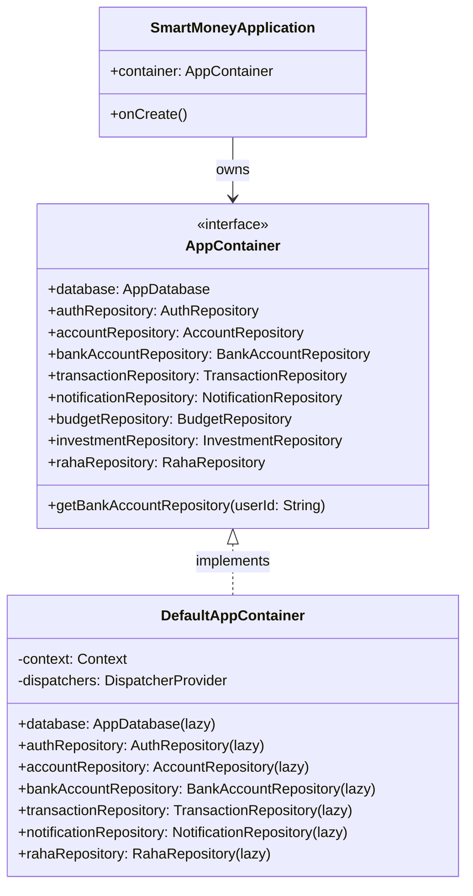

# Manual Dependency Injection: AppContainer Architecture

Dependency Injection (DI) is a software design pattern where an object receives its dependencies from an external source rather than creating them itself. In Android, many projects reach reflexively for large reflection or code-generation frameworks like **Hilt** or **Dagger 2**. 

In SmartMoney, we deliberately use **Manual Dependency Injection (Pure DI)** via [`AppContainer`](file:///home/frank/AndroidStudioProjects/smartmoney/app/src/main/java/com/example/smartmoney/core/di/AppContainer.kt).

---

## 1. Why Manual DI Over Dagger/Hilt?

| Dimension | Dagger / Hilt | Manual DI (`AppContainer`) |
| :--- | :--- | :--- |
| **Build Time** | Slow (KAPT / KSP code generation and annotation processing). | **Fast** (100% pure Kotlin, zero annotation generation). |
| **Traceability** | Hidden behind generated classes (`Hilt_MainActivity`, `_Factory`). | **Direct & Navigable** (Cmd/Ctrl + Click lands on the exact factory). |
| **Learning Curve** | High (`@Singleton`, `@InstallIn`, `@EntryPoint`, `@Component`). | **Low** (Simple interfaces, Kotlin properties, and `by lazy`). |
| **Testing** | Requires custom test runners or Robolectric Hilt test rules. | **Instant** (Pass a custom `AppContainer` or `TestDispatcherProvider`). |
| **Compose Integration** | Tight coupling to `@HiltViewModel` and `hiltViewModel()`. | **Clean separation** via standard Android `ViewModelProvider.Factory`. |

---

## 2. Container Hierarchy & Lifecycle

SmartMoney organizes all application-scoped singletons in `AppContainer`:



### The Interface: [`AppContainer.kt`](file:///home/frank/AndroidStudioProjects/smartmoney/app/src/main/java/com/example/smartmoney/core/di/AppContainer.kt)

```kotlin
interface AppContainer {
    val database: AppDatabase
    val authRepository: AuthRepository
    val accountRepository: AccountRepository
    val bankAccountRepository: BankAccountRepository
    val transactionRepository: TransactionRepository
    val notificationRepository: NotificationRepository
    val budgetRepository: BudgetRepository
    val investmentRepository: InvestmentRepository
    val userPreferencesRepository: UserPreferencesRepository
    val rahaRepository: RahaRepository

    fun getBankAccountRepository(userId: String): BankAccountRepository
}
```

### The Concrete Implementation: `DefaultAppContainer`

Each dependency is instantiated **lazily** using Kotlin's `by lazy` delegate. This ensures fast application startup because objects are only allocated when their respective screens are navigated to:

```kotlin
class DefaultAppContainer(
    private val context: Context,
    private val dispatchers: DispatcherProvider = DefaultDispatcherProvider()
) : AppContainer {

    override val database: AppDatabase by lazy {
        AppDatabase.getDatabase(context)
    }

    override val authRepository: AuthRepository by lazy {
        AuthRepositoryImpl(AuthRemoteDataSource())
    }

    override val bankAccountRepository: BankAccountRepository by lazy {
        BankAccountRepositoryImpl(
            remoteDataSource = AccountRemoteDataSource(),
            localDao = database.accountDao(),
            userIdProvider = { authRepository.currentUserId() ?: "default-user" },
            dispatchers = dispatchers
        )
    }

    override val transactionRepository: TransactionRepository by lazy {
        TransactionRepositoryImpl(
            remoteDataSource = TransactionRemoteDataSource(SupabaseClientProvider.getClient()),
            localDao = database.transactionDao(),
            accountDao = database.accountDao(),
            notificationDao = database.notificationDao(),
            userIdProvider = { authRepository.currentUserId() },
            context = context,
            dispatchers = dispatchers
        )
    }
    ...
}
```

---

## 3. Wiring the Container to Android Application Root

In [`SmartMoneyApplication.kt`](file:///home/frank/AndroidStudioProjects/smartmoney/app/src/main/java/com/example/smartmoney/SmartMoneyApplication.kt), the container is created once on app boot:

```kotlin
class SmartMoneyApplication : Application() {

    lateinit var container: AppContainer
        private set

    override fun onCreate() {
        super.onCreate()
        container = DefaultAppContainer(this)
        NotificationHelper.createNotificationChannel(this)
    }
}
```

---

## 4. Supplying Dependencies to ViewModels via Factories

Android ViewModels must survive configuration changes (e.g. screen rotation), so they cannot be instantiated directly via normal constructors in Composables. Instead, we use `ViewModelProvider.Factory`:

```kotlin
// Inside AccountViewModel.kt
companion object {
    fun provideFactory(
        application: SmartMoneyApplication,
        userId: String
    ): ViewModelProvider.Factory = object : ViewModelProvider.Factory {
        @Suppress("UNCHECKED_CAST")
        override fun <T : ViewModel> create(modelClass: Class<T>): T {
            val container = application.container
            return AccountViewModel(
                repository = container.accountRepository,
                bankAccountRepository = container.getBankAccountRepository(userId),
                userId = userId
            ) as T
        }
    }
}
```

### Instantiation in Composables:
In [`AccountScreen.kt`](file:///home/frank/AndroidStudioProjects/smartmoney/app/src/main/java/com/example/smartmoney/ui/accounts/AccountScreen.kt):

```kotlin
@Composable
fun AccountRoute(
    userId: String,
    context: Context = LocalContext.current
) {
    val app = context.applicationContext as SmartMoneyApplication
    val viewModel: AccountViewModel = viewModel(
        factory = AccountViewModel.provideFactory(app, userId)
    )

    AccountScreen(viewModel = viewModel, ...)
}
```

---

## 5. Swapping Dependencies for Testing

Because `AppContainer` and `DispatcherProvider` are interfaces, testing is trivial without Mockito or Hilt test annotations:

```kotlin
class FakeAppContainer : AppContainer {
    override val database: AppDatabase = mockk()
    override val authRepository: AuthRepository = FakeAuthRepository()
    override val transactionRepository: TransactionRepository = FakeTransactionRepository()
    ...
}
```
You can pass `FakeAppContainer` directly to tests, eliminating brittle framework mocks and keeping unit test suites executing in milliseconds.
