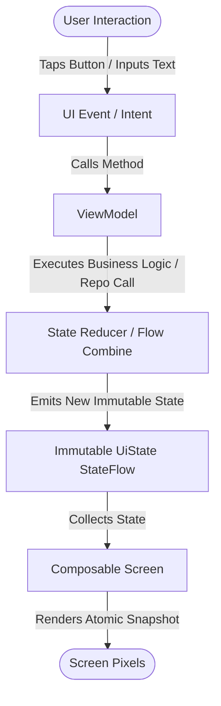

# MVVM & Unidirectional Data Flow (UDF) Design

The presentation layer of SmartMoney adheres strictly to the **Model-View-ViewModel (MVVM)** pattern augmented with **Unidirectional Data Flow (UDF)**. This architectural combination guarantees predictable state transitions, eliminates UI glitches, and prevents race conditions in Jetpack Compose.

---

## 1. Unidirectional Data Flow (UDF) Loop

In traditional imperative Android development (XML Views), screens often mutated view properties directly (e.g., `textView.setText(...)`), leading to fragmented, inconsistent states where loading spinners remained spinning while data was partially visible.

In SmartMoney, data and events move in a single, circular direction:



1. **State Flows DOWN**: The ViewModel exposes a single, read-only `StateFlow<UiState>`. Composables observe this stream and render whatever data it contains.
2. **Events Flow UP**: When the user taps a button or swipes to refresh, the Composable notifies the ViewModel by invoking a method (e.g. `viewModel.onDeleteClicked(id)` or `viewModel.simulateKcbInflow()`).
3. **Immutability**: Composables **never mutate state directly**. Only the ViewModel produces new state snapshots.

---

## 2. Anatomy of an Immutable `UiState` Contract

Consider [`AccountUiState.kt`](file:///home/frank/AndroidStudioProjects/smartmoney/app/src/main/java/com/example/smartmoney/ui/accounts/AccountViewModel.kt#L29-L34):

```kotlin
data class AccountUiState(
    val bankAccounts: List<BankAccount> = emptyList(),
    val isLoading: Boolean = false,
    val isAddingBankAccount: Boolean = false,
    val errorMessage: String? = null
)
```

And [`HomeUiState.kt`](file:///home/frank/AndroidStudioProjects/smartmoney/app/src/main/java/com/example/smartmoney/ui/home/HomeUiState.kt):

```kotlin
data class HomeUiState(
    val totalBalance: BigDecimal = BigDecimal.ZERO,
    val monthlyIncome: BigDecimal = BigDecimal.ZERO,
    val monthlyExpense: BigDecimal = BigDecimal.ZERO,
    val recentTransactions: List<Transaction> = emptyList(),
    val bankAccounts: List<BankAccount> = emptyList(),
    val selectedMonth: YearMonth = YearMonth.now(),
    val analyticsData: OverviewAnalyticsData? = null,
    val isLoading: Boolean = false,
    val error: String? = null
)
```

### Why a Consolidated Data Class?
* **Atomic Rendering**: If balance, transaction list, and loading state were three separate `MutableStateFlow` instances, Compose could recompose when the balance arrived, and recompose again when transactions arrived. With a single `UiState`, Compose receives one coherent snapshot representing the entire screen.
* **Reproducibility**: Any bug or edge case can be reproduced simply by inspecting the `UiState` snapshot.
* **Previewability**: Compose `@Preview` functions can render full screens by simply instantiating a dummy `HomeUiState(...)`.

---

## 3. ViewModel State Production & Flow Synthesis

In [`AccountViewModel.kt`](file:///home/frank/AndroidStudioProjects/smartmoney/app/src/main/java/com/example/smartmoney/ui/accounts/AccountViewModel.kt), state is synthesized from underlying repository flows and local UI flags:

```kotlin
class AccountViewModel(
    private val repository: AccountRepository,
    private val bankAccountRepository: BankAccountRepository,
    private val userId: String,
    private val dispatchers: DispatcherProvider = DefaultDispatcherProvider()
) : ViewModel() {

    private val _isLoading = MutableStateFlow(false)
    val isLoading: StateFlow<Boolean> = _isLoading.asStateFlow()

    private val _isAddingBankAccount = MutableStateFlow(false)
    val isAddingBankAccount: StateFlow<Boolean> = _isAddingBankAccount.asStateFlow()

    private val _bankAccountError = MutableStateFlow<String?>(null)
    val bankAccountError: StateFlow<String?> = _bankAccountError.asStateFlow()

    // Database-backed reactive stream
    val bankAccounts: StateFlow<List<BankAccount>> = bankAccountRepository.getBankAccounts()
        .distinctUntilChanged()
        .stateIn(
            scope = viewModelScope,
            started = SharingStarted.WhileSubscribed(5_000),
            initialValue = emptyList()
        )

    // Consolidated UI State combining all streams
    val uiState: StateFlow<AccountUiState> = combine(
        bankAccounts,
        _isLoading,
        _isAddingBankAccount,
        _bankAccountError
    ) { accounts, loading, adding, error ->
        AccountUiState(
            bankAccounts = accounts,
            isLoading = loading,
            isAddingBankAccount = adding,
            errorMessage = error
        )
    }.stateIn(
        scope = viewModelScope,
        started = SharingStarted.WhileSubscribed(5_000),
        initialValue = AccountUiState(isLoading = true)
    )
```

### Key Engineering Practices:
1. **Backing Property Encapsulation**: Private `_isLoading: MutableStateFlow` is exposed publicly as immutable `isLoading: StateFlow` using `.asStateFlow()`. External consumers cannot call `.value = ...`.
2. **`combine` Operator**: Merges multiple asynchronous flows into one. Whenever any input flow emits, the lambda executes and emits an updated `AccountUiState`.
3. **`distinctUntilChanged()`**: Prevents redundant emissions if the database query results are value-equivalent.

---

## 4. Consuming State in Jetpack Compose

In Compose screens (e.g. `AccountScreen.kt`), state is collected with lifecycle awareness:

```kotlin
@Composable
fun AccountScreen(
    viewModel: AccountViewModel,
    onNavigateBack: () -> Unit
) {
    // Collects with lifecycle safety (pauses when app goes to background)
    val uiState by viewModel.uiState.collectAsStateWithLifecycle()

    Scaffold(
        topBar = { AppTopBar(title = "Linked Accounts") }
    ) { padding ->
        when {
            uiState.isLoading && uiState.bankAccounts.isEmpty() -> {
                LoadingIndicator(modifier = Modifier.padding(padding))
            }
            uiState.errorMessage != null -> {
                ErrorDisplay(message = uiState.errorMessage!!)
            }
            else -> {
                AccountListContent(
                    accounts = uiState.bankAccounts,
                    onAddAccount = { viewModel.onAddAccountClicked() },
                    onSimulateInflow = { viewModel.simulateKcbInflow(...) }
                )
            }
        }
    }
}
```

### Why `collectAsStateWithLifecycle()`?
Unlike standard `collectAsState()`, `collectAsStateWithLifecycle()` monitors the Android `Lifecycle.State`. When the app enters the background (e.g. user presses Home), flow collection is cancelled, which triggers the upstream `WhileSubscribed(5000)` timeout and frees database cursors and coroutine resources.
