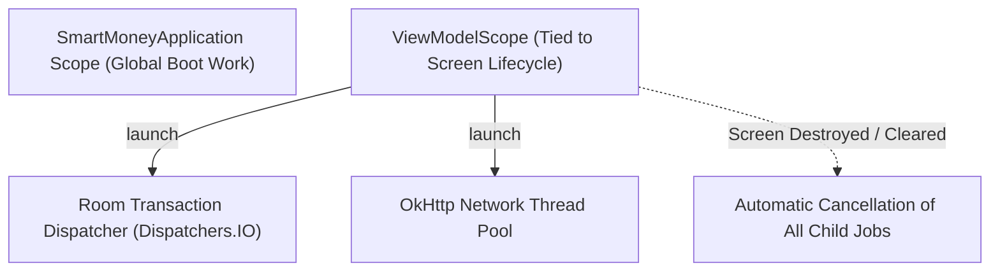

# Coroutine Fundamentals in Android: Structured Concurrency & Dispatchers

Asynchronous programming in SmartMoney is powered entirely by **Kotlin Coroutines**. Coroutines provide lightweight, sequential-looking asynchronous code without callback hell or reactive chaining complexity.

---

## 1. Structured Concurrency & Lifecycles

In older Android applications, launching background threads or RxJava subscriptions without lifecycle management often caused **memory leaks** and **crashes** (e.g. attempting to update a destroyed Activity or Fragment).

SmartMoney employs **Structured Concurrency**: every coroutine is bound to an explicit `CoroutineScope` that determines its lifetime:



### Why `viewModelScope`?
In all ViewModels (e.g. `AccountViewModel`, `HomeViewModel`, `RahaViewModel`), we use `androidx.lifecycle.viewModelScope`:
```kotlin
viewModelScope.launch {
    bankAccountRepository.syncBankAccounts()
}
```
* **Automatic Cancellation**: When the user navigates away and the ViewModel is popped from the backstack, `ViewModel.onCleared()` executes, instantly cancelling `viewModelScope` and all child jobs. In-flight HTTP requests and database queries are halted immediately, preserving CPU and battery.

---

## 2. Decoupling Dispatchers via `DispatcherProvider`

A common anti-pattern in Android development is hardcoding dispatchers directly into business logic:

```kotlin
// ❌ ANTI-PATTERN: Hardcoded Dispatcher
class BadRepository {
    suspend fun loadData() = withContext(Dispatchers.IO) { ... }
}
```

### The Problem:
When writing unit tests for `BadRepository`, tests run on the JVM (without Android main loopers), and `Dispatchers.IO` introduces non-deterministic thread switching and timing race conditions. Tests become flaky or require complex `Dispatchers.setMain` workarounds.

### The SmartMoney Solution:
In [`DispatcherProvider.kt`](file:///home/frank/AndroidStudioProjects/smartmoney/app/src/main/java/com/example/smartmoney/core/coroutine/DispatcherProvider.kt), we abstract dispatchers behind an interface:

```kotlin
interface DispatcherProvider {
    val main: CoroutineDispatcher
    val io: CoroutineDispatcher
    val default: CoroutineDispatcher
    val unconfined: CoroutineDispatcher
}

class DefaultDispatcherProvider : DispatcherProvider {
    override val main: CoroutineDispatcher get() = Dispatchers.Main
    override val io: CoroutineDispatcher get() = Dispatchers.IO
    override val default: CoroutineDispatcher get() = Dispatchers.Default
    override val unconfined: CoroutineDispatcher get() = Dispatchers.Unconfined
}

class TestDispatcherProvider(
    override val main: CoroutineDispatcher = Dispatchers.Unconfined,
    override val io: CoroutineDispatcher = Dispatchers.Unconfined,
    override val default: CoroutineDispatcher = Dispatchers.Unconfined,
    override val unconfined: CoroutineDispatcher = Dispatchers.Unconfined
) : DispatcherProvider
```

### Usage in Repositories & ViewModels:
Repositories inject `DispatcherProvider`:

```kotlin
class BankAccountRepositoryImpl(
    private val localDao: AccountDao,
    private val dispatchers: DispatcherProvider = DefaultDispatcherProvider()
) : BankAccountRepository {

    override suspend fun insertAccount(account: BankAccount) = withContext(dispatchers.io) {
        localDao.insert(account.toEntity())
    }
}
```

### In Unit Tests:
```kotlin
@Test
fun testInsertAccount() = runTest {
    // Everything executes synchronously on the test thread!
    val testDispatchers = TestDispatcherProvider()
    val repository = BankAccountRepositoryImpl(fakeDao, testDispatchers)

    repository.insertAccount(sampleAccount)
    assertTrue(fakeDao.contains(sampleAccount.id))
}
```

---

## 3. Which Dispatcher to Use When?

| Dispatcher | Targeted Workload | Example in SmartMoney |
| :--- | :--- | :--- |
| `dispatchers.io` | Disk I/O, Database transactions, Network HTTP requests | Room DAO inserts, Retrofit API calls, SharedPreferences reads. |
| `dispatchers.default` | CPU-intensive data transformations, JSON parsing, heavy math | `OverviewAnalyticsCalculator.calculate(...)`, sorting large transaction lists, cryptographic hashing. |
| `dispatchers.main` | Interacting with UI elements, updating UI state | Updating `_uiState.value = ...`, triggering Compose state snapshots. |
| `dispatchers.unconfined` | Unit tests only | Instant synchronous test execution without thread hopping. |

---

## 4. Exception Handling in Coroutines

Exceptions in coroutines propagate up the job hierarchy and will crash the application if unhandled. In SmartMoney, we handle exceptions systematically:

### 1. `runCatching` in ViewModels
```kotlin
viewModelScope.launch {
    _isLoading.value = true
    runCatching {
        repository.performAction()
    }.onSuccess { result ->
        _uiState.update { it.copy(data = result, isLoading = false) }
    }.onFailure { throwable ->
        _uiState.update { it.copy(errorMessage = throwable.message, isLoading = false) }
    }
}
```

### 2. Supervision Strategy
Child failures in independent coroutines should not cancel parent scopes. When multiple background sync tasks run concurrently, we wrap them in `coroutineScope` or use `async` with independent error boundaries so a failure in bank synchronization does not crash notification synchronization.
