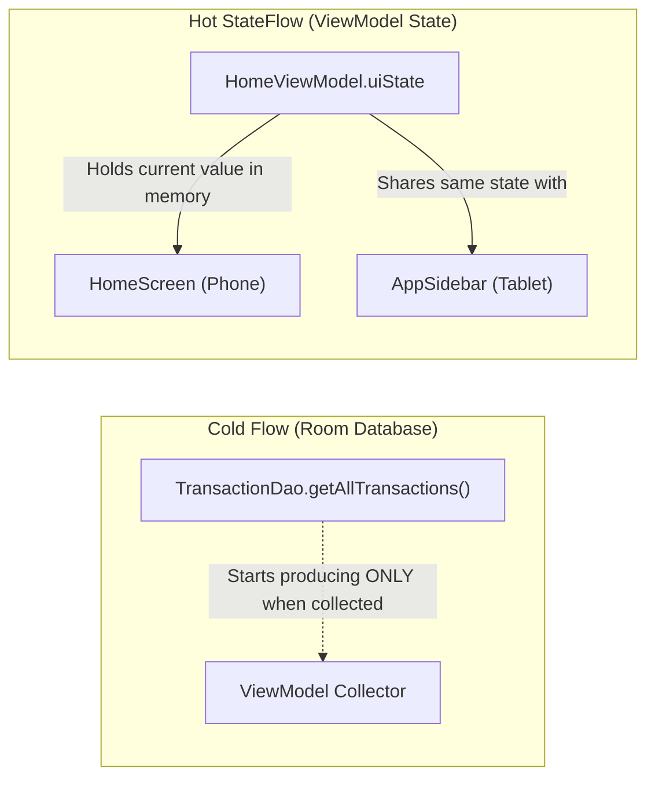

# Reactive Streams with Kotlin Flow: Cold Streams, StateFlow & WhileSubscribed

Kotlin **Flow** is the reactive stream engine powering SmartMoney's real-time financial updates. While coroutines manage one-shot asynchronous tasks (`suspend fun`), Flow manages continuous streams of changing values (e.g. database updates, incoming bank webhooks, live currency calculations).

---

## 1. Cold Streams vs. Hot Streams

Understanding the difference between cold and hot streams is essential for debugging and performance tuning:



### A. Cold Flows (Data Layer)
* **Behavior**: A cold flow does **not produce values until someone begins collecting it**. If no collector exists, no database cursor or query executes.
* **Origin**: Room DAOs emit cold flows:
  ```kotlin
  @Query("SELECT * FROM transactions WHERE userId = :userId ORDER BY date DESC")
  fun getTransactions(userId: String): Flow<List<TransactionEntity>>
  ```
* Every time a collector starts, Room registers an invalidation tracker on the SQLite table. When the table changes, Room re-runs the query and emits a new list. When collection stops, Room unregisters the tracker.

### B. Hot StateFlows (Presentation Layer)
* **Behavior**: A `StateFlow` is **hot**: it always holds a current value in memory (accessible via `.value`) regardless of whether any UI composable is currently observing it.
* **Role**: Used as the single source of state in all ViewModels (`uiState: StateFlow<HomeUiState>`).

---

## 2. Converting Cold Flows to Hot StateFlows: The `stateIn` Operator

To bridge the gap between Room's cold database flows and the UI's hot state, ViewModels use the `stateIn` operator:

```kotlin
val bankAccounts: StateFlow<List<BankAccount>> = bankAccountRepository.getBankAccounts()
    .distinctUntilChanged()
    .stateIn(
        scope = viewModelScope,
        started = SharingStarted.WhileSubscribed(5_000),
        initialValue = emptyList()
    )
```

### The Deep Mechanics of `SharingStarted.WhileSubscribed(5_000)`

The choice of `SharingStarted.WhileSubscribed(5_000)` is one of the most critical performance optimizations in Android development:

```mermaid
sequenceDiagram
    autonumber
    actor User as User Action
    participant Screen as Compose Screen
    participant VM as ViewModel (StateFlow)
    participant DB as Room Database

    User->>Screen: Navigates to Screen
    Screen->>VM: Starts collecting uiState
    VM->>DB: Upstream collection starts; Room registers SQLite tracker
    DB-->>VM: Emits initial database rows
    VM-->>Screen: Emits rendered UiState

    Note over User, DB: User rotates screen or receives phone call
    Screen->>VM: Screen destroyed / stops collecting (0 subscribers)
    Note over VM: 5,000ms stop-timeout timer begins ticking!

    alt User rotates screen within 5 seconds
        User->>Screen: New Activity created & starts collecting within 5s
        Note over VM: Timer cancelled! Upstream DB connection never stopped!
        VM-->>Screen: Re-emits current cached value INSTANTLY (0ms latency, no flicker!)
    else User leaves app for 10 minutes
        Note over VM: 5,000ms timer expires!
        VM->>DB: Cancels upstream collection; unregisters Room SQLite tracker
        Note over DB: Database connection closed; saves CPU and battery
    end
```

### Why not `SharingStarted.Eagerly`?
`Eagerly` keeps the database query running forever, even if the app has been in the background for 6 hours, draining battery.

### Why not `SharingStarted.Lazily`?
`Lazily` starts on first subscription and never stops, creating memory and resource leaks.

### Why not `WhileSubscribed(0)`?
If the timeout is `0`, when the user rotates their phone, the screen recreates. For a few milliseconds during the recreation, there are 0 subscribers. With a timeout of `0`, the database stream would cancel and restart immediately, causing unnecessary query re-execution and visible UI flashing. The **5,000ms delay** provides a safety window during configuration changes while ensuring clean teardown when truly inactive.

---

## 3. Combining Multiple Streams with `combine`

Financial dashboards rarely depend on a single table. The Home screen needs transactions, bank accounts, and budgets simultaneously:

```kotlin
val homeUiState: StateFlow<HomeUiState> = combine(
    transactionRepository.getTransactions(),
    bankAccountRepository.getBankAccounts(),
    budgetRepository.getBudgets(),
    _selectedMonth
) { transactions, accounts, budgets, month ->
    val analytics = OverviewAnalyticsCalculator.calculate(
        transactions = transactions,
        budgets = budgets,
        selectedMonth = month
    )
    HomeUiState(
        recentTransactions = transactions.take(10),
        bankAccounts = accounts,
        analyticsData = analytics,
        selectedMonth = month
    )
}.stateIn(
    scope = viewModelScope,
    started = SharingStarted.WhileSubscribed(5_000),
    initialValue = HomeUiState(isLoading = true)
)
```

Whenever **any** of the four inputs emits a new value, the lambda executes, recalculates the financial state, and emits an updated, atomic `HomeUiState`.
