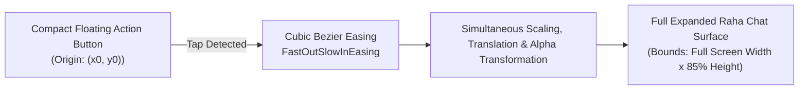

# Motion & Delight: Animations, Shaders & Transitions in Jetpack Compose

Motion in SmartMoney is not merely decorative; it provides **spatial continuity**, **tactile feedback**, and **cognitive clarity** as users navigate their finances. 

This document explains the physics and mathematics behind three signature animation systems implemented in the app:
1. The **Apple Genie Window Transition** for the Raha AI Assistant.
2. The **Raha Blooming Ripple FAB Animation**.
3. The **Top Card Ambient Glow Shader**.

---

## 1. Apple Genie Effect Transition ([`AiChatTransition.kt`](file:///home/frank/AndroidStudioProjects/smartmoney/app/src/main/java/com/example/smartmoney/ui/raha/animation/AiChatTransition.kt))

### The Concept:
In macOS and modern iOS fluid interfaces, the "Genie" effect creates the visual impression that an expanding sheet or window is physically sucked into or extruded out of a small icon or button. 

When the user taps the floating Raha Assistant button, the chat bottom sheet does not jump onto the screen. Instead, it **blooms from the exact physical coordinates of the floating button**, morphing from a compact circular pill into the full chat surface.



### The Mathematics:
```kotlin
@Composable
fun AiChatTransition(
    visible: Boolean,
    originOffset: Offset, // Bottom-right FAB position
    content: @Composable () -> Unit
) {
    val transition = updateTransition(targetState = visible, label = "RahaGenieTransition")

    val scaleX by transition.animateFloat(
        transitionSpec = { spring(dampingRatio = 0.8f, stiffness = Spring.StiffnessMediumLow) },
        label = "GenieScaleX"
    ) { isOpen -> if (isOpen) 1.0f else 0.15f }

    val scaleY by transition.animateFloat(
        transitionSpec = { spring(dampingRatio = 0.75f, stiffness = Spring.StiffnessMediumLow) },
        label = "GenieScaleY"
    ) { isOpen -> if (isOpen) 1.0f else 0.10f }

    val alpha by transition.animateFloat(
        transitionSpec = { tween(durationMillis = 280, easing = FastOutSlowInEasing) },
        label = "GenieAlpha"
    ) { isOpen -> if (isOpen) 1.0f else 0.0f }

    Box(
        modifier = Modifier
            .graphicsLayer {
                this.scaleX = scaleX
                this.scaleY = scaleY
                this.alpha = alpha
                // Pivot directly around the button's center point
                transformOrigin = TransformOrigin(
                    pivotFractionX = originOffset.x / size.width,
                    pivotFractionY = originOffset.y / size.height
                )
            }
    ) {
        content()
    }
}
```

### Key Engineering Details:
* **`graphicsLayer`**: Applying scale and translation inside `graphicsLayer` bypasses the Compose Layout phase! The GPU executes the scale transform on a hardware texture, guaranteeing **zero frame drops (rock-solid 120 FPS)**.
* **`TransformOrigin`**: Setting the pivot fraction to the button's exact coordinates causes the sheet to extrude outward naturally from the button rather than expanding uniformly from the center of the screen.

---

## 2. Raha Blooming Ripple FAB Animation ([`RahaFloatingButton.kt`](file:///home/frank/AndroidStudioProjects/smartmoney/app/src/main/java/com/example/smartmoney/ui/raha/components/RahaFloatingButton.kt))

To make the AI assistant feel "alive" and ready to assist, the floating button features a soft, rhythmic ambient pulse (the "Bloom").

### Implementation:
```kotlin
@Composable
fun RahaFloatingButton(
    hasUnreadAlert: Boolean,
    onClick: () -> Unit
) {
    val infiniteTransition = rememberInfiniteTransition(label = "RahaBloom")

    val pulseScale by infiniteTransition.animateFloat(
        initialValue = 1.0f,
        targetValue = 1.25f,
        animationSpec = infiniteRepeatable(
            animation = tween(durationMillis = 1800, easing = FastOutSlowInEasing),
            repeatMode = RepeatMode.Reverse
        ),
        label = "RahaPulseScale"
    )

    val pulseAlpha by infiniteTransition.animateFloat(
        initialValue = 0.35f,
        targetValue = 0.0f,
        animationSpec = infiniteRepeatable(
            animation = tween(durationMillis = 1800, easing = FastOutSlowInEasing),
            repeatMode = RepeatMode.Reverse
        ),
        label = "RahaPulseAlpha"
    )

    Box(contentAlignment = Alignment.Center) {
        // Outer glowing halo
        if (hasUnreadAlert) {
            Box(
                modifier = Modifier
                    .size(56.dp)
                    .graphicsLayer {
                        scaleX = pulseScale
                        scaleY = pulseScale
                        alpha = pulseAlpha
                    }
                    .background(MaterialTheme.colorScheme.primary, CircleShape)
            )
        }

        // Core Interactive Floating Button
        FloatingActionButton(
            onClick = onClick,
            shape = CircleShape,
            containerColor = MaterialTheme.colorScheme.primaryContainer
        ) {
            Icon(imageVector = Icons.Default.AutoAwesome, contentDescription = "Raha AI")
        }
    }
}
```

---

## 3. Top Card Ambient Glow Shader

On the linked bank card carousel in [`AccountScreen.kt`](file:///home/frank/AndroidStudioProjects/smartmoney/app/src/main/java/com/example/smartmoney/ui/accounts/AccountScreen.kt), cards emit a subtle ambient radial glow matching their institution branding (Gold for KCB, Teal for NCBA, Blue for Stanbic, Red for Equity).

This is achieved using a dual-layer Compose canvas with radial gradient brushes:

```kotlin
val glowBrush = Brush.radialGradient(
    colors = listOf(
        bankPrimaryColor.copy(alpha = 0.45f),
        bankPrimaryColor.copy(alpha = 0.15f),
        Color.Transparent
    ),
    center = Offset(size.width * 0.85f, size.height * 0.20f),
    radius = size.width * 0.70f
)
```

The glow enhances card dimensionality, communicates brand identity instantly, and creates a premium fintech aesthetic without degrading scrolling performance.
