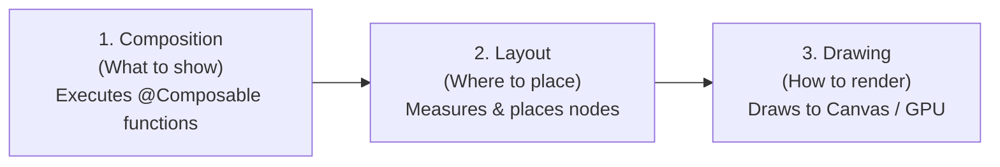

# Jetpack Compose: Lifecycle, Recomposition & Stability Optimization

Jetpack Compose replaces Android's legacy View hierarchy with a declarative programming model. Rather than mutating UI elements imperatively, developers describe UI as pure functions of state.

However, writing efficient Compose applications requires understanding the **Compose compiler's stability model**, **recomposition lifecycles**, and the differences between `remember`, `rememberUpdatedState`, and `derivedStateOf`.

---

## 1. The Compose Lifecycle Phases

Every frame in Jetpack Compose undergoes three distinct phases:



When state changes, Compose strives to **recompose only the smallest possible subtree** of functions that read that specific state. If a Composable's arguments have not changed and are considered **stable**, the Compose compiler **skips** that function entirely.

---

## 2. Compose Compiler Stability: `@Immutable` and `@Stable`

The Compose compiler classifies every parameter passed to a Composable as either **Stable** or **Unstable**:

* **Stable**: Primitive types (`Int`, `String`, `Float`), enums, and classes marked with `@Immutable` or `@Stable`. If the value hasn't changed, Compose skips the Composable.
* **Unstable**: Standard standard library collections (`List<T>`, `Set<T>`, `Map<T>`) because they are interfaces that could theoretically be backed by mutable instances (`ArrayList`).

### The List Recomposition Problem
```kotlin
// ⚠️ May cause unskippable recompositions:
@Composable
fun AccountList(accounts: List<BankAccount>) { ... }
```
Because `List<BankAccount>` is an interface, the Compose compiler cannot guarantee at compile time that the list will never be mutated. Consequently, `AccountList` is marked as **restartable but not skippable**, causing it to recompose on every parent recomposition.

### The SmartMoney Solution:
In our UI models and state containers, data classes are composed of immutable `val` properties and marked with `@Immutable`:

```kotlin
@Immutable
data class AccountUiState(
    val bankAccounts: List<BankAccount> = emptyList(),
    val isLoading: Boolean = false,
    val isAddingBankAccount: Boolean = false,
    val errorMessage: String? = null
)
```
Or for isolated lists, we wrap items in immutable value holders:
```kotlin
@Immutable
data class ImmutableAccountList(val items: List<BankAccount>)
```
This signals to the Compose compiler that all instances are structurally immutable, allowing Compose to skip the Composable if the instance reference has not changed.

---

## 3. Mastering `remember` and `derivedStateOf`

### A. `remember`: Preserving State Across Recompositions
`remember` caches the result of an allocation across recompositions of the same call site:

```kotlin
val scrollState = rememberScrollState()
val showDialog = remember { mutableStateOf(false) }
```
Without `remember`, the object would be allocated on every single frame recomposition.

### B. `derivedStateOf`: Eliminating Wasted Recompositions
`derivedStateOf` is used when a calculation depends on state that changes frequently (e.g., scroll position, raw timestamps), but the UI only cares about a derived threshold or boolean:

```kotlin
// ❌ WITHOUT derivedStateOf (Recomposes on EVERY single pixel scrolled!):
val isScrolled = scrollState.value > 0
FloatingActionButton(visible = isScrolled)

// ✅ WITH derivedStateOf (Recomposes ONLY when boolean transitions true <-> false):
val isScrolled by remember {
    derivedStateOf { scrollState.value > 0 }
}
FloatingActionButton(visible = isScrolled)
```

In [`BudgetPacingGraphCard.kt`](file:///home/frank/AndroidStudioProjects/smartmoney/app/src/main/java/com/example/smartmoney/ui/home/analytics/components/BudgetPacingGraphCard.kt), `derivedStateOf` is used to compute whether spending is ahead of or behind pace:
```kotlin
val pacingStatus by remember(data) {
    derivedStateOf {
        when {
            data.actualSpending > data.plannedSpending -> PacingStatus.OVER_BUDGET
            data.actualSpending < data.plannedSpending * 0.9 -> PacingStatus.UNDER_BUDGET
            else -> PacingStatus.ON_TRACK
        }
    }
}
```

---

## 4. State Hoisting Pattern

In SmartMoney, UI components are decoupled into **Stateful Containers** and **Stateless Presenters**:

```kotlin
// 1. Stateful Container (Handles ViewModel integration)
@Composable
fun AccountScreen(viewModel: AccountViewModel) {
    val state by viewModel.uiState.collectAsStateWithLifecycle()
    AccountContent(
        state = state,
        onAddClick = { viewModel.openAddDialog() },
        onRefresh = { viewModel.refreshAccounts(force = true) }
    )
}

// 2. Stateless Presenter (Pure UI, Easy to Preview & Test)
@Composable
fun AccountContent(
    state: AccountUiState,
    onAddClick: () -> Unit,
    onRefresh: () -> Unit
) {
    // Pure rendering logic
}
```

### Benefits:
1. **Previewability**: `AccountContent` can be rendered in Android Studio's Compose Preview without instantiating ViewModels or Android Application contexts.
2. **Reusability**: `AccountContent` can be embedded inside bottom sheets, dialogs, or multi-pane tablet layouts.
3. **Decoupled Testing**: UI interactions can be verified using Compose UI testing without mocking repository streams.
