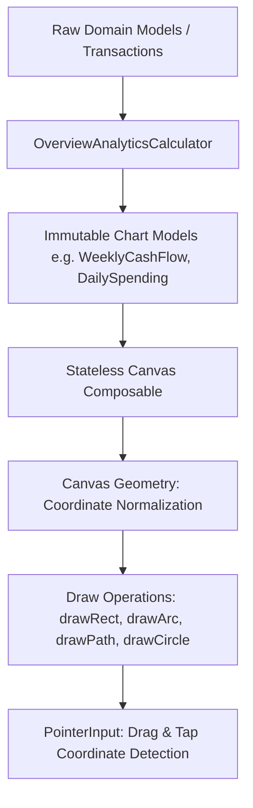

# Custom Charts & Native Compose Canvas Drawing

Financial applications rely heavily on data visualizations to communicate cash flow trends, budget health, and spending behavior. Rather than importing bulky, third-party Android charting libraries (which increase APK size, introduce legacy View wrappers, and fight Compose animations), SmartMoney implements its visualizations using **Native Jetpack Compose `Canvas`**.

---

## 1. Native Canvas Architecture Principles

Every custom chart in SmartMoney follows a four-step pipeline:



1. **Calculations Outside UI**: Mathematical aggregations, date arithmetic, and percent calculations occur in `OverviewAnalyticsCalculator.kt` on `Dispatchers.Default`. The Composable receives pre-computed numerical models.
2. **Normalized Coordinates**: Charts scale dynamically to any device screen size. Coordinates are computed as fractions of `size.width` and `size.height`.
3. **Hardware Acceleration**: Operations are drawn directly onto the Android GPU via `androidx.compose.ui.graphics.drawscope.DrawScope`.

---

## 2. The Four Financial Visualizations

### 1. Cash Flow Column Chart ([`CashFlowColumnsCard.kt`](file:///home/frank/AndroidStudioProjects/smartmoney/app/src/main/java/com/example/smartmoney/ui/home/analytics/components/CashFlowColumnsCard.kt))
* **Visual**: Grouped column chart showing weekly **Money In** (Green) vs. **Money Out** (Red/Coral) with a time-toggle supporting Day, Week, and Month.
* **Canvas Math**:
  ```kotlin
  Canvas(modifier = Modifier.fillMaxWidth().height(180.dp)) {
      val maxVal = maxOf(data.maxInflow, data.maxOutflow).coerceAtLeast(1.0)
      val groupWidth = size.width / data.weeks.size
      val barWidth = groupWidth * 0.35f

      data.weeks.forEachIndexed { index, week ->
          val groupX = index * groupWidth
          val inHeight = (week.moneyIn / maxVal).toFloat() * size.height
          val outHeight = (week.moneyOut / maxVal).toFloat() * size.height

          // Draw Money In (Inflow) Bar
          drawRoundRect(
              color = InflowGreen,
              topLeft = Offset(groupX + groupWidth * 0.1f, size.height - inHeight),
              size = Size(barWidth, inHeight),
              cornerRadius = CornerRadius(4.dp.toPx())
          )

          // Draw Money Out (Outflow) Bar
          drawRoundRect(
              color = OutflowCoral,
              topLeft = Offset(groupX + groupWidth * 0.1f + barWidth + 4.dp.toPx(), size.height - outHeight),
              size = Size(barWidth, outHeight),
              cornerRadius = CornerRadius(4.dp.toPx())
          )
      }
  }
  ```

---

### 2. Spending Category Donut Chart ([`SpendingDonutCard.kt`](file:///home/frank/AndroidStudioProjects/smartmoney/app/src/main/java/com/example/smartmoney/ui/home/analytics/components/SpendingDonutCard.kt))
* **Visual**: Clean donut chart visualizing category share (Rent, Groceries, Transport, Utilities, Other). The center displays the full monthly spending total.
* **Canvas Math**:
  Uses `drawArc` with `useCenter = false` and a stroke width:
  ```kotlin
  Canvas(modifier = Modifier.size(160.dp)) {
      val stroke = Stroke(width = 24.dp.toPx(), cap = StrokeCap.Round)
      var startAngle = -90f // Start at top 12 o'clock

      categories.forEach { category ->
          val sweepAngle = (category.percentage / 100f) * 360f
          drawArc(
              color = category.color,
              startAngle = startAngle,
              sweepAngle = sweepAngle - 2f, // Subtle gap between slices
              useCenter = false,
              style = stroke
          )
          startAngle += sweepAngle
      }
  }
  ```

---

### 3. Daily Spending Heatmap ([`DailySpendingHeatmapCard.kt`](file:///home/frank/AndroidStudioProjects/smartmoney/app/src/main/java/com/example/smartmoney/ui/home/analytics/components/DailySpendingHeatmapCard.kt))
* **Visual**: GitHub-style calendar intensity matrix representing daily spending volume across the month:
  * Tier 0: `░` (Zero spending / Rest day)
  * Tier 1: `▒` (Light spending: KES 1 – 999)
  * Tier 2: `▓` (Moderate spending: KES 1,000 – 2,499)
  * Tier 3: `█` (High intensity spending: KES 2,500+)
* **Interactivity**: Users can tap any day block to inspect transaction count, category breakdown, and whether it was the highest spending day of the month.

---

### 4. Budget Pacing Graph ([`BudgetPacingGraphCard.kt`](file:///home/frank/AndroidStudioProjects/smartmoney/app/src/main/java/com/example/smartmoney/ui/home/analytics/components/BudgetPacingGraphCard.kt))
* **Visual**: Cumulative spending line chart comparing **Actual Cumulative Spending** against a **Uniform Planned Monthly Budget Pace**.
* **Key Visual Elements**:
  * **Planned Pace**: Linear reference dashed line connecting $(Day_1, 0)$ to $(Day_{end}, MonthlyLimit)$.
  * **Actual Spending**: Smooth bezier path (`Path.cubicTo`) colored dynamically based on pacing (Green when under budget, Orange/Red when pacing ahead).
  * **Interactive Touch Scrubber**:
    ```kotlin
    Modifier.pointerInput(Unit) {
        detectDragGestures { change, _ ->
            val touchX = change.position.x
            val dayFraction = (touchX / size.width).coerceIn(0f, 1f)
            val selectedDay = (dayFraction * daysInMonth).toInt() + 1
            viewModel.onDayScrubbed(selectedDay)
        }
    }
    ```
    As the user drags their finger across the graph, a vertical indicator line and tooltip pill follow the finger, displaying exact actual vs. planned values on that date.
