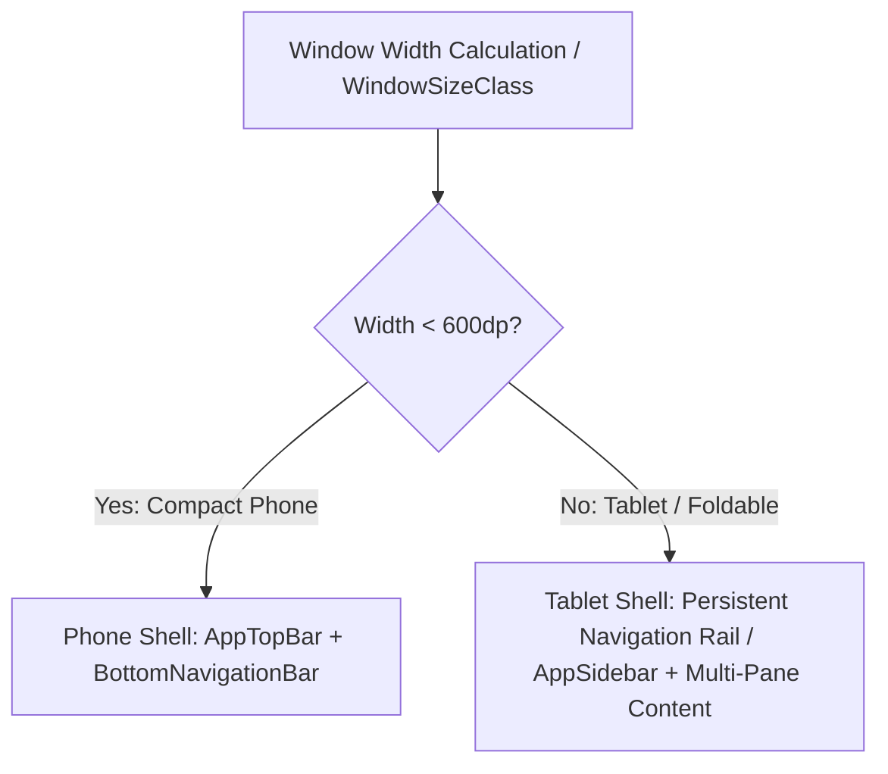

# Navigation & Responsive Layout: Mobile, Foldable & Tablet Adaptation

SmartMoney is designed to run seamlessly across diverse Android form factors: compact smartphones, large flagship phones, foldables, and desktop/tablet devices.

This guide details the navigation architecture and the responsive shell pattern.

---

## 1. Type-Safe Navigation via Sealed Hierarchies

Rather than relying on raw navigation strings (which are prone to runtime typos like `"user_profile"` vs `"userProfile"`), SmartMoney models its destination routes using a sealed class hierarchy in [`Screen.kt`](file:///home/frank/AndroidStudioProjects/smartmoney/app/src/main/java/com/example/smartmoney/ui/navigation/Screen.kt):

```kotlin
sealed class Screen(
    val route: String,
    val title: String,
    val icon: ImageVector? = null
) {
    object Splash : Screen("splash", "Splash")
    object Login : Screen("login", "Login")
    object SignUp : Screen("signup", "Sign Up")
    object WarmUpSync : Screen("warmup_sync", "Warming Up")

    // Main App Navigation Destinations
    object Home : Screen("home", "Home", Icons.Outlined.Home)
    object Accounts : Screen("accounts", "Accounts", Icons.Outlined.AccountBalance)
    object Budget : Screen("budget", "Budgets", Icons.Outlined.PieChart)
    object Investment : Screen("investment", "Investments", Icons.Outlined.TrendingUp)
    object Transactions : Screen("transactions", "History", Icons.Outlined.ReceiptLong)
    object Menu : Screen("menu", "Menu", Icons.Outlined.Menu)
}
```

### Benefits:
1. **Compile-Time Safety**: When a route changes or a new screen is added, the compiler enforces updates across navigation graphs and bottom bars.
2. **Metadata Association**: Each route carries its display title and navigation vector icon in a single, cohesive declaration.

---

## 2. The Responsive Shell Pattern ([`MainResponsiveShell.kt`](file:///home/frank/AndroidStudioProjects/smartmoney/app/src/main/java/com/example/smartmoney/ui/components/MainResponsiveShell.kt))

Modern Android devices span from 5-inch compact phones to 13-inch tablets and Chromebooks. A bottom navigation bar looks great on a smartphone, but on a tablet, it stretches awkwardly across 2500 pixels. Conversely, a sidebar on a phone occupies valuable horizontal space.

To solve this, SmartMoney wraps primary screens in a **Responsive Shell**:



### Implementation:
```kotlin
@Composable
fun MainResponsiveShell(
    currentScreen: Screen,
    onNavigate: (Screen) -> Unit,
    content: @Composable () -> Unit
) {
    val configuration = LocalConfiguration.current
    val screenWidthDp = configuration.screenWidthDp

    if (screenWidthDp < 600) {
        // 📱 COMPACT LAYOUT (Smartphones)
        Scaffold(
            bottomBar = {
                AppBottomNavigationBar(
                    currentScreen = currentScreen,
                    onNavigate = onNavigate
                )
            }
        ) { paddingValues ->
            Box(modifier = Modifier.padding(paddingValues)) {
                content()
            }
        }
    } else {
        // 💻 EXPANDED LAYOUT (Tablets / Foldables / Landscape)
        Row(modifier = Modifier.fillMaxSize()) {
            AppSidebar(
                currentScreen = currentScreen,
                onNavigate = onNavigate,
                modifier = Modifier.width(240.dp)
            )
            VerticalDivider()
            Box(modifier = Modifier.weight(1f)) {
                content()
            }
        }
    }
}
```

### Key Responsive Design Decisions:
* **Compact (< 600dp)**: Thumb-friendly bottom navigation bar (`AppBottomNavigationBar.kt`) with quick access to Home, Accounts, Budgets, and Investments.
* **Expanded ($\ge$ 600dp)**: Left-anchored navigation rail or drawer (`AppSidebar.kt`), providing clear labeling, profile avatars, and freeing up the full vertical height for rich financial charts and transaction ledgers.
