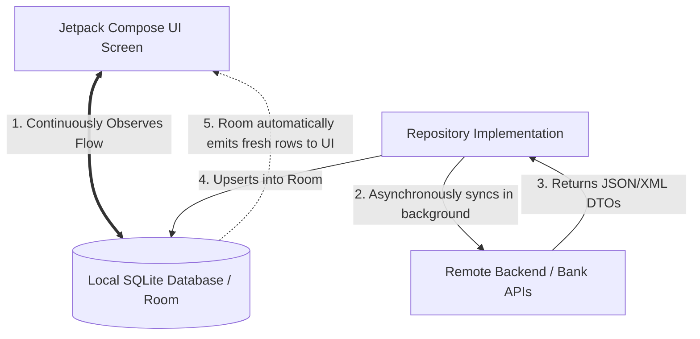

# Room Database & Offline-First Single Source of Truth (SSOT)

A hallmark of a high-quality fintech application is that it **works reliably without an active internet connection**. Users should be able to open SmartMoney on an airplane or in an underground parking garage and immediately see their account balances, recent transactions, and budgets.

To achieve this, SmartMoney implements the **Single Source of Truth (SSOT)** pattern backed by **AndroidX Room**.

---

## 1. The Single Source of Truth (SSOT) Architecture

In a naive network-first architecture, UI screens make HTTP calls and display whatever the network returns. If the network drops or is slow, the screen displays a blank spinner or an error dialog.

In SmartMoney's SSOT architecture, **the UI never waits on the network**:



### Architectural Guarantees:
1. **Zero-Wait UI Startup**: When the user opens the app, the UI renders local database cached records in under **50 milliseconds**.
2. **Seamless Offline Operation**: The user can browse existing transactions, review budgets, and inspect accounts completely offline.
3. **Background Convergence**: Network operations run silently in the background. When fresh transactions arrive, the repository upserts them into Room, and Room automatically pushes updates to the UI stream.

---

## 2. AppDatabase Setup & Converters

[`AppDatabase.kt`](file:///home/frank/AndroidStudioProjects/smartmoney/app/src/main/java/com/example/smartmoney/data/local/database/AppDatabase.kt) is the central SQLite database definition:

```kotlin
@Database(
    entities = [
        AccountEntity::class,
        TransactionEntity::class,
        NotificationEntity::class,
        UserEntity::class,
        AccountConnectionEntity::class
    ],
    version = 4,
    exportSchema = false
)
@TypeConverters(Converters::class)
abstract class AppDatabase : RoomDatabase() {
    abstract fun accountDao(): AccountDao
    abstract fun transactionDao(): TransactionDao
    abstract fun notificationDao(): NotificationDao
    abstract fun userDao(): UserDao

    companion object {
        @Volatile
        private var INSTANCE: AppDatabase? = null

        fun getDatabase(context: Context): AppDatabase {
            return INSTANCE ?: synchronized(this) {
                val instance = Room.databaseBuilder(
                    context.applicationContext,
                    AppDatabase::class.java,
                    "smartmoney_db"
                )
                .fallbackToDestructiveMigration()
                .build()
                INSTANCE = instance
                instance
            }
        }
    }
}
```

### Type Converters: Handling Financial Datatypes ([`Converters.kt`](file:///home/frank/AndroidStudioProjects/smartmoney/app/src/main/java/com/example/smartmoney/data/local/database/Converters.kt))
SQLite natively supports only `INTEGER`, `REAL`, `TEXT`, and `BLOB`. It has no native understanding of Java/Kotlin `BigDecimal` or `Instant`.
* **`BigDecimal`**: Floats or doubles must **never be used for currency** due to binary floating-point rounding errors (e.g., $0.1 + 0.2 = 0.30000000000000004$). We serialize `BigDecimal` as high-precision Strings in the database.
* **`Instant` / `Date`**: Serialized as epoch milliseconds (`Long`) or ISO-8601 strings.

---

## 3. Room DAOs: Reactive Query Streams

Room DAOs expose Kotlin `Flow` directly from SQLite query methods:

```kotlin
@Dao
interface TransactionDao {

    @Query("SELECT * FROM transactions WHERE userId = :userId ORDER BY date DESC")
    fun getTransactionsByUserId(userId: String): Flow<List<TransactionEntity>>

    @Insert(onConflict = OnConflictStrategy.REPLACE)
    suspend fun insertTransactions(transactions: List<TransactionEntity>)

    @Query("DELETE FROM transactions WHERE userId = :userId")
    suspend fun clearTransactionsForUser(userId: String)
}
```

### Automatic Invalidation Tracking:
When `insertTransactions(...)` is called, Room's background SQLite hook triggers invalidation for the `transactions` table. Any active collector of `getTransactionsByUserId(userId)` receives the new list automatically without requiring manual callbacks or notification dispatchers.

---

## 4. Entity to Domain Mapping

Room entities represent SQLite table schemas (`@Entity(tableName = "transactions")`). Domain models represent clean business concepts.

In [`TransactionRepositoryImpl.kt`](file:///home/frank/AndroidStudioProjects/smartmoney/app/src/main/java/com/example/smartmoney/data/repository/TransactionRepositoryImpl.kt):

```kotlin
fun TransactionEntity.toDomainModel(): Transaction {
    return Transaction(
        id = this.id,
        userId = this.userId,
        accountId = this.accountId,
        amount = this.amount,
        type = TransactionType.valueOf(this.type.uppercase()),
        category = this.category,
        date = this.date,
        description = this.description,
        isPending = this.isPending
    )
}
```

This mapping prevents database column renames from leaking into the presentation layer or business calculators.
