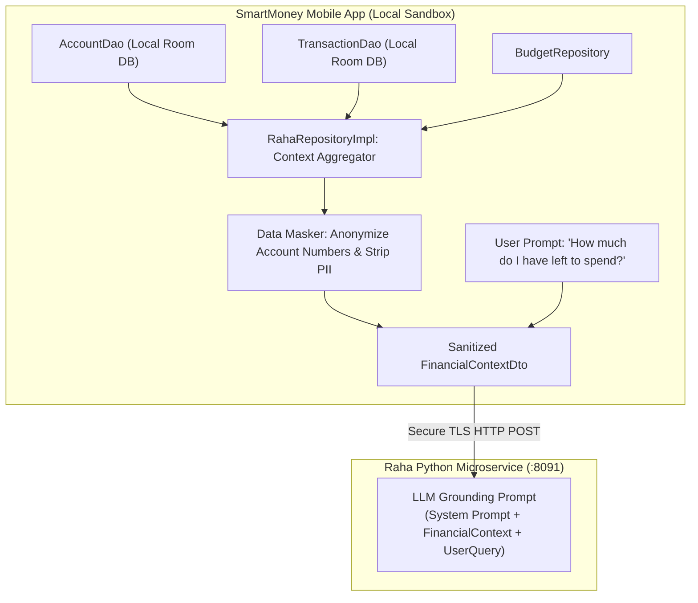

# Privacy-Preserving Financial Context Aggregation for AI

Large Language Models (LLMs) hallucinate if they lack ground-truth data. When a user asks:
> *"Can I afford dinner at an upscale restaurant this weekend?"*

Raha cannot answer intelligently without knowing:
1. The user's liquid cash balance across linked bank accounts.
2. The remaining budget allocation for the "Dining" category this month.
3. Recent transactions in the last 48 hours.

However, streaming raw bank statements or unmasked account numbers over the wire to an AI service violates user privacy.

SmartMoney solves this through **On-Device Financial Context Aggregation & Sanitization**.

---

## 1. On-Device Aggregation Architecture

The mobile app aggregates financial state locally **before** sending a prompt to the AI backend:



---

## 2. Constructing the Sanitized Context DTO

In [`RahaRepositoryImpl.kt`](file:///home/frank/AndroidStudioProjects/smartmoney/app/src/main/java/com/example/smartmoney/data/repository/RahaRepositoryImpl.kt), the repository queries local DAOs and constructs an anonymized financial snapshot:

```kotlin
suspend fun buildFinancialContext(): FinancialContextDto = withContext(dispatchers.io) {
    val userId = userIdProvider() ?: return@withContext FinancialContextDto.EMPTY

    // 1. Fetch live local accounts
    val accounts = accountDao.getAccountsByUserIdSync(userId)
    val totalBalance = accounts.sumOf { it.balance }

    // 2. Fetch recent transactions (last 30 days)
    val recentTxs = transactionDao.getRecentTransactionsSync(userId, limit = 20)
    val monthlySpend = recentTxs
        .filter { it.type == "EXPENSE" }
        .sumOf { it.amount }

    // 3. Mask sensitive identifiers
    val sanitizedAccounts = accounts.map { acc ->
        SanitizedAccountSummary(
            institution = acc.institution,
            maskedNumber = maskAccountNumber(acc.accountNumber),
            balance = acc.balance.toPlainString(),
            currency = acc.currency
        )
    }

    FinancialContextDto(
        totalLiquidBalance = totalBalance.toPlainString(),
        monthlyTotalExpense = monthlySpend.toPlainString(),
        accounts = sanitizedAccounts,
        topSpendingCategories = computeTopCategories(recentTxs)
    )
}

private fun maskAccountNumber(raw: String): String {
    return if (raw.length <= 4) "****" else "****" + raw.takeLast(4)
}
```

---

## 3. Grounding Prompt Synthesis on the Backend

When the intelligence microservice receives the request:

```json
{
  "prompt": "Can I afford dinner at an upscale restaurant this weekend?",
  "context": {
    "totalLiquidBalance": "125000.00",
    "monthlyTotalExpense": "48350.00",
    "accounts": [
      { "institution": "KCB", "maskedNumber": "****164", "balance": "85000.00" },
      { "institution": "NCBA", "maskedNumber": "****902", "balance": "40000.00" }
    ],
    "topSpendingCategories": [
      { "category": "Rent", "amount": "20000.00" },
      { "category": "Groceries", "amount": "12000.00" }
    ]
  }
}
```

The AI backend formats this into a system prompt:
```text
You are Raha, the user's personal financial assistant.
The user currently has KES 125,000.00 across 2 linked accounts (KCB and NCBA).
Their total expenses this month are KES 48,350.00.
Answer the user's question directly, accurately, and encourage responsible budgeting.
```

### Benefits:
1. **Zero Hallucination on Balances**: Raha accurately cites the user's real balance (KES 125,000) and specific bank breakdown.
2. **PIE/PII Compliance**: No real account numbers, national IDs, or personal names ever leave the mobile device.
3. **Local Cache Speed**: Reading the context takes **< 5ms** from the local Room database.
