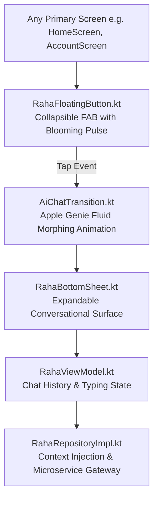

# Raha AI Assistant: Architecture & Conversational UI

**Raha** is SmartMoney's conversational financial intelligence assistant. Rather than hiding AI inside a nested settings menu, Raha is designed as an ambient, omnipresent companion that users can summon from any screen in the application.

This document details the UI component structure, state management, and conversational interaction model of Raha.

---

## 1. Visual & Component Hierarchy

Raha consists of three primary visual layers:



---

## 2. The Expandable Bottom Sheet ([`RahaBottomSheet.kt`](file:///home/frank/AndroidStudioProjects/smartmoney/app/src/main/java/com/example/smartmoney/ui/raha/RahaBottomSheet.kt))

The conversational surface is implemented using Jetpack Compose's `ModalBottomSheet`:

* **Drag Handle & Header**: Displays Raha's glowing avatar, online status badge, and clear context button.
* **Message List (`LazyColumn`)**: Chronological bubble stream:
  * **User Messages**: Right-aligned, primary container color, user avatar.
  * **Raha Messages**: Left-aligned, surface variant color, markdown formatting, quick suggestion chips.
* **Typing Indicator**: Animated three-dot bouncing wave indicating that the LLM is synthesizing a response.
* **Quick Action Pills**: Pre-computed suggestion chips (e.g., *"What is my total balance?"*, *"How much have I spent on groceries this month?"*, *"Compare spending with last month"*).
* **Input Dock**: Rounded text field with audio microphone icon and instant send button.

---

## 3. The Conversational UI State ([`RahaUiState.kt`](file:///home/frank/AndroidStudioProjects/smartmoney/app/src/main/java/com/example/smartmoney/ui/raha/RahaUiState.kt))

```kotlin
data class RahaUiState(
    val isOpen: Boolean = false,
    val hasUnreadAlert: Boolean = false,
    val isTyping: Boolean = false,
    val messages: List<RahaMessage> = emptyList(),
    val quickReplies: List<String> = emptyList(),
    val currentFinancialContext: FinancialContextSummary? = null,
    val errorMessage: String? = null
)

data class RahaMessage(
    val id: String = UUID.randomUUID().toString(),
    val sender: RahaSender, // USER or RAHA
    val text: String,
    val timestamp: Instant = Instant.now(),
    val quickReplies: List<String> = emptyList(),
    val actions: List<RahaAction> = emptyList()
)
```

---

## 4. ViewModel Workflow ([`RahaViewModel.kt`](file:///home/frank/AndroidStudioProjects/smartmoney/app/src/main/java/com/example/smartmoney/ui/raha/RahaViewModel.kt))

When a user submits a prompt:

```kotlin
fun sendMessage(text: String) {
    if (text.isBlank()) return

    // 1. Instantly append User message to UI state (Optimistic Update)
    val userMsg = RahaMessage(sender = RahaSender.USER, text = text.trim())
    _uiState.update { current ->
        current.copy(
            messages = current.messages + userMsg,
            isTyping = true,
            errorMessage = null
        )
    }

    // 2. Launch asynchronous dispatch to intelligence engine
    viewModelScope.launch {
        val result = rahaRepository.sendMessage(
            prompt = text.trim(),
            history = _uiState.value.messages
        )

        result.fold(
            onSuccess = { assistantMsg ->
                _uiState.update { current ->
                    current.copy(
                        messages = current.messages + assistantMsg,
                        isTyping = false
                    )
                }
            },
            onFailure = { error ->
                _uiState.update { current ->
                    current.copy(
                        isTyping = false,
                        errorMessage = "Unable to reach Raha. Operating in offline mode."
                    )
                }
            }
        )
    }
}
```

### Key Conversational UX Design Decisions:
1. **Optimistic Rendering**: The user's bubble appears with 0ms latency.
2. **Auto-Scroll to Bottom**: The `LazyListState` automatically animates to `messages.size - 1` upon message insertion.
3. **Action Triggers**: If Raha suggests an action (e.g. *"Navigate to Budget Screen"*), the message includes an executable `RahaAction` pill that navigates the user directly to the relevant screen when tapped.
