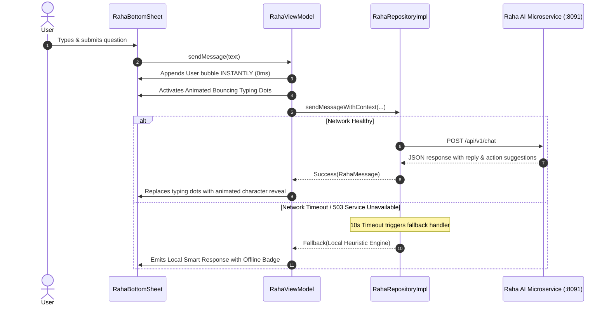

# Raha AI: Streaming, Latency & Heuristic Fallbacks

Mobile networks are inherently unreliable. When communicating with generative AI models (which can have variable latency or be temporarily unreachable during network transitions), a mobile app must have robust strategies for **streaming tokens**, **handling timeouts**, and **providing intelligent local fallbacks**.

---

## 1. Handling Latency: Optimistic UI & Progressive Typing

Waiting 3 to 5 seconds for a complete LLM response without UI feedback makes users assume the app has frozen. SmartMoney employs three UX techniques to manage latency:



---

## 2. On-Device Heuristic Fallback Engine

If the AI backend microservice is offline or the user is completely disconnected from the internet, Raha does **not** fail with an unhelpful *"Network Error 500"* message.

Instead, [`RahaRepositoryImpl.kt`](file:///home/frank/AndroidStudioProjects/smartmoney/app/src/main/java/com/example/smartmoney/data/repository/RahaRepositoryImpl.kt) invokes a **Local Heuristic Rule Engine**:

```kotlin
private suspend fun generateLocalFallbackResponse(
    prompt: String,
    context: FinancialContextDto
): RahaMessage {
    val lower = prompt.lowercase()

    return when {
        lower.contains("balance") || lower.contains("how much") -> {
            RahaMessage(
                sender = RahaSender.RAHA,
                text = "You currently have a total liquid balance of KES ${context.totalLiquidBalance} " +
                       "across your linked accounts.",
                quickReplies = listOf("View Linked Accounts", "Check Budgets")
            )
        }
        lower.contains("budget") || lower.contains("spending") -> {
            RahaMessage(
                sender = RahaSender.RAHA,
                text = "Your total expenses this month stand at KES ${context.monthlyTotalExpense}. " +
                       "Your top spending category is ${context.topSpendingCategories.firstOrNull()?.category ?: "General"}.",
                quickReplies = listOf("View Budgets", "Recent Transactions")
            )
        }
        lower.contains("hi") || lower.contains("hello") || lower.contains("habari") -> {
            RahaMessage(
                sender = RahaSender.RAHA,
                text = "Habari! I am currently running in offline mode. I can still answer basic questions about your current balances and spending.",
                quickReplies = listOf("What is my balance?", "Check spending")
            )
        }
        else -> {
            RahaMessage(
                sender = RahaSender.RAHA,
                text = "I'm currently unable to reach my cloud reasoning engine. However, your local balances and transactions are safe. Please check back when online!",
                quickReplies = listOf("Check my balance", "Retry")
            )
        }
    }
}
```

### Why This Delights Users:
Even with zero internet connectivity, a user asking *"What is my balance?"* gets an immediate, accurate response synthesized from their local Room database. The app feels indestructible.
