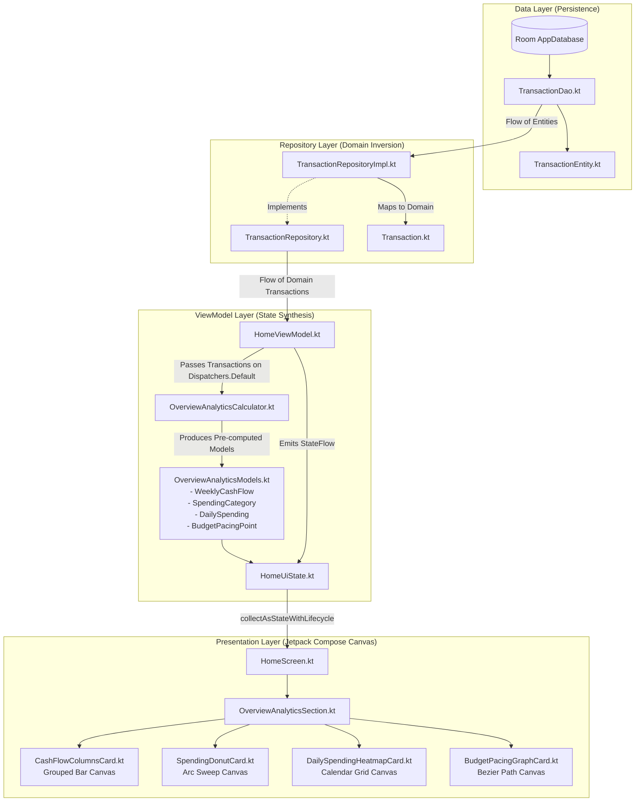
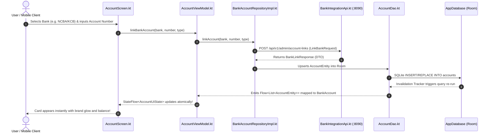
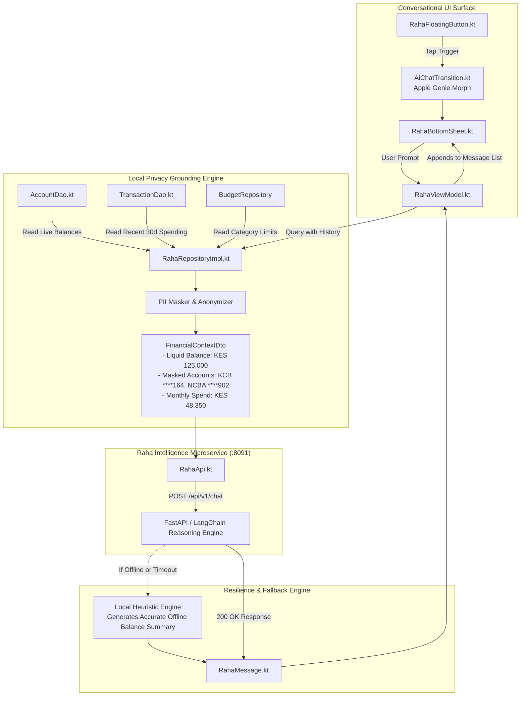

# Architecture Dependency Graphs: Visualizing Component Couplings

This document maps the exact, file-to-file relationships and data transformations across the SmartMoney mobile application using visual Mermaid diagrams.

---

## 1. Feature 1: Overview & Financial Visualizations Pipeline

This pipeline demonstrates how transactions flow from the local database, through calculation models, into the four custom Compose Canvas charts on the Overview page.



---

## 2. Feature 2: Bank Integration & Account Linking Pipeline

This pipeline maps how external bank accounts (KCB, NCBA, Stanbic, Equity) are linked and how Instant Payment Notifications (IPN) reach the mobile app.



---

## 3. Feature 3: Raha AI Assistant & Financial Grounding Pipeline

This pipeline illustrates how Raha queries local financial state to ground user queries without leaking personal identifying information over the wire.



---

## 4. Feature 4: Post-Login Warm-Up Synchronization Pipeline

When a user signs in, the application performs an orchestrated pre-warming synchronization in [`WarmUpSyncViewModel.kt`](file:///home/frank/AndroidStudioProjects/smartmoney/app/src/main/java/com/example/smartmoney/ui/warmup/WarmUpSyncViewModel.kt) to ensure the local database cache is fully primed before revealing the dashboard.

```mermaid
flowchart TD
    LoginSuccess[User Signs In via LoginScreen.kt] --> WarmUpNav[Navigate to WarmUpSyncScreen.kt]
    WarmUpNav --> WarmUpVM[WarmUpSyncViewModel.kt]

    subgraph Parallel_Sync ["Structured Concurrency: CoroutineScope(IO).launch"]
        Job1["Sync Bank Accounts\n(BankAccountRepository.syncBankAccounts())"]
        Job2["Sync Transactions\n(TransactionRepository.syncTransactions())"]
        Job3["Sync In-App Notifications\n(NotificationRepository.syncNotifications())"]
        Job4["Warm User Preferences\n(UserPreferencesRepository.loadPreferences())"]
    end

    WarmUpVM --> Job1
    WarmUpVM --> Job2
    WarmUpVM --> Job3
    WarmUpVM --> Job4

    Job1 --> RoomCache[(Room SQLite Local Cache Primed)]
    Job2 --> RoomCache
    Job3 --> RoomCache
    Job4 --> RoomCache

    RoomCache --> AllReady{All Sync Jobs Complete?}
    AllReady -->|Yes| NavHome[Navigate to Screen.Home (Instant 0ms Load!)]
    AllReady -->|Network Failure| NavHomeFallback[Log Warning & Navigate to Screen.Home with Local Cache]
```
