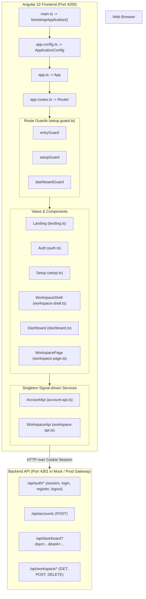

# Architecture and Project Structure

This document details the system architecture, application structure, state management patterns, and security contracts of the **SM-Intelligence Customer Frontend**.

---

## 1. High-Level Architecture

The frontend is an Angular single-page application built on Angular 22 without legacy `NgModule` wrappers. All components, pipes, and directives are standalone.



---

## 2. Directory Structure and Responsibilities

| Path | Purpose | Key References |
| :--- | :--- | :--- |
| [`src/main.ts`](file:///home/frank/SmartMoney_intelligence/SM-Intelligence/web/src/main.ts#L1-L7) | Application bootstrap entrypoint using `bootstrapApplication` | [`bootstrapApplication`](file:///home/frank/SmartMoney_intelligence/SM-Intelligence/web/src/main.ts#L5) |
| [`src/app/app.config.ts`](file:///home/frank/SmartMoney_intelligence/SM-Intelligence/web/src/app/app.config.ts#L1-L14) | Global providers: HTTP client, routing, and scroll restoration | [`appConfig`](file:///home/frank/SmartMoney_intelligence/SM-Intelligence/web/src/app/app.config.ts#L5-L13) |
| [`src/app/app.routes.ts`](file:///home/frank/SmartMoney_intelligence/SM-Intelligence/web/src/app/app.routes.ts#L1-L61) | Public and protected route table, guards, titles, and lazy component imports | [`routes`](file:///home/frank/SmartMoney_intelligence/SM-Intelligence/web/src/app/app.routes.ts#L3-L58) |
| [`src/app/app.ts`](file:///home/frank/SmartMoney_intelligence/SM-Intelligence/web/src/app/app.ts#L1-L88) | Root component containing the public marketing header, sign-out handler, and router outlet | [`App`](file:///home/frank/SmartMoney_intelligence/SM-Intelligence/web/src/app/app.ts#L43-L87) |
| [`src/app/setup.guard.ts`](file:///home/frank/SmartMoney_intelligence/SM-Intelligence/web/src/app/setup.guard.ts#L1-L24) | Guard functions controlling transitions between public, onboarding, and dashboard areas | [`setupGuard`](file:///home/frank/SmartMoney_intelligence/SM-Intelligence/web/src/app/setup.guard.ts#L4-L10), [`dashboardGuard`](file:///home/frank/SmartMoney_intelligence/SM-Intelligence/web/src/app/setup.guard.ts#L11-L17), [`entryGuard`](file:///home/frank/SmartMoney_intelligence/SM-Intelligence/web/src/app/setup.guard.ts#L18-L23) |
| [`src/app/account-api.ts`](file:///home/frank/SmartMoney_intelligence/SM-Intelligence/web/src/app/account-api.ts#L1-L82) | State and HTTP transport for auth, session hydration, and initial bank account setup | [`AccountApi`](file:///home/frank/SmartMoney_intelligence/SM-Intelligence/web/src/app/account-api.ts#L26-L81) |
| [`src/app/workspace-api.ts`](file:///home/frank/SmartMoney_intelligence/SM-Intelligence/web/src/app/workspace-api.ts#L1-L81) | HTTP transport for multi-collection workspace data and mutations | [`WorkspaceApi`](file:///home/frank/SmartMoney_intelligence/SM-Intelligence/web/src/app/workspace-api.ts#L63-L80) |
| [`src/app/dashboard.ts`](file:///home/frank/SmartMoney_intelligence/SM-Intelligence/web/src/app/dashboard.ts#L1-L350) | Dedicated Financial Overview component for 30/90-day cash flow & summaries | [`Dashboard`](file:///home/frank/SmartMoney_intelligence/SM-Intelligence/web/src/app/dashboard.ts#L276-L349) |
| [`src/app/workspace-shell.ts`](file:///home/frank/SmartMoney_intelligence/SM-Intelligence/web/src/app/workspace-shell.ts#L1-L131) | Signed-in workspace layout: sidebar drawer, sticky topbar, and mobile navigation bar | [`WorkspaceShell`](file:///home/frank/SmartMoney_intelligence/SM-Intelligence/web/src/app/workspace-shell.ts#L17-L130) |
| [`src/app/workspace-page.ts`](file:///home/frank/SmartMoney_intelligence/SM-Intelligence/web/src/app/workspace-page.ts#L1-L649) | Universal workspace module controller driving 9 distinct financial pages | [`WorkspacePage`](file:///home/frank/SmartMoney_intelligence/SM-Intelligence/web/src/app/workspace-page.ts#L27-L648) |
| [`src/app/finance-chart.ts`](file:///home/frank/SmartMoney_intelligence/SM-Intelligence/web/src/app/finance-chart.ts#L1-L164) | Interactive cash-flow chart (`FinanceChart`) & category donut chart (`CategoryChart`) | [`FinanceChart`](file:///home/frank/SmartMoney_intelligence/SM-Intelligence/web/src/app/finance-chart.ts#L74-L92), [`CategoryChart`](file:///home/frank/SmartMoney_intelligence/SM-Intelligence/web/src/app/finance-chart.ts#L131-L163) |
| [`src/app/smooth-chart.ts`](file:///home/frank/SmartMoney_intelligence/SM-Intelligence/web/src/app/smooth-chart.ts#L1-L15) | Pure spline interpolation function producing smooth SVG cubic Bezier paths | [`smoothChartPath`](file:///home/frank/SmartMoney_intelligence/SM-Intelligence/web/src/app/smooth-chart.ts#L2-L14) |
| [`src/app/bank-logo.ts`](file:///home/frank/SmartMoney_intelligence/SM-Intelligence/web/src/app/bank-logo.ts#L1-L60) | Kenyan bank logo presenter with image failure detection and fallback badges | [`BankLogo`](file:///home/frank/SmartMoney_intelligence/SM-Intelligence/web/src/app/bank-logo.ts#L53-L59) |
| [`src/app/notification-filter.ts`](file:///home/frank/SmartMoney_intelligence/SM-Intelligence/web/src/app/notification-filter.ts#L1-L14) | Filtering engine for notifications across timelines, categories, and banks | [`matchesNotification`](file:///home/frank/SmartMoney_intelligence/SM-Intelligence/web/src/app/notification-filter.ts#L3-L13) |
| [`src/styles.css`](file:///home/frank/SmartMoney_intelligence/SM-Intelligence/web/src/styles.css#L1-L60) | Root theme variables, DM Sans font imports, base button, input & card styles | Line 1-60 |
| [`src/workspace.css`](file:///home/frank/SmartMoney_intelligence/SM-Intelligence/web/src/workspace.css#L1-L100) | Workspace-specific CSS custom properties, grid layouts, tables, and dark theme | Line 1-100 |

---

## 3. Application Bootstrap and Configuration

The application is bootstrapped in [`src/main.ts`](file:///home/frank/SmartMoney_intelligence/SM-Intelligence/web/src/main.ts#L5-L6):
```typescript
// src/main.ts:5-6
bootstrapApplication(App, appConfig)
  .catch((err) => console.error(err));
```

Global providers are defined in [`src/app/app.config.ts`](file:///home/frank/SmartMoney_intelligence/SM-Intelligence/web/src/app/app.config.ts#L5-L13):
- [`provideHttpClient()`](file:///home/frank/SmartMoney_intelligence/SM-Intelligence/web/src/app/app.config.ts#L7): Injects Angular's HTTP client for backend REST interaction.
- [`provideRouter(...)`](file:///home/frank/SmartMoney_intelligence/SM-Intelligence/web/src/app/app.config.ts#L8-L11): Registers route definitions and enables `withInMemoryScrolling({ scrollPositionRestoration: 'top', anchorScrolling: 'enabled' })` so anchor links (like `#features` and `#how` on the landing page) scroll smoothly.

---

## 4. State Management and Angular Signals

State in this application is predominantly managed in memory using **Angular Signals** (`signal`):

1. **Session & Auth State** in [`AccountApi`](file:///home/frank/SmartMoney_intelligence/SM-Intelligence/web/src/app/account-api.ts#L28-L30):
   ```typescript
   // src/app/account-api.ts:28-30
   readonly authenticated = signal(false);
   readonly setupCompleted = signal(false);
   readonly kind = signal<AccountKind>('individual');
   ```
2. **Dashboard Overview State** in [`Dashboard`](file:///home/frank/SmartMoney_intelligence/SM-Intelligence/web/src/app/dashboard.ts#L278-L283):
   ```typescript
   // src/app/dashboard.ts:278-283
   readonly data = signal<DashboardData | null>(null);
   readonly loading = signal(false);
   readonly error = signal('');
   readonly days = signal(30);
   readonly bank = signal('');
   ```
3. **Workspace Data State** in [`WorkspacePage`](file:///home/frank/SmartMoney_intelligence/SM-Intelligence/web/src/app/workspace-page.ts#L33-L37):
   ```typescript
   // src/app/workspace-page.ts:33-37
   readonly data = signal<WorkspaceData | null>(null);
   readonly loading = signal(false);
   readonly error = signal('');
   readonly message = signal('');
   readonly pending = signal(false);
   ```

Derived state is expressed via getters (e.g., [`WorkspacePage.cash`](file:///home/frank/SmartMoney_intelligence/SM-Intelligence/web/src/app/workspace-page.ts#L131-L133), [`WorkspacePage.debt`](file:///home/frank/SmartMoney_intelligence/SM-Intelligence/web/src/app/workspace-page.ts#L134-L136), [`Dashboard.spendingPoints`](file:///home/frank/SmartMoney_intelligence/SM-Intelligence/web/src/app/dashboard.ts#L320-L328)), ensuring that view calculations re-run cleanly when signals mutate.

---

## 5. Monetary Integrity & Minor Units

A primary design requirement of SM-Intelligence is avoiding financial floating-point rounding errors:
- **Currency**: Fixed strictly to `'KES'` ([`AccountDetails.currency`](file:///home/frank/SmartMoney_intelligence/SM-Intelligence/web/src/app/account-api.ts#L19), [`DashboardData.currency`](file:///home/frank/SmartMoney_intelligence/SM-Intelligence/web/src/app/dashboard.ts#L31)).
- **Minor Units**: Amounts stored on the backend are minor currency units (cents/cents of KES), named with the suffix `Minor` (`availableBalanceMinor`, `amountMinor`, `allocatedMinor`, `principalMinor`).
- **Precision Validation on Input**: In [`WorkspacePage.save()`](file:///home/frank/SmartMoney_intelligence/SM-Intelligence/web/src/app/workspace-page.ts#L577-L583), inputs are strictly validated before being converted into minor units:
  ```typescript
  // src/app/workspace-page.ts:577-583
  const minor = (v: unknown) => {
    if (!/^\d+(\.\d{1,2})?$/.test(String(v)))
      throw new Error('Use nonnegative amounts with at most two decimal places.');
    const n = Math.round(Number(v) * 100);
    if (!Number.isSafeInteger(n)) throw new Error('Amount is too large.');
    return n;
  };
  ```

---

## 6. Security & Cookie Session Contract

Following [API-CONTRACT.md](file:///home/frank/SmartMoney_intelligence/SM-Intelligence/web/API-CONTRACT.md):
- Authentication does not use raw localStorage tokens or bearer headers that are vulnerable to XSS.
- The API expects same-origin HTTP cookies (`HttpOnly; SameSite=Lax; Path=/api`).
- Angular's `HttpClient` transparently carries session cookies on all `/api/*` calls.
- On cold page refreshes, the app calls [`AccountApi.restoreSession()`](file:///home/frank/SmartMoney_intelligence/SM-Intelligence/web/src/app/account-api.ts#L56-L67), which issues `GET /api/auth/session` to rehydrate `authenticated`, `kind`, and `setupCompleted`.
