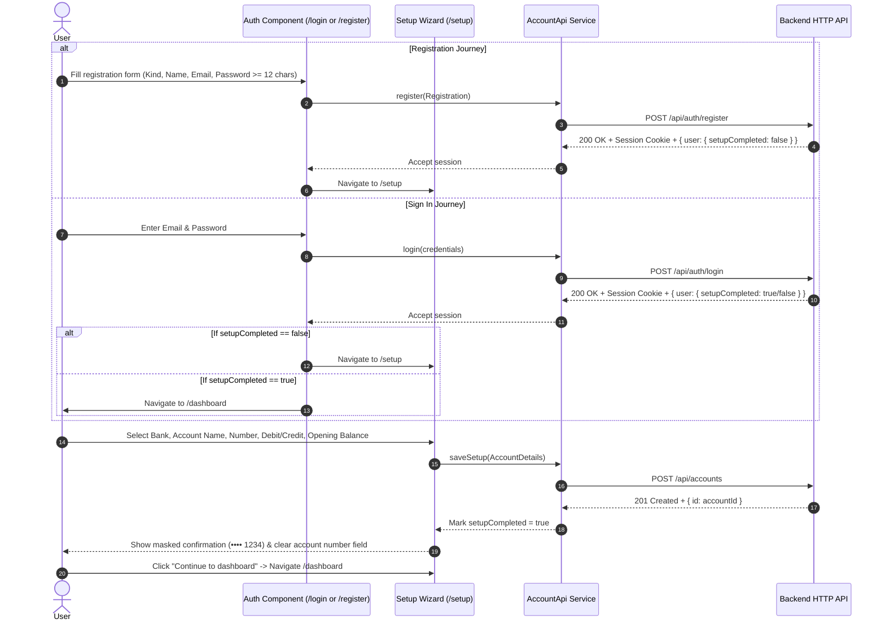

# Authentication and Onboarding

This document details the customer authentication and onboarding journey implemented in [`src/app/auth.ts`](file:///home/frank/SmartMoney_intelligence/SM-Intelligence/web/src/app/auth.ts), [`src/app/setup.ts`](file:///home/frank/SmartMoney_intelligence/SM-Intelligence/web/src/app/setup.ts), and [`src/app/account-api.ts`](file:///home/frank/SmartMoney_intelligence/SM-Intelligence/web/src/app/account-api.ts).

---

## 1. Customer Journey Overview



---

## 2. Authentication Component (`Auth`)

The [`Auth`](file:///home/frank/SmartMoney_intelligence/SM-Intelligence/web/src/app/auth.ts#L140) component drives both `/login` and `/register`.

### Mode Detection & Form Construction
- **Mode Detection** ([Line 144](file:///home/frank/SmartMoney_intelligence/SM-Intelligence/web/src/app/auth.ts#L144)):
  ```typescript
  readonly register = this.router.url.startsWith('/register');
  ```
- **Reactive Form FormBuilder** ([Lines 145-155](file:///home/frank/SmartMoney_intelligence/SM-Intelligence/web/src/app/auth.ts#L145-L155)):
  ```typescript
  readonly form = this.fb.nonNullable.group({
    kind: ['individual' as AccountKind],
    name: ['', this.register ? [Validators.required, Validators.pattern(/.*\S.*/)] : []],
    email: ['', [Validators.required, Validators.email]],
    phone: ['', [Validators.pattern(/^[+\d][\d\s()-]{6,19}$/)]],
    password: [
      '',
      this.register ? [Validators.required, Validators.minLength(12)] : [Validators.required],
    ],
    confirm: ['', this.register ? [Validators.required] : []],
  });
  ```

### Key Behaviors
1. **Account Type Choice** ([Lines 32-45](file:///home/frank/SmartMoney_intelligence/SM-Intelligence/web/src/app/auth.ts#L32-L45)): Toggle between `'individual'` (personal/freelance) and `'organization'` (company/team).
2. **Password Security** ([Lines 83-109](file:///home/frank/SmartMoney_intelligence/SM-Intelligence/web/src/app/auth.ts#L83-L109)): Enforces at least 12 characters during registration. Password visibility toggle (`showPassword` signal at [Line 156](file:///home/frank/SmartMoney_intelligence/SM-Intelligence/web/src/app/auth.ts#L156)).
3. **Password Confirmation Check** ([Lines 163-168](file:///home/frank/SmartMoney_intelligence/SM-Intelligence/web/src/app/auth.ts#L163-L168)): Verifies that `confirm.value === password.value`.
4. **Form Submission & Navigation** ([Lines 169-201](file:///home/frank/SmartMoney_intelligence/SM-Intelligence/web/src/app/auth.ts#L169-L201)):
   ```typescript
   // src/app/auth.ts:189-191
   await this.router.navigate([
     this.register || !this.api.setupCompleted() ? '/setup' : '/dashboard',
   ]);
   ```

---

## 3. Account Setup Wizard (`Setup`)

The [`Setup`](file:///home/frank/SmartMoney_intelligence/SM-Intelligence/web/src/app/setup.ts#L144) component guides users to record their first bank account snapshot.

### Step 1: Account Input Form ([Lines 43-140](file:///home/frank/SmartMoney_intelligence/SM-Intelligence/web/src/app/setup.ts#L43-L140))
- **Supported Banks**: KCB, Equity, NCBA, and Stanbic ([Line 148](file:///home/frank/SmartMoney_intelligence/SM-Intelligence/web/src/app/setup.ts#L148)).
- **Dynamic Name Assignment** ([Lines 164-170](file:///home/frank/SmartMoney_intelligence/SM-Intelligence/web/src/app/setup.ts#L164-L170)):
  - Defaults to `"{Bank} Personal Account"` or `"{Bank} Business Account"` depending on `api.kind()`.
  - Selecting another bank updates the name *unless* the user manually edited it (`form.controls.accountName.dirty`).
- **Account Number Validation**: Must contain 4 to 34 digits (`/^\d{4,34}$/`, [Line 156](file:///home/frank/SmartMoney_intelligence/SM-Intelligence/web/src/app/setup.ts#L156)).
- **Card/Account Type**:
  - `debit`: Representing customer funds held in the bank, counted as **available cash**.
  - `credit`: Representing borrowed funds, counted strictly as **credit outstanding / debt owed**, excluded from cash.
- **Balance Validation**: Zero or positive amount with at most two decimal places (`/^\d+(\.\d{1,2})?$/`, [Line 160](file:///home/frank/SmartMoney_intelligence/SM-Intelligence/web/src/app/setup.ts#L160)).
- **Date Validation**: Effective date must not be in the future (`balanceDate <= today`, [Line 191](file:///home/frank/SmartMoney_intelligence/SM-Intelligence/web/src/app/setup.ts#L191)).

### Step 2: Post-Save Confirmation & Masking ([Lines 24-42](file:///home/frank/SmartMoney_intelligence/SM-Intelligence/web/src/app/setup.ts#L24-L42))
- Upon successful persistence via [`api.saveSetup()`](file:///home/frank/SmartMoney_intelligence/SM-Intelligence/web/src/app/setup.ts#L203):
  1. Stores summary info with masked last four digits (`•••• 1234`, [Lines 204-209](file:///home/frank/SmartMoney_intelligence/SM-Intelligence/web/src/app/setup.ts#L204-L209)).
  2. Clears the raw account number from form state ([Line 210](file:///home/frank/SmartMoney_intelligence/SM-Intelligence/web/src/app/setup.ts#L210)).
  3. Sets [`saved.set(true)`](file:///home/frank/SmartMoney_intelligence/SM-Intelligence/web/src/app/setup.ts#L211) to render the confirmation screen.
  4. Allows adding additional accounts via [`addAnother()`](file:///home/frank/SmartMoney_intelligence/SM-Intelligence/web/src/app/setup.ts#L218-L229) or proceeding to `/dashboard`.

---

## 4. API Service Contract (`AccountApi`)

The [`AccountApi`](file:///home/frank/SmartMoney_intelligence/SM-Intelligence/web/src/app/account-api.ts#L26-L81) service handles all authentication and setup HTTP requests.

### Data Types
```typescript
// src/app/account-api.ts:4-20
export type AccountKind = 'individual' | 'organization';

export interface Registration {
  name: string;
  email: string;
  phone: string;
  password: string;
  kind: AccountKind;
}

export interface AccountDetails {
  bank: string;
  accountName: string;
  accountNumber: string;
  cardType: 'debit' | 'credit';
  balance: number;
  balanceDate: string;
  currency: 'KES';
}
```

### Methods & Endpoints
1. [`login(input)`](file:///home/frank/SmartMoney_intelligence/SM-Intelligence/web/src/app/account-api.ts#L44-L48): `POST /api/auth/login` with 15-second timeout.
2. [`register(input)`](file:///home/frank/SmartMoney_intelligence/SM-Intelligence/web/src/app/account-api.ts#L49-L55): `POST /api/auth/register`.
3. [`restoreSession()`](file:///home/frank/SmartMoney_intelligence/SM-Intelligence/web/src/app/account-api.ts#L56-L67): `GET /api/auth/session` to rehydrate active cookie session.
4. [`saveSetup(input)`](file:///home/frank/SmartMoney_intelligence/SM-Intelligence/web/src/app/account-api.ts#L68-L75): `POST /api/accounts`. Expects `{ id: string }`. Rejection if unconfirmed.
5. [`logout()`](file:///home/frank/SmartMoney_intelligence/SM-Intelligence/web/src/app/account-api.ts#L76-L80): `POST /api/auth/logout`. Clears local auth signals.

---

## 5. Automated Tests

All behaviors are covered by unit tests in [`src/app/app.spec.ts`](file:///home/frank/SmartMoney_intelligence/SM-Intelligence/web/src/app/app.spec.ts):
- [`app.spec.ts:28-40`](file:///home/frank/SmartMoney_intelligence/SM-Intelligence/web/src/app/app.spec.ts#L28-L40): Prevents submission on password mismatch and missing fields.
- [`app.spec.ts:41-52`](file:///home/frank/SmartMoney_intelligence/SM-Intelligence/web/src/app/app.spec.ts#L41-L52): Navigates to `/setup` only after successful API authentication.
- [`app.spec.ts:58-66`](file:///home/frank/SmartMoney_intelligence/SM-Intelligence/web/src/app/app.spec.ts#L58-L66): Validates account numbers, rejects negative amounts and future dates.
- [`app.spec.ts:67-83`](file:///home/frank/SmartMoney_intelligence/SM-Intelligence/web/src/app/app.spec.ts#L67-L83): Verifies KES enforcement, cardType credit handling, masking, and field clearing.
- [`app.spec.ts:84-95`](file:///home/frank/SmartMoney_intelligence/SM-Intelligence/web/src/app/app.spec.ts#L84-L95): Preserves form values on network error to allow seamless user retry.
- [`app.spec.ts:96-102`](file:///home/frank/SmartMoney_intelligence/SM-Intelligence/web/src/app/app.spec.ts#L96-L102): Prevents overwriting custom account names when switching bank logos.
- [`app.spec.ts:111-120`](file:///home/frank/SmartMoney_intelligence/SM-Intelligence/web/src/app/app.spec.ts#L111-L120): HTTP contract testing with `HttpTestingController`.
