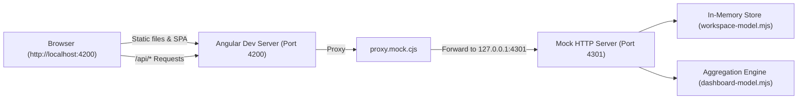

# Mock Backend, Testing & Tooling

This document details the local development mock infrastructure and automated test suites located in [`tools/`](file:///home/frank/SmartMoney_intelligence/SM-Intelligence/web/tools) and [`src/app/`](file:///home/frank/SmartMoney_intelligence/SM-Intelligence/web/src/app).

---

## 1. Mock Architecture Overview

To enable complete frontend development without requiring a live banking backend or cloud database, this project provides an in-memory Node.js mock API and proxy server.



---

## 2. Mock Server Runner (`dev-with-mocks.mjs`)

The launcher [`dev-with-mocks.mjs`](file:///home/frank/SmartMoney_intelligence/SM-Intelligence/web/tools/dev-with-mocks.mjs) orchestrates both the Angular dev server and the Mock API:

- **Port Collision Prevention** ([Lines 6-27](file:///home/frank/SmartMoney_intelligence/SM-Intelligence/web/tools/dev-with-mocks.mjs#L6-L27)): Probes ports 4200 and 4301 across both IPv4 (`127.0.0.1`) and IPv6 (`::1`) before starting. If either is busy, it halts with an informative error rather than silently rebinding to an unexpected port.
- **Mock Server Spin-up** ([Line 28](file:///home/frank/SmartMoney_intelligence/SM-Intelligence/web/tools/dev-with-mocks.mjs#L28)): Starts [`startMockServer(apiPort, port)`](file:///home/frank/SmartMoney_intelligence/SM-Intelligence/web/tools/mock-api.mjs#L6).
- **Angular CLI Spawning** ([Lines 37-50](file:///home/frank/SmartMoney_intelligence/SM-Intelligence/web/tools/dev-with-mocks.mjs#L37-L50)): Executes `ng serve --host localhost --port 4200 --proxy-config proxy.mock.cjs`.
- **Clean Teardown** ([Lines 51-57](file:///home/frank/SmartMoney_intelligence/SM-Intelligence/web/tools/dev-with-mocks.mjs#L51-L57)): Traps process exit signals (`SIGINT`, `SIGTERM`) to kill both the Angular child process and HTTP mock server simultaneously.

---

## 3. Mock API Server (`mock-api.mjs`)

[`startMockServer()`](file:///home/frank/SmartMoney_intelligence/SM-Intelligence/web/tools/mock-api.mjs#L6) establishes a zero-dependency HTTP server implementing all endpoints defined in [API-CONTRACT.md](file:///home/frank/SmartMoney_intelligence/SM-Intelligence/web/API-CONTRACT.md):

### Seed Accounts (Password: `SamplePass123!`)
- `individual@example.com`: Personal profile with 3 accounts (KCB deposit, Equity savings, NCBA credit).
- `business@example.com`: Commercial organization profile.
- `new@example.com`: Fresh user with `setupCompleted: false` (tests onboarding wizard).
- `empty@example.com`: User with completed setup but zero activity.
- `slow@example.com`: Adds a 3-second artificial delay to test loading skeletons ([Line 108](file:///home/frank/SmartMoney_intelligence/SM-Intelligence/web/tools/mock-api.mjs#L108)).
- `error@example.com`: Fails with HTTP 503 on the first call to test retry logic ([Lines 104-107](file:///home/frank/SmartMoney_intelligence/SM-Intelligence/web/tools/mock-api.mjs#L104-L107)).
- `realistic@example.com`: Rich multi-month realistic ledger dataset.
- `retail@example.com`: Multi-channel retail business ledger dataset.

### Implemented Endpoints
1. `GET /api/auth/session` ([Lines 98-101](file:///home/frank/SmartMoney_intelligence/SM-Intelligence/web/tools/mock-api.mjs#L98-L101)): Validates session cookie and returns user profile.
2. `POST /api/auth/login` ([Lines 145-173](file:///home/frank/SmartMoney_intelligence/SM-Intelligence/web/tools/mock-api.mjs#L145-L173)): Sets `sm_mock_session` cookie.
3. `POST /api/auth/register` ([Lines 148-166](file:///home/frank/SmartMoney_intelligence/SM-Intelligence/web/tools/mock-api.mjs#L148-L166)): Validates email format, name, kind, and 12+ character password.
4. `POST /api/auth/logout` ([Lines 115-119](file:///home/frank/SmartMoney_intelligence/SM-Intelligence/web/tools/mock-api.mjs#L115-L119)): Expires session cookie.
5. `GET /api/dashboard` ([Lines 102-114](file:///home/frank/SmartMoney_intelligence/SM-Intelligence/web/tools/mock-api.mjs#L102-L114)): Period (30/90 days) and bank filter aggregation.
6. `POST /api/accounts` ([Lines 174-203](file:///home/frank/SmartMoney_intelligence/SM-Intelligence/web/tools/mock-api.mjs#L174-L203)): Validates bank, account number digits, balance, and balanceDate.
7. `GET /api/workspace` ([Lines 87-88](file:///home/frank/SmartMoney_intelligence/SM-Intelligence/web/tools/mock-api.mjs#L87-L88)): Returns full workspace snapshot for user.
8. `POST /api/workspace/:collection` ([Lines 137-144](file:///home/frank/SmartMoney_intelligence/SM-Intelligence/web/tools/mock-api.mjs#L137-L144)): Inserts or updates budgets, investments, profile, transactions, or notifications.
9. `DELETE /api/workspace/:collection/:id` ([Lines 89-97](file:///home/frank/SmartMoney_intelligence/SM-Intelligence/web/tools/mock-api.mjs#L89-L97)): Removes budget or investment item.

---

## 4. Models and Aggregation Engines

### 1. Dashboard Model (`tools/dashboard-model.mjs`)
The [`dashboardData()`](file:///home/frank/SmartMoney_intelligence/SM-Intelligence/web/tools/dashboard-model.mjs#L2-L15) function processes raw accounts and transactions into client-ready metrics:
- Filters records strictly belonging to `user.id`.
- Partitions accounts into `DEPOSIT` vs. `CREDIT`.
- Filters transactions by the period window (`from` to `to`) and isolates `POSTED` credits (Money In) and `POSTED` debits (Money Out).
- Constructs 6 time bins across the period for the cash flow chart.

### 2. Workspace Store (`tools/workspace-model.mjs`)
The [`createWorkspaceStore()`](file:///home/frank/SmartMoney_intelligence/SM-Intelligence/web/tools/workspace-model.mjs#L10) factory provides multi-tenant in-memory state:
- Maintains separate holding state per `user.id`.
- Validates field constraints: max lengths, positive minor units up to 1 trillion cents, and valid dates.
- Handles mutation operations and appends to an internal audit trail.

---

## 5. Automated Test Suites

The project incorporates two automated testing pipelines:

### 1. Frontend Angular & Vitest Specs
Run using:
```sh
npm test -- --watch=false
```
- [`src/app/routing.spec.ts`](file:///home/frank/SmartMoney_intelligence/SM-Intelligence/web/src/app/routing.spec.ts):
  - Validates guard protection on `/setup`, `/login`, `/dashboard`.
  - Asserts returning user routing decisions.
  - Verifies session restore behavior on cold load.
- [`src/app/app.spec.ts`](file:///home/frank/SmartMoney_intelligence/SM-Intelligence/web/src/app/app.spec.ts):
  - Form validation on registration and login.
  - Password mismatch prevention.
  - Account setup validation (digits, non-negative amounts, date validity).
  - Masking and sensitive field cleanup after save.
  - HTTP contract verification using `HttpTestingController`.

### 2. Mock Backend Model Tests
Run using:
```sh
npm run test:mock
```
- [`tools/dashboard-model.test.mjs`](file:///home/frank/SmartMoney_intelligence/SM-Intelligence/web/tools/dashboard-model.test.mjs):
  - Ownership filtering (ensuring User A never sees User B's accounts).
  - Accurate math on available cash vs credit debt.
  - Direction and status filtering (pending/cancelled records excluded from cash flow).
  - Bank filter partitioning.
- [`tools/workspace-model.test.mjs`](file:///home/frank/SmartMoney_intelligence/SM-Intelligence/web/tools/workspace-model.test.mjs):
  - Data mutation contracts (CRUD on budgets, investments, notifications).
  - Validation rejections on malformed numbers or unauthorized deletions.
