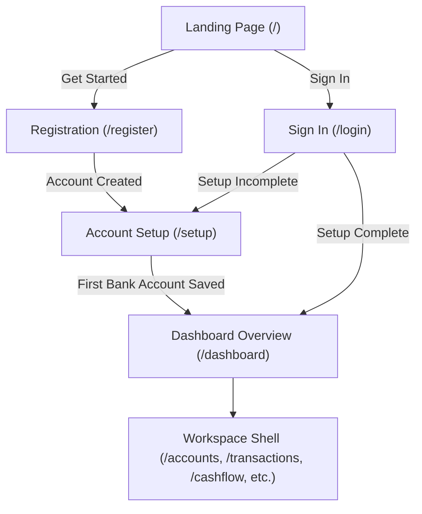

# SM-Intelligence Web Application Documentation

Welcome to the technical documentation for the **SM-Intelligence Customer Frontend** (`sm-intelligence-web`). This application is a high-clarity financial management portal built with Angular 22, designed using the Azure design system, and structured for personal and organizational financial intelligence in Kenyan Shillings (KES).

---

## Table of Contents

1. [Architecture and Project Structure](file:///home/frank/SmartMoney_intelligence/SM-Intelligence/web/documentation/ARCHITECTURE_AND_STRUCTURE.md)
   - Application bootstrap, Angular 22 standalone architecture, directory map, state model, currency & minor-unit precision, and cookie session security.
2. [Routing and Route Guards](file:///home/frank/SmartMoney_intelligence/SM-Intelligence/web/documentation/ROUTING_AND_GUARDS.md)
   - Route tree, standalone component lazy loading, authentication & setup guard pipeline (`entryGuard`, `setupGuard`, `dashboardGuard`), and redirection rules.
3. [Authentication and Onboarding](file:///home/frank/SmartMoney_intelligence/SM-Intelligence/web/documentation/AUTHENTICATION_AND_ONBOARDING.md)
   - Registration flow, authentication form validation, session restoration, first-time bank account setup, and credential hygiene.
4. [Workspace Shell and Financial Overview](file:///home/frank/SmartMoney_intelligence/SM-Intelligence/web/documentation/WORKSPACE_AND_DASHBOARD.md)
   - Navigation layout (`WorkspaceShell`), responsive desktop/mobile navigation, dashboard metrics, 30/90-day cash flow analysis, bank filtering, and recent transactions.
5. [Workspace Modules & Feature Pages](file:///home/frank/SmartMoney_intelligence/SM-Intelligence/web/documentation/WORKSPACE_MODULES.md)
   - Detailed review of the 9 workspace feature modules: Accounts, Transactions, Cash Flow, Budgets, Investments, Analytics, Reports (PDF & CSV), Notifications, and Settings.
6. [Visualization and Shared Components](file:///home/frank/SmartMoney_intelligence/SM-Intelligence/web/documentation/VISUALIZATION_AND_UI_COMPONENTS.md)
   - Visual components: `FinanceChart`, `CategoryChart`, `BankLogo`, `WorkspaceIcon`, and the cubic Bezier curve engine (`smoothChartPath`).
7. [Mock Backend, Testing & Tooling](file:///home/frank/SmartMoney_intelligence/SM-Intelligence/web/documentation/MOCK_BACKEND_AND_TESTING.md)
   - Node-based in-memory mock API, multi-tenant state isolation, realistic seed generation, and test verification (`vitest` and `node:test`).

---

## Core Application Overview



### Key Principles & Design Rules

- **Strict Separation of Money**: Available cash reflects **DEPOSIT** accounts only. Credit balances represent **amounts owed (debt)** and are never aggregated into cash or treated as assets.
- **Fixed Currency**: Fixed to **KES** (Kenyan Shilling). All backend amounts are exchanged as 64-bit integer minor units (`amountMinor` in cents) to prevent floating-point rounding errors.
- **Session-Driven Identity**: Authentication utilizes same-origin HTTP cookies (`sm_mock_session` in dev, standard cookie session in production). State is rehydrated via `/api/auth/session` on reload.
- **Light & Dark Theme**: Defaults to Light mode with an Azure surface aesthetic; user preference persists to `localStorage` under `sm-intelligence-appearance` and updates `document.documentElement.dataset['theme']`.

---

## Directory Layout

```
web/
├── documentation/               # Technical architectural documentation
├── public/                      # Static web assets
├── src/                         # Angular application source code
│   ├── index.html               # Main HTML entrypoint
│   ├── main.ts                  # Application bootstrap entrypoint
│   ├── styles.css               # Global theme & typography styles
│   ├── workspace.css            # Signed-in workspace styling & tokens
│   └── app/                     # Standalone components, guards & services
│       ├── account-api.ts       # Authentication & setup HTTP service
│       ├── app.config.ts        # Application router & HTTP client config
│       ├── app.routes.ts        # Route registry with lazy loaders
│       ├── app.ts               # Root component & public navigation header
│       ├── auth.ts              # Login & registration component
│       ├── bank-logo.ts         # Brand logo component with fallback
│       ├── dashboard.ts         # Main financial overview page
│       ├── finance-chart.ts     # SVG line/bar chart & conic donut chart
│       ├── landing.ts           # Public marketing landing page
│       ├── notification-filter.ts# Notification filtering utility
│       ├── setup.guard.ts       # Auth, setup, & entry route guards
│       ├── setup.ts             # Initial bank account setup wizard
│       ├── smooth-chart.ts      # Cubic spline path generator
│       ├── workspace-api.ts     # Workspace data service & CRUD endpoints
│       ├── workspace-icon.ts    # SVG icon component
│       ├── workspace-page.html  # Unified template for 9 workspace sub-pages
│       ├── workspace-page.ts    # Logic for 9 workspace modules
│       └── workspace-shell.ts   # Persistent sidebar, topbar & mobile nav
└── tools/                       # Development mock backend & tests
    ├── dashboard-model.mjs      # Dashboard aggregation engine
    ├── dev-with-mocks.mjs       # Mock server + Angular proxy runner
    ├── mock-api.mjs             # In-memory HTTP mock API server
    ├── realistic-records.mjs    # Realistic seed dataset generator
    └── workspace-model.mjs      # In-memory workspace state store
```
