# Routing and Route Guards

This document explains the route hierarchy, lazy-loading architecture, and session guard pipeline in [`src/app/app.routes.ts`](file:///home/frank/SmartMoney_intelligence/SM-Intelligence/web/src/app/app.routes.ts) and [`src/app/setup.guard.ts`](file:///home/frank/SmartMoney_intelligence/SM-Intelligence/web/src/app/setup.guard.ts).

---

## 1. Route Hierarchy

All routes use standalone components loaded dynamically via dynamic `import()` promises.

```mermaid
graph TD
    Root["/ (Landing)"]
    Login["/login (Auth)"]
    Register["/register (Auth)"]
    Setup["/setup (Setup Wizard)"]
    Shell["/ (WorkspaceShell - canActivateChild: dashboardGuard)"]
    
    Shell --> Dash["/dashboard (Dashboard Overview)"]
    Shell --> OverRedirect["/overview -> redirect to /dashboard"]
    Shell --> Accounts["/accounts (WorkspacePage)"]
    Shell --> Transactions["/transactions (WorkspacePage)"]
    Shell --> Cashflow["/cashflow (WorkspacePage)"]
    Shell --> Budgets["/budgets (WorkspacePage)"]
    Shell --> Investments["/investments (WorkspacePage)"]
    Shell --> Analysis["/analysis (WorkspacePage)"]
    Shell --> Reports["/reports (WorkspacePage)"]
    Shell --> Notifications["/notifications (WorkspacePage)"]
    Shell --> Settings["/settings (WorkspacePage)"]
    
    Wildcard["/** -> redirect to /"]
```



### Route Table Reference

| Route Path | Component / Target | Route Guard | Route Data / Purpose | Line Pointer |
| :--- | :--- | :--- | :--- | :--- |
| `/` | [`Landing`](file:///home/frank/SmartMoney_intelligence/SM-Intelligence/web/src/app/landing.ts#L4) | None (Public) | Public marketing & hero page | [`app.routes.ts:4-9`](file:///home/frank/SmartMoney_intelligence/SM-Intelligence/web/src/app/app.routes.ts#L4-L9) |
| `/login` | [`Auth`](file:///home/frank/SmartMoney_intelligence/SM-Intelligence/web/src/app/auth.ts#L140) | [`entryGuard`](file:///home/frank/SmartMoney_intelligence/SM-Intelligence/web/src/app/setup.guard.ts#L18) | Redirects authenticated users away | [`app.routes.ts:11-15`](file:///home/frank/SmartMoney_intelligence/SM-Intelligence/web/src/app/app.routes.ts#L11-L15) |
| `/register` | [`Auth`](file:///home/frank/SmartMoney_intelligence/SM-Intelligence/web/src/app/auth.ts#L140) | [`entryGuard`](file:///home/frank/SmartMoney_intelligence/SM-Intelligence/web/src/app/setup.guard.ts#L18) | Redirects authenticated users away | [`app.routes.ts:17-21`](file:///home/frank/SmartMoney_intelligence/SM-Intelligence/web/src/app/app.routes.ts#L17-L21) |
| `/setup` | [`Setup`](file:///home/frank/SmartMoney_intelligence/SM-Intelligence/web/src/app/setup.ts#L144) | [`setupGuard`](file:///home/frank/SmartMoney_intelligence/SM-Intelligence/web/src/app/setup.guard.ts#L4) | Ensures user is authenticated & incomplete | [`app.routes.ts:23-27`](file:///home/frank/SmartMoney_intelligence/SM-Intelligence/web/src/app/app.routes.ts#L23-L27) |
| `''` (Shell) | [`WorkspaceShell`](file:///home/frank/SmartMoney_intelligence/SM-Intelligence/web/src/app/workspace-shell.ts#L17) | [`dashboardGuard`](file:///home/frank/SmartMoney_intelligence/SM-Intelligence/web/src/app/setup.guard.ts#L11) (as `canActivateChild`) | Persistent layout wrapper | [`app.routes.ts:29-56`](file:///home/frank/SmartMoney_intelligence/SM-Intelligence/web/src/app/app.routes.ts#L29-L56) |
| `/dashboard` | [`Dashboard`](file:///home/frank/SmartMoney_intelligence/SM-Intelligence/web/src/app/dashboard.ts#L276) | Child of Shell | Main financial overview & 30/90-day cash flow | [`app.routes.ts:34-37`](file:///home/frank/SmartMoney_intelligence/SM-Intelligence/web/src/app/app.routes.ts#L34-L37) |
| `/overview` | Redirect to `/dashboard` | Child of Shell | Alias for dashboard | [`app.routes.ts:38`](file:///home/frank/SmartMoney_intelligence/SM-Intelligence/web/src/app/app.routes.ts#L38) |
| `/accounts` | [`WorkspacePage`](file:///home/frank/SmartMoney_intelligence/SM-Intelligence/web/src/app/workspace-page.ts#L27) | Child of Shell | `data: { page: 'accounts' }` | [`app.routes.ts:39-54`](file:///home/frank/SmartMoney_intelligence/SM-Intelligence/web/src/app/app.routes.ts#L39-L54) |
| `/transactions` | [`WorkspacePage`](file:///home/frank/SmartMoney_intelligence/SM-Intelligence/web/src/app/workspace-page.ts#L27) | Child of Shell | `data: { page: 'transactions' }` | [`app.routes.ts:39-54`](file:///home/frank/SmartMoney_intelligence/SM-Intelligence/web/src/app/app.routes.ts#L39-L54) |
| `/cashflow` | [`WorkspacePage`](file:///home/frank/SmartMoney_intelligence/SM-Intelligence/web/src/app/workspace-page.ts#L27) | Child of Shell | `data: { page: 'cashflow' }` | [`app.routes.ts:39-54`](file:///home/frank/SmartMoney_intelligence/SM-Intelligence/web/src/app/app.routes.ts#L39-L54) |
| `/budgets` | [`WorkspacePage`](file:///home/frank/SmartMoney_intelligence/SM-Intelligence/web/src/app/workspace-page.ts#L27) | Child of Shell | `data: { page: 'budgets' }` | [`app.routes.ts:39-54`](file:///home/frank/SmartMoney_intelligence/SM-Intelligence/web/src/app/app.routes.ts#L39-L54) |
| `/investments` | [`WorkspacePage`](file:///home/frank/SmartMoney_intelligence/SM-Intelligence/web/src/app/workspace-page.ts#L27) | Child of Shell | `data: { page: 'investments' }` | [`app.routes.ts:39-54`](file:///home/frank/SmartMoney_intelligence/SM-Intelligence/web/src/app/app.routes.ts#L39-L54) |
| `/analysis` | [`WorkspacePage`](file:///home/frank/SmartMoney_intelligence/SM-Intelligence/web/src/app/workspace-page.ts#L27) | Child of Shell | `data: { page: 'analysis' }` | [`app.routes.ts:39-54`](file:///home/frank/SmartMoney_intelligence/SM-Intelligence/web/src/app/app.routes.ts#L39-L54) |
| `/reports` | [`WorkspacePage`](file:///home/frank/SmartMoney_intelligence/SM-Intelligence/web/src/app/workspace-page.ts#L27) | Child of Shell | `data: { page: 'reports' }` | [`app.routes.ts:39-54`](file:///home/frank/SmartMoney_intelligence/SM-Intelligence/web/src/app/app.routes.ts#L39-L54) |
| `/notifications` | [`WorkspacePage`](file:///home/frank/SmartMoney_intelligence/SM-Intelligence/web/src/app/workspace-page.ts#L27) | Child of Shell | `data: { page: 'notifications' }` | [`app.routes.ts:39-54`](file:///home/frank/SmartMoney_intelligence/SM-Intelligence/web/src/app/app.routes.ts#L39-L54) |
| `/settings` | [`WorkspacePage`](file:///home/frank/SmartMoney_intelligence/SM-Intelligence/web/src/app/workspace-page.ts#L27) | Child of Shell | `data: { page: 'settings' }` | [`app.routes.ts:39-54`](file:///home/frank/SmartMoney_intelligence/SM-Intelligence/web/src/app/app.routes.ts#L39-L54) |
| `**` | Redirect to `''` | None | Fallback wildcard redirect to landing | [`app.routes.ts:57`](file:///home/frank/SmartMoney_intelligence/SM-Intelligence/web/src/app/app.routes.ts#L57) |

---

## 2. Route Guard Mechanics

The route guards in [`src/app/setup.guard.ts`](file:///home/frank/SmartMoney_intelligence/SM-Intelligence/web/src/app/setup.guard.ts) are async functional guards (`CanActivateFn`). They depend on [`AccountApi`](file:///home/frank/SmartMoney_intelligence/SM-Intelligence/web/src/app/account-api.ts) and Angular's [`Router`](file:///home/frank/SmartMoney_intelligence/SM-Intelligence/web/src/app/setup.guard.ts#L2).

### 1. `setupGuard` ([Lines 4-10](file:///home/frank/SmartMoney_intelligence/SM-Intelligence/web/src/app/setup.guard.ts#L4-L10))
Protects the `/setup` wizard:
```typescript
// src/app/setup.guard.ts:4-10
export const setupGuard: CanActivateFn = async () => {
  const api = inject(AccountApi);
  const router = inject(Router);
  if (!api.authenticated() && !(await api.restoreSession()))
    return router.createUrlTree(['/login']);
  return api.setupCompleted() ? router.createUrlTree(['/dashboard']) : true;
};
```
- If the user is unauthenticated and session restore fails: redirects to `/login`.
- If the user has already completed setup (`setupCompleted() === true`): prevents redundant setup and routes to `/dashboard`.
- Otherwise allows access to `/setup`.

### 2. `dashboardGuard` ([Lines 11-17](file:///home/frank/SmartMoney_intelligence/SM-Intelligence/web/src/app/setup.guard.ts#L11-L17))
Enforces security on the entire signed-in area (`canActivateChild` on the workspace shell):
```typescript
// src/app/setup.guard.ts:11-17
export const dashboardGuard: CanActivateFn = async () => {
  const api = inject(AccountApi);
  const router = inject(Router);
  if (!api.authenticated() && !(await api.restoreSession()))
    return router.createUrlTree(['/login']);
  return api.setupCompleted() ? true : router.createUrlTree(['/setup']);
};
```
- If unauthenticated and session restore fails: redirects to `/login`.
- If authenticated but setup is incomplete (`setupCompleted() === false`): redirects to `/setup`.
- If authenticated and setup completed: grants access.

### 3. `entryGuard` ([Lines 18-23](file:///home/frank/SmartMoney_intelligence/SM-Intelligence/web/src/app/setup.guard.ts#L18-L23))
Protects entry routes (`/login` and `/register`):
```typescript
// src/app/setup.guard.ts:18-23
export const entryGuard: CanActivateFn = async () => {
  const api = inject(AccountApi);
  const router = inject(Router);
  if (!api.authenticated() && !(await api.restoreSession())) return true;
  return router.createUrlTree([api.setupCompleted() ? '/dashboard' : '/setup']);
};
```
- If not signed in: allows access to the sign-in / registration forms.
- If already signed in: redirects completed users directly to `/dashboard` and incomplete users to `/setup`.

---

## 3. Guard State Transition Matrix

| Current Auth State | `setupCompleted` Flag | User Attempts To Access | Resulting Destination |
| :--- | :--- | :--- | :--- |
| Unauthenticated | `false` | `/login` or `/register` | Allowed (`true`) |
| Unauthenticated | `false` | `/setup` | Redirect to `/login` |
| Unauthenticated | `false` | `/dashboard` or `/accounts` | Redirect to `/login` |
| Authenticated | `false` | `/login` or `/register` | Redirect to `/setup` |
| Authenticated | `false` | `/setup` | Allowed (`true`) |
| Authenticated | `false` | `/dashboard` or `/accounts` | Redirect to `/setup` |
| Authenticated | `true` | `/login` or `/register` | Redirect to `/dashboard` |
| Authenticated | `true` | `/setup` | Redirect to `/dashboard` |
| Authenticated | `true` | `/dashboard` or `/accounts` | Allowed (`true`) |

---

## 4. Verification in Test Suites

These routing guard contracts are verified in [`src/app/routing.spec.ts`](file:///home/frank/SmartMoney_intelligence/SM-Intelligence/web/src/app/routing.spec.ts):
- [`routing.spec.ts:11`](file:///home/frank/SmartMoney_intelligence/SM-Intelligence/web/src/app/routing.spec.ts#L11): Returning completed users navigate to `/dashboard` after login.
- [`routing.spec.ts:12`](file:///home/frank/SmartMoney_intelligence/SM-Intelligence/web/src/app/routing.spec.ts#L12): New registrations are directed to `/setup`.
- [`routing.spec.ts:13`](file:///home/frank/SmartMoney_intelligence/SM-Intelligence/web/src/app/routing.spec.ts#L13): Incomplete users cannot bypass setup into the dashboard.
- [`routing.spec.ts:14`](file:///home/frank/SmartMoney_intelligence/SM-Intelligence/web/src/app/routing.spec.ts#L14): Completed users are redirected away from `/setup` and `/login`.
- [`routing.spec.ts:15`](file:///home/frank/SmartMoney_intelligence/SM-Intelligence/web/src/app/routing.spec.ts#L15): Server session restoration on cold page load (`api.restoreSession()`).
- [`routing.spec.ts:16`](file:///home/frank/SmartMoney_intelligence/SM-Intelligence/web/src/app/routing.spec.ts#L16): Unauthenticated access triggers redirect to `/login`.
