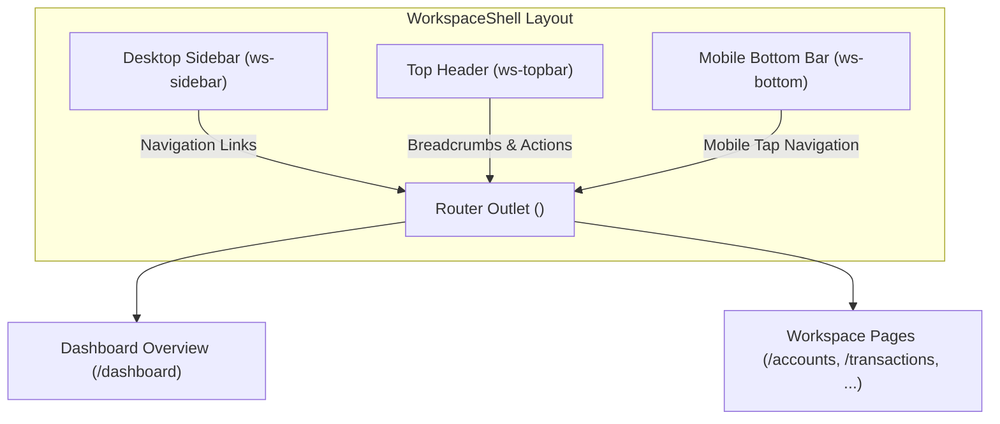

# Workspace Shell and Financial Overview

This document details the signed-in workspace shell ([`src/app/workspace-shell.ts`](file:///home/frank/SmartMoney_intelligence/SM-Intelligence/web/src/app/workspace-shell.ts)) and the core Financial Overview page ([`src/app/dashboard.ts`](file:///home/frank/SmartMoney_intelligence/SM-Intelligence/web/src/app/dashboard.ts)).

---

## 1. Workspace Shell (`WorkspaceShell`)

The [`WorkspaceShell`](file:///home/frank/SmartMoney_intelligence/SM-Intelligence/web/src/app/workspace-shell.ts#L17) component defines the persistent signed-in environment containing three responsive viewports: Desktop Sidebar, Desktop Topbar, and Mobile Bottom Bar.



### 1. Navigation Definition ([Lines 5-16](file:///home/frank/SmartMoney_intelligence/SM-Intelligence/web/src/app/workspace-shell.ts#L5-L16))
```typescript
// src/app/workspace-shell.ts:5-16
export const workspaceLinks = [
  { path: 'dashboard', label: 'Financial Overview', group: '', icon: '🌌' },
  { path: 'accounts', label: 'Accounts', group: 'FINANCES', icon: '💳' },
  { path: 'transactions', label: 'Transactions', group: '', icon: '🧾' },
  { path: 'cashflow', label: 'Cash Flow', group: '', icon: '💸' },
  { path: 'budgets', label: 'Budgets', group: '', icon: '🛡️' },
  { path: 'investments', label: 'Investments', group: '', icon: '💼' },
  { path: 'analysis', label: 'Analytics', group: '', icon: '📐' },
  { path: 'reports', label: 'Reports', group: '', icon: '📄' },
  { path: 'notifications', label: 'Notifications', group: 'ACCOUNT', icon: '🔔' },
  { path: 'settings', label: 'Profile and Settings', group: '', icon: '👤' },
];
```

### 2. Viewport Features
- **Sidebar Drawer**: Toggled via the `menu` signal ([Line 64](file:///home/frank/SmartMoney_intelligence/SM-Intelligence/web/src/app/workspace-shell.ts#L64)). Renders navigation grouped under `FINANCES` and `ACCOUNT`, along with an avatar and workspace type badge ([Lines 47-55](file:///home/frank/SmartMoney_intelligence/SM-Intelligence/web/src/app/workspace-shell.ts#L47-L55)). Pressing `Escape` or clicking the backdrop shade closes the mobile drawer ([Lines 19-25](file:///home/frank/SmartMoney_intelligence/SM-Intelligence/web/src/app/workspace-shell.ts#L19-L25)).
- **Desktop Topbar** ([Lines 59-83](file:///home/frank/SmartMoney_intelligence/SM-Intelligence/web/src/app/workspace-shell.ts#L59-L83)): Displays quick horizontal links, the fixed `KES` currency badge, notification alert shortcut, and user initials avatar leading to `/settings`.
- **Mobile Bottom Navigation Bar** ([Lines 89-106](file:///home/frank/SmartMoney_intelligence/SM-Intelligence/web/src/app/workspace-shell.ts#L89-L106)): Fixed thumb-accessible bottom bar rendering Overview, Accounts, Activity, Reports, and Menu drawer trigger.
- **Sign Out Action** ([Lines 120-129](file:///home/frank/SmartMoney_intelligence/SM-Intelligence/web/src/app/workspace-shell.ts#L120-L129)): Calls [`AccountApi.logout()`](file:///home/frank/SmartMoney_intelligence/SM-Intelligence/web/src/app/account-api.ts#L76-L80) and redirects to `/login`.

---

## 2. Financial Overview (`Dashboard`)

The [`Dashboard`](file:///home/frank/SmartMoney_intelligence/SM-Intelligence/web/src/app/dashboard.ts#L276) component is the primary landing view of the signed-in experience (`/dashboard` and `/overview`).

### Data Fetching and Query Filtering
- Triggered on initialization ([Line 290](file:///home/frank/SmartMoney_intelligence/SM-Intelligence/web/src/app/dashboard.ts#L290)) and manual refresh ([Line 60](file:///home/frank/SmartMoney_intelligence/SM-Intelligence/web/src/app/dashboard.ts#L60)).
- Loads from `GET /api/dashboard?days=${days}&bank=${bank}` ([Lines 296-298](file:///home/frank/SmartMoney_intelligence/SM-Intelligence/web/src/app/dashboard.ts#L296-L298)).
- **Period Filter** ([Lines 315-319](file:///home/frank/SmartMoney_intelligence/SM-Intelligence/web/src/app/dashboard.ts#L315-L319)): Toggles between **Last 30 days** and **Last 90 days**.
- **Bank Filter** ([Lines 284-288](file:///home/frank/SmartMoney_intelligence/SM-Intelligence/web/src/app/dashboard.ts#L284-L288)): Allows filtering all financial summaries by specific bank (`KCB`, `Equity`, `Stanbic`, `NCBA`) or viewing all banks.

### Four Key Metric Cards ([Lines 102-129](file:///home/frank/SmartMoney_intelligence/SM-Intelligence/web/src/app/dashboard.ts#L102-L129))
```
┌─────────────────────────┐  ┌─────────────────────────┐
│ Available Cash          │  │ Credit Outstanding      │
│ KES 280,000.00          │  │ KES 18,500.00           │
│ Deposit accounts only   │  │ Amount owed (excluded)  │
└─────────────────────────┘  └─────────────────────────┘
┌─────────────────────────┐  ┌─────────────────────────┐
│ Money In                │  │ Money Out               │
│ KES 153,000.00          │  │ KES 94,000.00           │
│ Posted deposit credits  │  │ Posted deposit debits   │
└─────────────────────────┘  └─────────────────────────┘
```
1. **Available Cash**: Sum of all `availableBalanceMinor` across `DEPOSIT` accounts.
2. **Credit Outstanding**: Amount owed across `CREDIT` accounts. Strictly segregated from cash.
3. **Money In**: Posted incoming credits into deposit accounts over the selected period.
4. **Money Out**: Posted outgoing debits from deposit accounts over the selected period.

### Interactive Visualizations
1. **Cash Flow Panel** ([Lines 130-178](file:///home/frank/SmartMoney_intelligence/SM-Intelligence/web/src/app/dashboard.ts#L130-L178)):
   - Renders [`FinanceChart`](file:///home/frank/SmartMoney_intelligence/SM-Intelligence/web/src/app/finance-chart.ts#L74) in line mode, mapping the 6 computed time bins.
   - Highlights Net Cash Flow (`moneyIn - moneyOut`).
   - Includes an accessible `<details class="chart-details">` table with exact numeric KES figures.
2. **Spending Breakdown Panel** ([Lines 179-184](file:///home/frank/SmartMoney_intelligence/SM-Intelligence/web/src/app/dashboard.ts#L179-L184)):
   - Computed via [`spendingPoints`](file:///home/frank/SmartMoney_intelligence/SM-Intelligence/web/src/app/dashboard.ts#L320-L328) by aggregating recent `POSTED` `DEBIT` entries from deposit accounts by category.
   - Renders interactive donut chart [`CategoryChart`](file:///home/frank/SmartMoney_intelligence/SM-Intelligence/web/src/app/finance-chart.ts#L131).

### Account Summaries & Transaction Ledger
- **Your Accounts** ([Lines 185-214](file:///home/frank/SmartMoney_intelligence/SM-Intelligence/web/src/app/dashboard.ts#L185-L214)): Lists all connected bank accounts with their official logo ([`BankLogo`](file:///home/frank/SmartMoney_intelligence/SM-Intelligence/web/src/app/bank-logo.ts#L53)), masked account identifier (`•••• 4321`), account type, and balance.
- **Recent Transactions** ([Lines 215-270](file:///home/frank/SmartMoney_intelligence/SM-Intelligence/web/src/app/dashboard.ts#L215-L270)): Shows up to 12 most recent records with UTC date formatting, status indicators (`POSTED`, `PENDING`, `CANCELLED`), category, account name, and signed amount (`+` for credit, `−` for debit).
